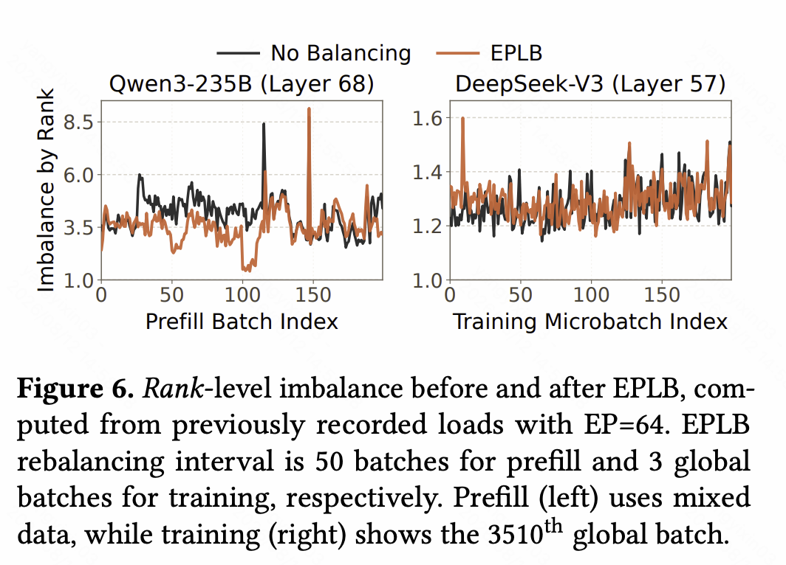

## 背景

### Group-limited routing

DeepSeek v3 中，$E$ 个 Expert 被划分为若干个 group。Router 不是在全部 $E$ 个 Expert 中自由选 Top-$k$，而是先选出有限数量的 group，再在这些 group 内部选 Expert：
- 无约束路由
  - 一个 token 的 $k$ 个目标 Expert 可能散落在任意位置
  - 最坏情况下要与所有节点通信
- group-limited 路由
  - 先限定少数几个 group，再在其中选 Expert
  - 一个 token 的目标范围被压缩到少数几个 group

Group 的设计是为了限制跨节点通信量。因此 EPLB 要求 group 与节点对齐：

- group 与节点对齐
  - token 只涉及少数几个 group → 只需与少数几个节点通信
  - 跨节点流量被路由规则本身限制住
- group 跨节点摆放
  - 同一个 group 的 Expert 分散在多个节点
  - 即使 group 数受限，涉及的节点数仍可能很多
  - 约束被浪费

## 动机

EPLB（Expert Parallelism Load Balancer）是 DeepSeek 开源的 EP 负载均衡算法。它用历史 Expert 负载低频准备布局，避免长期热点集中在少数 GPU。参考实现见同目录 `eplb.py`。

## 方法

### 输入、输出与约束

EPLB 的输入是每个逻辑 Expert 的负载估计，输出是一份 Expert 复制与布局方案，使各 GPU 的负载尽量均衡。

布局方案由三组关系描述：

- 物理 → 逻辑：每个物理槽位放的是哪个逻辑 Expert
- 逻辑 → 物理：每个逻辑 Expert 有哪些物理实例可选
- 副本计数：每个逻辑 Expert 的实例数 $c_e$

***

硬约束：每 GPU 的物理实例「个数」必须相等
- 权重显存整齐、Grouped GEMM 形状规整、无需处理不规则布局

优化目标：每 GPU 的「负载」尽量相等
- 软目标，允许有残余误差

EPLB 是在个数完全均等的前提下去优化负载均等，这是一个带基数约束的划分问题。

**逐层独立。** 负载统计的组织方式是「每层一组 $w_e$」，**每个 MoE 层独立求解、独立布局**。
- 不同层的热点分布不同：某个逻辑编号的 Expert 在第 3 层是热门的，在第 20 层可能是冷门的。
- 若所有层共用一套放置方案，就只能按各层的平均情况妥协，浪费大量优化空间。
- 代价是路由表变成 per-layer 的，大小是元数据量乘以层数。

**算法给出的是容量分布，不是分流决策。** 「逻辑 → 物理」给出的是一个**候选物理实例列表**。运行时把某个 token 具体发给哪一个实例，不属于 EPLB 的职责。

***

### 分层算法的三步

它按「节点 → 副本 → GPU」三步求解：

- Step 1：把 Expert Group 装箱到节点（重排）
  - 单位：group（保持 group 完整）
  - 目标：各节点总负载均衡
  - 决定：跨节点流量
- Step 2：在每个节点内部构造冗余副本（复制）
  - 约束：一个逻辑专家的所有副本都留在同一节点内
  - 目标：最小化该节点内所有副本的最大负载（minimax）
  - 决定：负载峰值能被削到多低
- Step 3：把节点内的物理实例装箱到该节点的各个 GPU（重排）
  - 单位：物理实例，权重为 $w_e/c_e$
  - 目标：各 GPU 负载均衡
  - 决定：节点内 GPU 之间的均衡

三步分别对应拓扑、容量、放置三个层次，职责不重叠，正好对应背景篇提出的前三个问题。

### 唯一真正的取舍

Step 2 为什么要把副本限制在节点内？
- 因为 Step 1 已经把 group 绑定到了节点上。如果副本可以跨节点，那么某个 group 的 Expert 就会同时出现在多个节点上，token 的目标节点数增加，Step 1 建立的局部性被抵消。

于是分层策略的代价很清楚：
- 放弃：副本放置的自由度（副本只能在本节点内摆放）
- 换取：跨节点流量受 group 局部性约束

这个 trade-off 成立的前提是跨节点带宽显著低于节点内带宽——如果两者接近，这个取舍就不划算。

***

### 两个子算法的性质

三步里只用了两种子算法，但它们的算法性质**根本不同**。

#### 装箱：降序贪心，启发式

Step 1 与 Step 3 是同一个子问题：把 $n$ 个带权物体装进 $m$ 个箱子，**每箱恰好 $n/m$ 个**，使各箱总重尽量均衡。

做法是按权重降序遍历，每次把物体放进「当前最轻且尚未装满」的箱子。

它的性质由两个细节决定：

- **降序是必要的。** 先放大物体、用小物体做微调，误差被限制在小物体的量级；若升序或随机，最后剩下的大物体无处安放，误差会被放大到大物体的量级。这也是经典 LPT（Longest Processing Time first）规则有理论保证的原因。
- **「尚未装满」这个限制让它不再是标准 LPT。** 标准的 makespan 最小化问题没有基数约束，LPT 有 $4/3$ 的近似比；加上「每箱恰好 $n/m$ 个」之后，贪心的候选集被裁剪，它退化为一个没有紧近似比的启发式。

它不追求最优解，理由有两层：

- 理论上：带基数约束的均衡划分是 NP-hard 的
- 实践上：输入 $w_e$ 本身只是负载「估计值」
  - 为一个带噪声的目标函数求精确最优没有意义

#### 副本分配：贪心，且是最优的

Step 2 的问题是：给定 $E$ 个逻辑 Expert、$P$ 个物理槽位，分配实例数 $c_e$（满足 $\sum_e c_e=P$ 且 $c_e\ge1$），使得

$$\max_e\frac{w_e}{c_e}$$

最小。

做法是从每个逻辑 Expert 一个主实例开始，把剩余的 $P-E$ 个槽位逐个分配，每次给**当前 $w_e/c_e$ 最大**的那个逻辑 Expert 增加一个副本。

与装箱不同，**这个贪心得到的是最优解**。可以这样看：

- 判断「$\max_e w_e/c_e\le\theta$ 是否可行」
  - 等价于问 $\sum_e\lceil w_e/\theta\rceil\le P$ 是否成立
  - 即：达到 $\theta$ 这个上界，最少需要多少个槽位
- 贪心每一步都在削减当前的最大值
  - 等价于让 $\theta$ 从大到小连续下降，恰好停在槽位耗尽的那一刻

这与选举席位分配中的除数法（divisor method）是同一个算法，其最优性有成熟结论。

Step 2 优化的是 $w_e/c_e$ 而不是 $w_e$：它衡量的是**每个物理实例的平均负载**，而不是逻辑 Expert 的总负载。这里隐含了一个假设：

> 同一个逻辑 Expert 的 token 能够在它的物理实例之间均匀分摊。

这个假设由**运行时的副本选择策略**保证，而它不在 EPLB 的职责范围内。如果运行时把某个热门 Expert 的 token 都发给了同一个副本，那么 EPLB 规划出的容量就是虚的，$\rho$ 不会真的下降。

**规划与执行必须配套，这是 EPLB 落地时最容易踩空的地方。**

***

### 两种策略：Prefill 与 Decode

除分层策略外还有一个全局策略：忽略 group 结构，在全局范围内复制 Expert，再把所有物理实例直接装箱到所有 GPU。

实现上，全局策略是分层策略在「group 数与节点数都退化为 1」时的特例，两者共用同一套逻辑：Step 1 变成 trivial（只有一个箱子），Step 2 在全局范围复制，Step 3 面向全部 GPU 装箱。

选择依据是部署阶段：

- 分层策略
  - 适用条件：节点数能整除 group 数
  - 特点：保持 group 的节点局部性，副本受限于节点
  - 场景：Prefill，EP 度较小
- 全局策略
  - 适用条件：其他情况
  - 特点：放弃 group 局部性，放置自由度最大
  - 场景：Decode，EP 度较大

#### 为什么两个阶段的选择不同

有三条理由。

- 理由一：瓶颈位置不同
  - Prefill：$T=B\times S$，token 量巨大 → 通信量大，bandwidth-bound
    - 跨节点流量是主要矛盾 → 优先保 group 局部性
  - Decode：$T=B$，消息小、数量多 → latency-bound
    - 单个 Rank 的长尾是主要矛盾 → 优先保负载均衡
- 理由二：容错空间不同
  - Prefill 的 Grouped GEMM 较大，少量不均衡可以被计算时间摊薄
  - Decode 每步时间极短，任何长尾都直接放大到端到端延迟
- 理由三：EP 度大时约束会冲突
  - EP 度大 ⇒ 每 GPU 的物理实例数极少（可能只有一两个）
  - 放置的自由度本来就很低
  - 「每 GPU 个数相等」这个硬约束叠加 group 局部性，可能根本没有可行的均衡解

**EP 度越大、放置粒度越粗，硬约束就越容易与 group 约束冲突。** 此时坚持 group 局部性不是保守，而是无解，所以必须放弃它。

***

## 代价与适用条件

EPLB 是一个纯函数：输入负载估计，输出布局方案。它刻意把几件事留在了外面：

### 负载预测

上游明确说明预测方法不在其范围内，常见做法是对历史统计做滑动平均。这是整个系统最脆弱的环节：

- 统计窗口太短 → 噪声大，方案频繁变动，迁移开销吃掉收益
- 统计窗口太长 → 跟不上负载漂移，方案总是过时

更棘手的是负载分布本身会随**输入分布**漂移：不同语言、不同任务、不同领域的 token 激活的 Expert 不同。一个在通用流量上标定的方案，遇到某类请求突增时可能完全失效。

因此 EPLB 的效果上限由预测质量决定，而不是由算法质量决定。

### 权重迁移

新方案要生效，必须把 Expert 权重在 GPU 之间实际搬动。这部分代价不在 EPLB 内：

- 迁移时机：不能每步做，需要按周期或触发条件
- 迁移开销：Expert 权重体积大，搬运期间可能需要暂停服务或双缓冲
- 一致性：迁移过程中，路由表与实际放置必须始终保持一致

**EPLB 是周期性、粗粒度运行的，不是每个 step 都重新求解。** 这也解释了为什么它可以接受一个跑在 CPU 上、含串行循环的实现——它不在关键路径上。

EPLB 不改变 Router 的逻辑路由，只调整实例数与布局。因此启用与不启用它，模型输出完全一致（浮点归约顺序变化除外）。

***

## 问题

- 负载预测基于历史统计数据，但是历史统计数据的指导性可能非常弱
    - 负载分布可能随输入分布变化很大，如果做了反向负载均衡，**甚至可能是负收益**
- 这是一个运行在 CPU 上的串行算法
- 它周期性、粗粒度地运行，专家分配可能很快失效
- 它包含重排，而且算法不考虑重排开销
  - 算法可能（经常）给出一个大规模搬家的输出

