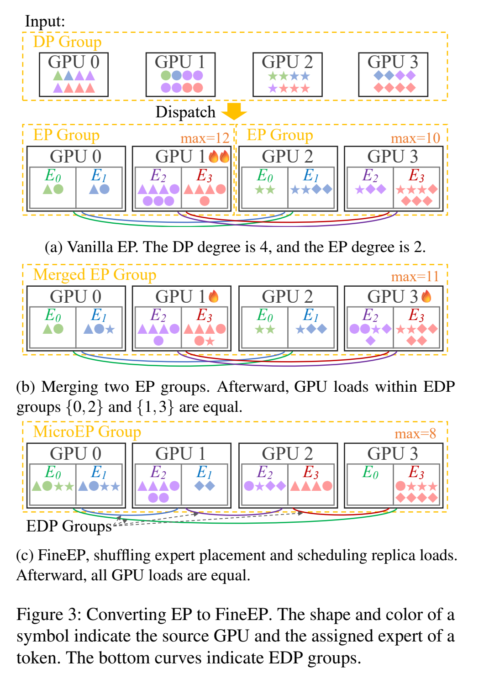
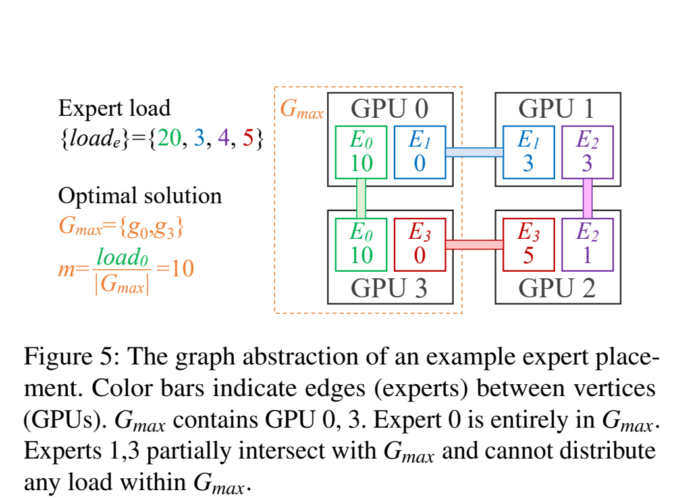
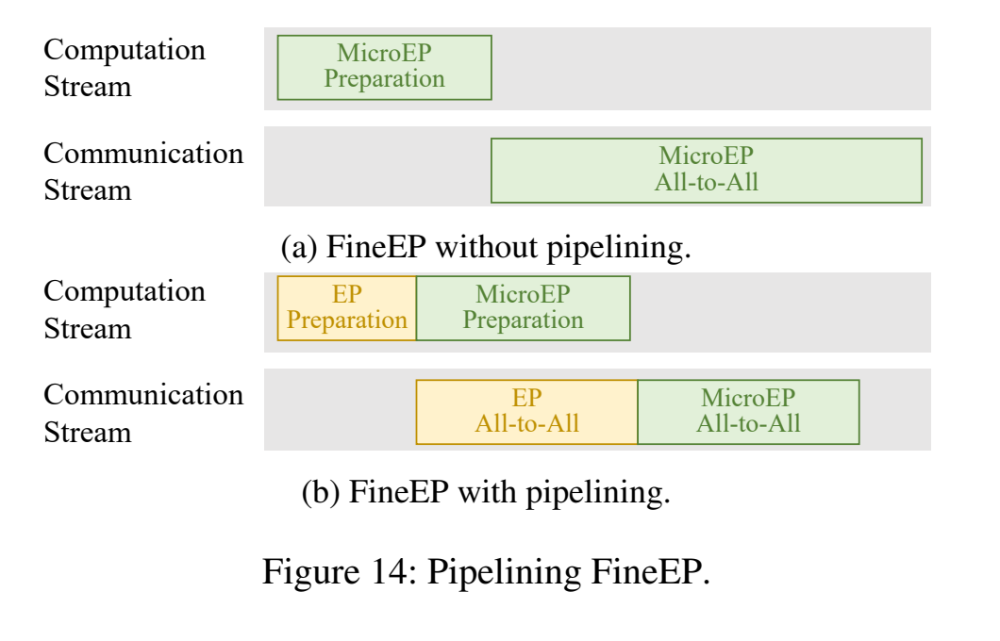

# FineMoE：在 EDP 副本之间实时分流 Token

## 背景

论文中的两个名字分工不同：

- **FineEP** 是并行与分流策略，定义可用哪些 Expert 副本以及怎样在它们之间分流
- **FineMoE** 是建立在 FineEP、Megatron-LM 和布局管理器（placement manager）之上的训练系统，负责执行分流、维护布局并在必要时迁移模型状态

论文的部分图表和残留文字仍使用旧称 **MicroEP/MicroMoE**。本文统一写作 FineEP/FineMoE；引用原图时，图中的旧称指向同一方案。

FineEP 的分流空间来自 Expert Data Parallelism（EDP），不是临时创建的新副本。它成立需要三个前提：

- DP degree 大于 EP degree，因此一个 DP group 内包含多个 EP group
- 同一个逻辑 Expert 在不同 EP group 中已经有多份等价参数，这些副本通过 EDP 同步
- 每张 GPU 承载多个本地物理实例，布局才有在 GPU 之间打散的空间

论文 Figure 3 的 `DP=4、EP=2` 正好说明这些组怎样重叠：

- 一个 DP group 包含 GPU 0、1、2、3
- 其中划分出两个 EP group：`{GPU 0, GPU 1}` 与 `{GPU 2, GPU 3}`
- GPU 0 与 GPU 2 在各自 EP group 中具有相同的 EP rank，持有同一组逻辑 Expert 的等价实例；它们构成一组 EDP group
- GPU 1 与 GPU 3 同理构成另一组 EDP group

因此这里只用了 4 张 GPU，而不是把 DP degree 与 EP degree 相乘得到 8 张。FineEP 合并的是这两个已经存在于同一 DP group 内的 EP group，然后在它们的 EDP 副本之间扩大 token 分流范围。

## 动机

FineMoE 的核心不是为每个 microbatch 迁移 Expert，而是利用数据并行已经产生的同 Expert 副本，在一个更大的通信组内重新安排 token。这样，逐 microbatch 变化的是 token 去哪个现有副本，Expert 参数的位置只在更长的时间尺度上调整。

下图的四卡例子把分流空间如何一步步扩大画得很清楚。形状表示 token 的源 GPU，颜色表示 Router 选中的 Expert；底部同色曲线连接同一 Expert 的 EDP 副本。图中 `MicroEP` 是 FineEP 的旧称。

- **Vanilla EP**：每个 token 只能发给自己所在 EP group 内的目标 Expert。Router 结果确定逻辑 Expert，固定布局又唯一确定该 Expert 所在的 GPU，因此没有副本选择空间。图中两个 EP group 的最大负载分别为 12 和 10
- **只合并 EP group**：token 可以在同一 Expert 的 EDP 副本之间转移，但各 EP group 仍使用相同布局。于是不同 Expert 的 EDP group 要么完全相同、要么互不相交：图中 $E_0/E_1$ 只能在 GPU 0、2 之间均衡，$E_2/E_3$ 只能在 GPU 1、3 之间均衡。局部最优以后，全局最大负载仍是 11

## 方法

### FineEP Group 与布局

- **FineEP**：在合并后的 EP group 内打乱 Expert 布局，使不同 Expert 的 EDP group 相互交叉。一个 Expert 沿自己的副本集合转移负载，另一个 Expert 再沿另一组交叉的副本继续转移；多条路径连起来后，负载可以传播到整个 FineEP group，例子中四张 GPU 都降到 8

FineEP 用参数 $d$ 控制合并范围：每 $d$ 个 EP group 组成一个 FineEP group，通信组规模也随之扩大为原 EP group 的 $d$ 倍。

- $d$ 小，All-to-All 范围较小，但可选副本和负载传播路径也少
- $d$ 大，LP 的可行域更大，更容易接近完全均衡，但 All-to-All 可能跨越更多 GPU 甚至节点，求解规模也随之增长

因此 FineEP 做的是**在已有 EDP 副本上扩大 token 的分流空间**。它没有为当前 microbatch 复制或迁移 Expert，也没有改变 Router 为 token 选择的逻辑 Expert；变化的只是由哪个等价副本执行计算。

### LP：先算每个副本承担多少 Token

FineEP 不直接把每个 token 当成优化变量。它先把粒度提高到“专家副本配额”：一个专家在每张持有其副本的 GPU 上，最终各承担多少 token。

设 $\mathcal G$ 是一个 FineEP group 内的 GPU 集合，$\mathcal G_e$ 是专家 $e$ 的 EDP 副本集合，$\mathrm{load}_e$ 是该专家在当前 microbatch 的 token 总数。变量 $x_e^g$ 表示 GPU $g$ 上专家 $e$ 的副本配额，$m$ 表示最忙 GPU 的负载。核心 LP 是：

$$
\begin{aligned}
\min_{x,m}\quad & m \\
\text{s.t.}\quad
& \sum_{g\in\mathcal G_e}x_e^g=\mathrm{load}_e, && \forall e,\\
& \sum_{e:\,g\in\mathcal G_e}x_e^g\le m, && \forall g\in\mathcal G,\\
& x_e^g\ge 0, && \forall e,\ g\in\mathcal G_e.
\end{aligned}
$$

三行约束分别表达三件事：

- 同一专家在所有副本上的配额之和，必须等于 Router 分给该专家的总负载，token 不能丢也不能凭空增加
- 一张 GPU 的负载，是它持有的所有专家副本配额之和；所有 GPU 都要被压在共同上界 $m$ 以下
- 一个专家只能把 token 分给自己的副本集合

目标是最小化 $m$，也就是最小化所有 GPU 中最高的计算负载。之所以用 token 数近似计算负载，是因为 Dispatch 和 Combine 两侧都要等待最慢的专家计算完成；收到 token 最多的 GPU 通常决定这一段的尾部延迟。

这个 LP 的作用不是单独把每个热专家平均切开，而是**同时协调多个专家怎样占用 GPU 容量**。例如，一个热专家的副本只在 GPU 0、1 上，它不可能把负载直接送到 GPU 2；但另一个专家若连接 GPU 1、2，就可以把自己的 token 从 GPU 1 移到 GPU 2，为前一个热专家腾出 GPU 1。能否完全均衡，不只取决于总 token 数与总容量，还取决于所有专家副本集合能否把这些 GPU 连起来。

LP 能逐 microbatch 求解，依赖两个实现性质：

- 布局在相邻多个 microbatch 之间不变，所以约束矩阵不变；变化的主要是每个 Expert 的 $\mathrm{load}_e$
- FineMoE 使用单线程 CPU HiGHS solver，并用上一个 microbatch 的求解状态 warm start，而不是每次从零开始

论文认为问题规模不足以让多线程或 GPU solver 获得明显收益。这里的关键不是追求一个大型通用优化器，而是利用固定结构，把一个小 LP 快速重复求解。

### 布局决定分流空间

LP 只能在 $\mathcal G_e$ 中分配 Expert $e$ 的 token，因此布局直接决定 LP 的约束矩阵与可行域。FineMoE 用图来表达这种限制：

- 每张 GPU 是一个顶点
- 一个 Expert 连接所有持有其副本的 GPU，因此是一个 hyperedge
- 当一个 Expert 恰好有两个副本时，hyperedge 就退化成普通边
- Expert 的 token 总数是这条边的权重；token 只能沿同一条边所覆盖的顶点重新分配

理解布局瓶颈的关键，是看“负载为什么会困在一组 GPU 里”。假设一组 GPU 最终都达到了最优解中的最大负载：

- 如果某个 Expert 在这组 GPU 外还有副本，它的 token 就能继续向外转移；在论文选择的最优解中，不必让它在这组最忙 GPU 上留下负载
- 真正无法流出的，是副本全部落在这组 GPU 内的 Expert。无论 LP 怎样分配，这些 Expert 的全部 token 都只能由组内 GPU 承担
- 因而这组 GPU 的平均负载不可能低于“困在其中的 Expert 总负载 ÷ GPU 数量”

枚举所有非空 GPU 子集后，LP 能达到的最小最大负载就是最高的 trapped-load density：

$$
m^*=\max_{\varnothing\ne S\subseteq\mathcal G}
\frac{\displaystyle\sum_{e:\,\mathcal G_e\subseteq S}\mathrm{load}_e}{|S|}.
$$

这里的“density”不是泛指每张 GPU 放了几个 Expert，而是只计算**整个副本集合都被封闭在子集 $S$ 内**的 Expert 负载。它给布局一个比“每卡 Expert 数相等”更精确的目标：避免某个小 GPU 子集封闭地持有过多高负载 Expert，使大量 token 无处可去。好的布局要让所有诱导子图中最坏的 trapped-load density 尽量低。

### 从副本配额到每个 Token 的目的地

LP 输出的 $x_e^g$ 还不能直接交给 All-to-All。它只说明每个副本最终要收多少 token，Dispatch 还需要知道：每张源 GPU 上的哪些 token，具体发给哪一个副本。

FineMoE 对每个专家分别维护两组剩余量：

- 每张源 GPU 尚未分配的 token range
- 每个目标副本尚未填满的配额

然后按两个阶段生成 token 到副本的映射：

- **本地优先**
  - 如果源 GPU 自己持有目标专家的副本，就先用本地 token 填本地配额
  - 一次取“本地剩余 token 数”和“本地剩余配额”的较小值；这部分不需要跨 GPU 传输
- **填充剩余配额**
  - 按固定顺序遍历各源 GPU 的剩余 token，以及该专家各副本的剩余配额
  - 每次取二者的较小值，把这一段 token 交给当前副本，然后扣减两边的剩余量
  - 重复直到所有源 token 与所有副本配额同时清零

实现操作的是连续 token range，而不是逐 token 做一次调度决定。如果输入的副本配额已经是整数，这个过程可以精确填满每个配额，同时减少元数据量和控制开销。固定遍历顺序也让所有 GPU 在相同输入下能独立重建同一份确定性方案；但论文没有说明连续 LP 解怎样先变成这样一组整数配额，这正是后文问题章节保留的缺口。

这里要区分三个层次的优化目标：

- **基础 LP** 只最小化最大计算负载，不关心 token 从哪里来
- **locality-aware 分流**不改变 LP 给定的副本配额，只在实现这些配额时优先保留本地 token，从而减少实际跨卡流量
- **communication-aware LP** 进一步把最大收发量和节点拓扑写进优化问题：先本 GPU，再同节点副本，最后才跨节点。它可能减少通信时间，但也会增加变量、约束和求解时间

因此 communication-aware 版本并不必然更快。是否启用，要看节省的 All-to-All 时间能否覆盖更复杂 LP 的额外求解开销。

### 求解如何不挡住 Dispatch

FineEP 的 LP 使用当前 microbatch 的精确 Router 结果，所以不可能在 Gate 之前求。它又必须在 All-to-All 之前给出目的地，因此天然位于 Dispatch 的串行路径上。FineMoE 用“分布式独立求解 + 与 GPU 工作重叠”压缩这段暴露时间。

每个 microbatch 的准备过程是：

- 每张 GPU 统计本地 token 按目标专家划分的数量
- FineEP group 做一次 All-Gather，使所有 GPU 都拿到“源 GPU × 专家”的全局负载统计
- 每张 GPU 在 CPU 上独立运行相同的 LP 和 range 分流算法
- 因为输入与算法都相同且求解过程是确定性的，各 GPU 会得到一致方案，不需要中心节点再广播结果

集中式 scheduler 需要先 gather 输入、再 scatter 输出；FineMoE 的分布式做法只需要一次 All-Gather。负载统计本身很小，这里更重要的是少一次通信操作带来的低延迟，而不是节省数据吞吐量。

求解延迟有两种隐藏方式：

- **普通 overlap**：Megatron-LM 在 Gate 与 All-to-All 之间还要做 Top-k token 复制，并按专家索引 permute。FineMoE 让 CPU 求解与这段 GPU permutation 同时执行。只要 permutation 足够长，LP 和 routing 的大部分延迟就不会暴露
- **Pipelining**：如果框架在 Gate 后没有足够长的 GPU 工作可供重叠，就把 token 分为两部分。前一部分按普通 EP 准备并先启动 All-to-All；CPU 同时为后一部分计算 FineEP 方案，随后再发起后一部分的 FineEP All-to-All。规划时还要把前一部分已经留给各 GPU 的负载考虑进去

Pipelining 不是默认路径。它把一次 All-to-All 拆成两次，会增加同步、通信启动和 kernel launch 开销；只有普通 overlap 无法隐藏较长求解时间，而这些额外开销又足够小时，它才可能更划算。

### 两种布局与自适应重排

#### 无负载先验：对称布局

模型初始化时还不知道真实 Expert 负载，FineMoE 把所有 Expert 视为服从相同分布，先构造对称布局。论文使用 Cayley graph，核心直觉是：

- 顶点与边的角色尽量对称，不让某几张 GPU 天生承接更多封闭的专家边
- 边均匀分散在顶点和不同子图之间，使少数诱导子图出现异常高 density 的概率更低
- 这种结构给未知负载提供保守、通用的均衡能力，但不针对某个已知热专家做特殊优化

cycle、torus 都可以看成这类对称结构的直观例子。论文给出的是适合多种实际配置的近优构造，而不是对任意 GPU 数、专家数和负载分布都精确全局最优的结论。

#### 已知负载：非对称布局

如果已经观察到稳定的负载差异，再要求所有 Expert 副本数和位置完全对称就会浪费容量。FineMoE 用两步经验策略构造针对当前负载的非对称布局：

- **先分配副本数**
  - 维护按“专家负载 ÷ 当前副本数”排序的优先队列
  - 每次把一个剩余副本槽位分给当前单副本压力最大的专家
  - 新副本会降低该专家的平均副本负载，然后重新比较下一轮最需要副本的专家
- **再决定副本位置**
  - 随机生成多份满足每卡容量与正确性约束的布局图
  - 用最大诱导子图 density 评价每份候选
  - 选择最坏 density 最低的一份

第一步解决“热 Expert 应该有几份”，第二步解决“这些副本怎样分散才不会形成封闭热点”。Monte Carlo sampling 扩大了搜索范围，但整套方法仍是经验性的近优策略，不应写成精确求得全局最优布局。

#### 布局的正确性约束

打乱布局后，不同 Expert 会使用不同的 EDP group。训练中的参数与梯度同步如果以不一致顺序进入这些通信组，可能互相等待并死锁。

例如 Rank A 先进入 Expert 0 的 EDP collective、再进入 Expert 1，而 Rank B 因本地 Expert 顺序不同，先进入 Expert 1、再进入 Expert 0；两边就可能分别等待对方进入不同的 collective，形成循环等待。

FineMoE 因此要求：**同一专家在所有 GPU 上必须使用相同的 local expert index**。DDP 按本地参数顺序同步参数，并按相反顺序同步梯度；统一 local index 后，同一专家的所有副本会以一致顺序进入它自己的 EDP 通信组。

#### 自适应重排

FineMoE 把快速波动和长期偏斜交给两个不同时间尺度：

- **每个 microbatch**：布局固定，LP 根据当前 Router 结果重新分配副本配额，处理瞬时波动
- **每隔若干 iteration**：布局管理器在后台汇总历史负载，用 moving average 等时间序列方法预测后续分布，再用最大诱导子图 density 评价当前布局
- **预测性能低于阈值时**：生成新的非对称布局，暂停训练并按新布局重建各 Rank 的本地模型状态，把原有参数和 optimizer state 迁移到新位置。论文所说的 model re-initialization 指分布式状态按新 placement 重新建立，不是把模型参数重新随机初始化

自适应重排会暂停训练，而且需要搬动远大于 token 元数据的模型状态，所以只能低频执行。它是针对极端或持续 skew 的粗粒度补充；FineMoE 的主要均衡手段仍是固定布局上的逐 microbatch 分流。

### 与 LPLB 的区别

FineMoE 与 `LPLB.md` 都把在线分流写成 LP，但两者的副本来源、可行域和求解路径不同：

| 维度 | FineMoE | LPLB |
| --- | --- | --- |
| 副本来源 | DP 中多个 EP group 已有的 EDP 副本 | EPLB 预先建立的主实例—副本关系 |
| 拓扑 | 一般 graph/hypergraph，布局可重排 | 预设的成对共享图 |
| LP 变量 | 每个专家在各副本上的 token 配额 | 每条主副本边两端的分流比例 |
| 求解 | CPU HiGHS、warm start、每卡独立求解 | GPU 小型内点法、固定迭代并带 fallback |
| 布局 | 用图论分析对称/非对称布局，并可周期重排 | 在线阶段拓扑固定，位置不变 |
| 通信范围 | 合并多个 EP group，All-to-All 组扩大 | 受预设副本图约束 |

所以“都使用 LP”只说明二者都在最小化峰值负载，不意味着问题相同。FineMoE 的核心自由度是 EDP 副本形成的 graph/hypergraph；LPLB 则主动把副本关系约束成小而固定的成对图，以换取极轻的 GPU 在线求解。

## 代价与适用条件

论文给出的关键性能证据是：

- 相比 Megatron-LM，FineMoE 端到端吞吐最高提升 **47.6%**，平均提升 **36.9%**
- FineEP 的 LP 求解与 token 分流合计最低约 $100\,\mu s$；即使扩展到 64 GPU、256 Experts，仍低于 1 ms
- warm start、overlap 与 locality-aware 分流组合后，论文的示例中 Dispatch 相比 Megatron-LM 只增加约 0.4 ms
- 自适应重排迁移 Expert 参数和 optimizer state 通常需要数百毫秒，因此论文建议训练早期约每 50 iteration 检查一次；进入稳定阶段后放宽到数百步，甚至停止重排

这些结果成立在明确的系统与实验范围内：

- 当前实现基于 Megatron-LM DDP；FSDP 集成仍被列为 future work
- FineEP 必须存在多个 EP group 和 EDP 副本。当 DP degree 等于 EP degree、每个专家在 DP group 内只有一个实例时，没有可供 FineEP 调度的同专家副本
- 增大 $d$ 会扩大 All-to-All group。若因此跨节点，新增通信可能抵消均衡收益，需要与通信感知调度一起评估
- 主要端到端实验因测试平台节点间带宽限制，让 PP 跨节点而将 EP/FineEP 留在节点内；这些结果不能直接推出大规模跨节点 FineEP 仍有相同比例收益
- 实验仍启用了较小的 auxiliary loss 以避免极端负载影响模型精度。FineMoE 不改变 Router 的专家选择，但论文没有据此证明训练时可以完全取消算法侧均衡

## 问题

论文没有交代清楚 LP 连续解如何落到离散 token。核心 LP 中的 $x_e^g$ 是连续非负变量，而实际 routed token 数必须是整数；Algorithm 1 说明了如何按 range 填充给定配额，却没有说明：

- 小数配额怎样取整
- 如何保证取整后，每个专家的 token 总量守恒，同时所有副本配额仍彼此一致
- 当全局 token 总数不能被 GPU 数整除时，论文所说的 “complete balance” 具体采用什么判定

这些细节需要结合实现或作者说明确认。本文不自行补一种取整算法，以免把合理猜测写成论文方法。
