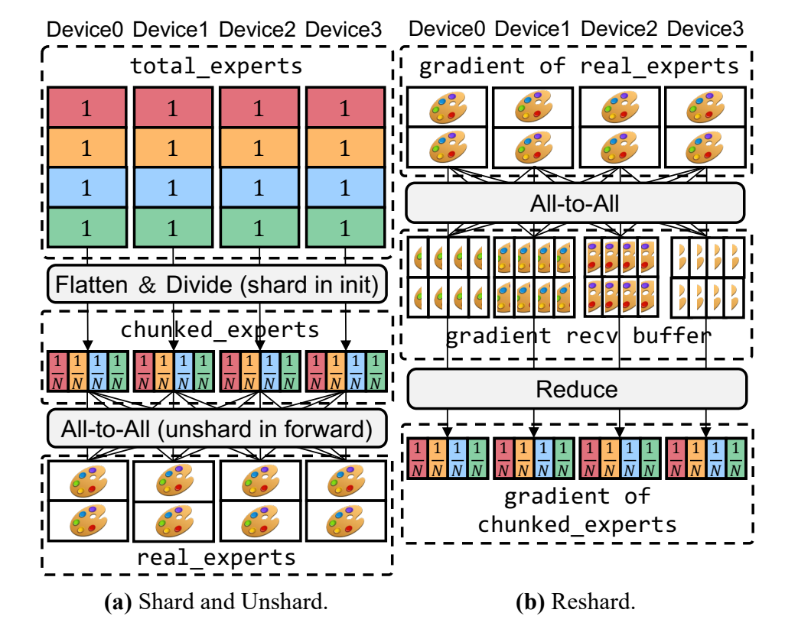
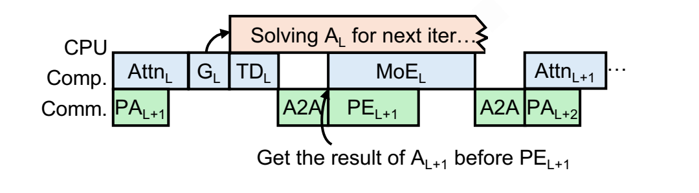
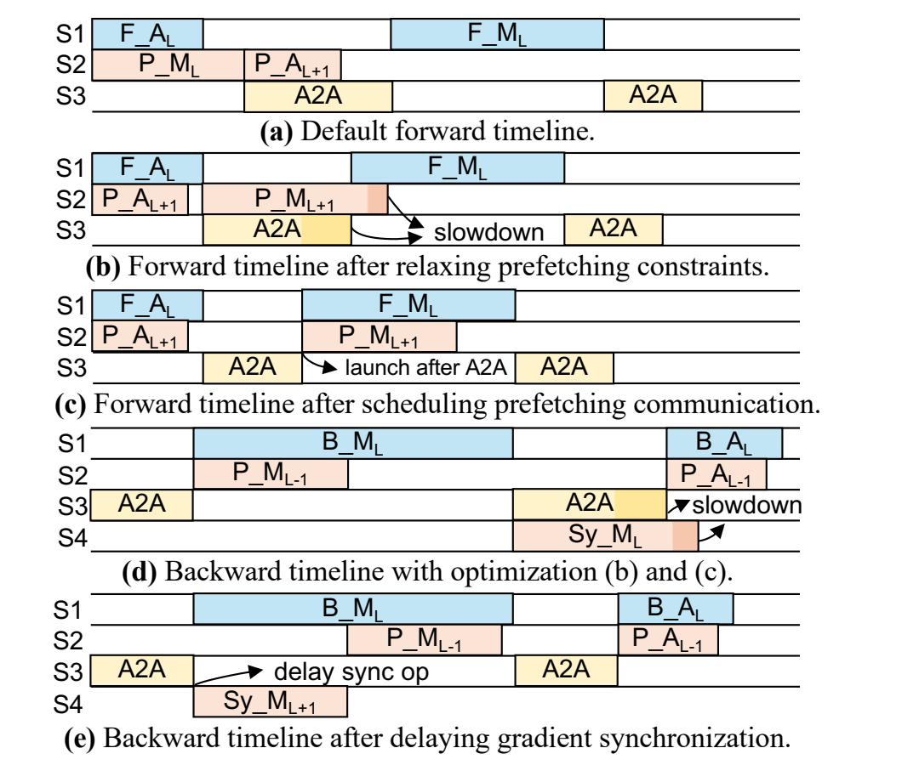

# LAER-MoE：用全分片 Expert 支持逐步布局更新

## 背景

普通 EP 让每个完整 Expert 长期归属于某台设备。LAER-MoE 则先改变 Expert 参数的存储方式：每台设备长期保存所有 Expert 的一部分，需要计算时再按本轮布局恢复若干完整 Expert。于是布局更新不再表示把一份完整参数从旧主人搬给新主人，而只是决定**这一次在哪些设备上把哪些 Expert 拼完整**。

## 动机

传统的 Expert 布局更新是在两种固定形态之间做选择：要么复制一个热 Expert，要么把它的主实例重排到别的设备。两种做法都会改变完整参数的可用位置，因此每次调整都伴随着额外的数据搬运或梯度同步。开销一大，布局就只能隔很多步更新一次；而 Expert 热度又在持续变化，等新布局生效时，负载可能已经变了。

### 为什么已有布局更新无法及时进行

普通 EP 中，每个 Expert 长期属于某台设备。负载不均衡时，系统通常有两种调整手段：

- **复制热 Expert**：让多台设备共同处理它的 token，但反向产生的多份梯度必须重新汇总。不同 Expert 的副本数不同，这次同步本身也是不规则且不均衡的
- **重排主实例**：把热 Expert 的主实例移到空闲设备，但训练时不能只搬一份权重；参数、梯度归属和 optimizer state 都要一起改变，还需要额外的收发 buffer

两类方法都把布局更新当成一个独立阶段：先暂停正常流水，完成参数状态调整，再使用新布局继续训练。为了控制这段暴露开销，已有系统通常会降低调整频率，或者在求解布局时惩罚改动较大的方案。结果是布局算法即使知道更均衡的放法，也可能因为“搬过去太贵”而不能采用。

LAER-MoE 的突破口是：**不再让完整 Expert 拥有固定的主实例所在 Rank。** 每台设备本来就保存了每个 Expert 的一块，恢复任何 Expert 都走相同的规则通信；变化的只是接收哪些块，而不是长期参数归属。这样，布局更新产生的通信就可以和 FSDP 式的参数预取、梯度归约合并，再通过调度藏到计算下面。

## 方法

### Executor 与 Planner 的职责

整个系统由三项职责组成，它们消费的信号和服务的时点不同：

- **FSEP executor**：输入当前层已经选定的 Expert 布局，负责从长期 shard 恢复本地要执行的完整物理实例；反向后再把完整梯度切开并归约回长期 shard
- **GPU token dispatcher**：输入当前 Rank 的 Router 结果与当前已经生效的布局，立即输出当前 token 的物理实例目的地
- **CPU expert layout tuner**：输入当前层已经观察到的负载、历史数据、设备容量和拓扑，异步输出同一层下一 iteration 使用的新布局

后两项共同构成 load-balancing planner：GPU 解决当前 token 去哪里，CPU 准备未来要恢复哪些 Expert。

### FSEP：长期分片，按需恢复

Fully Sharded Expert Parallelism（FSEP）可以先用三个量理解：

- $N$：参与 FSEP 的设备数
- $E$：逻辑专家总数
- $C$：一台设备在计算时可以同时恢复多少个完整专家

FSEP 中同时存在两种形态：

- **长期分片**：每台设备都保存 $E$ 个小块，每块是对应专家的 $1/N$。合起来看，一台设备长期持有的专家参数总量仍然只相当于 $E/N$ 个完整专家
- **临时完整专家**：进入前向或反向前，每台设备根据当前布局恢复 $C$ 个完整专家；这些完整参数只服务这一段计算，长期状态仍是下面那组分片

*论文 Figure 4：左侧是参数从长期分片恢复成完整专家，右侧是完整专家梯度重新归约成长期分片。*

三个动作分别承担不同职责：

- **`shard`：建立长期状态。** 初始化时把每个专家展平并均匀切成 $N$ 块，设备 $r$ 保存所有专家的第 $r$ 块。一个设备并没有任何完整专家，但它对每个专家都持有一部分
- **`unshard`：按布局临时拼出完整专家。** 如果某台设备这一轮需要专家 0 和专家 3，其他所有设备就分别把这两个专家的本地 shard 发给它。收齐后，它得到两份可以直接参与计算的完整权重。前向与反向都需要完整参数，因此两段计算前各有一次恢复
- **`reshard`：把梯度送回长期状态。** 完整专家在反向中产生完整梯度，系统把梯度切成 $N$ 块，通过 All-to-All 发送给对应 shard 的持有者，再在接收端归约。参数 shard 本来就一直保留着，所以这里真正需要重分片和同步的是梯度

这种存法为什么能支持任意布局？关键在于**所有设备在恢复任何专家时都处于对称位置**：

- 每台设备都持有每个专家的一块，不存在只有某个 Rank 才能提供的完整主实例
- 每台设备最终都只恢复 $C$ 个专家，因此任意两个设备之间发送和接收的 shard 数量相同
- 一个热专家可以在多台设备上同时恢复；对 FSEP 而言，这只是多台接收方选择了同一种 shard 组合，不需要临时建立新的参数归属
- optimizer state 始终跟随长期 shard 保存在原设备上，不会随着每轮完整专家的落点迁移

所以 FSEP 的参数通信是一轮规则、均匀的 All-to-All。相比 FSDP+EP，它把专家恢复扩展到了整个 FSEP 组，通信量会略多，但不会出现“持有热专家的 Rank 要独自向很多副本发送完整权重”的热点；随着并行规模增大，两者的通信量也趋于接近。

### Planner：把布局和 token 分流分开求

FSEP 允许每台设备自由选择要恢复的专家，但仍然需要回答两个不同的问题：

- **专家布局 $A$**：每个专家要恢复多少份，这些实例分别放在哪些设备上
- **token 分流 $S$**：某个源设备上选择了专家 $e$ 的 token，具体应发给 $e$ 的哪个物理实例

Planner 的输入包括：

- 各源设备分别有多少 token 选择了每个逻辑专家
- 一台设备最多能恢复多少个完整专家
- 哪些设备在同一节点，以及节点内、节点间通信的带宽差异

它同时考虑计算与通信：

- **计算时间看最忙的设备。** 一台设备收到的 token 越多，它的专家计算越晚结束，其他设备等待的时间越长
- **通信时间看 token 经过的路径。** 同样数量的 token，如果尽量留在源设备所在节点内，通常比跨节点发送更便宜。前向与反向各有 dispatch 和 combine，这种差异会在四次 token All-to-All 中重复出现

LAER-MoE 把它拆成两个时间窗口不同的组件：

- GPU token dispatcher 使用已经确定的布局，立即给当前 token 选择副本
- CPU expert layout tuner 用已经观察到的负载异步求新布局，供后续参数恢复使用

#### Token dispatcher

同一个专家存在多个副本时，最精确的办法是先收集“源 Rank × Expert”的全局 token 统计，再联合决定每个源 Rank 应该把多少 token 发给每个副本。但这会在分流前增加一次同步，而 dispatch 正在等待目的地。

普通 Dispatch 交换的 per-peer 发送计数不能反过来解决这个问题：这些计数只有在 token 目的地已经确定后才能形成，是分流的结果，不是分流的先验输入。LAER-MoE 因此选择不依赖这份全局统计的 lite routing：每台设备只处理自己的 token，并共享同一份专家布局。

对当前设备上的每个目标专家，规则只有两步：

- 如果当前节点内已经有这个专家的副本，就把本地 token 均匀分给这些节点内副本，不再发送到其他节点
- 如果当前节点一个副本也没有，再把 token 均匀分给全局所有副本

这个策略首先减少跨节点传输，然后才在可选副本之间做均分。不同源设备不需要互相报告自己有多少 token，也不需要等待一个集中式配额表；只要布局 $A$ 已知，每张卡就能独立得到自己的路由 $S$。

Lite routing 不负责重新决定哪些专家应该复制。它接受布局、快速产生当前 dispatch 所需的目的地，优化的是**关键路径上的即时性与通信局部性**。

#### Expert layout tuner

Expert layout tuner 的工作较复杂，但它不必阻塞当前 token，因此被放到 CPU 上异步执行。求解分成两层：先决定每个专家需要几份，再决定这些副本放到哪里。

**先分副本数。** LAER-MoE 不只相信一种启发式，而是构造多份候选：

- **按负载分配**：每个专家先有一份实例，剩余槽位反复交给“每个现有副本平均要处理的 token 最多”的专家。增加一个副本后，它的平均压力会下降，再与其他专家重新比较
- **均匀分配**：不看热度，让每个专家得到相同数量的副本。它看起来不够聪明，但当历史负载不能准确代表下一步，或者按负载贪心落入不利布局时，可能反而更稳
- **扰动候选**：还可以从已有副本数方案出发做小幅随机调整，得到更多可比较的布局

例如有 4 张卡、4 个专家，每张卡能恢复 2 个专家，一共就有 8 个实例槽位。若四个专家的历史负载分别是 700、200、80、20：

- 先给每个专家一份，使用掉 4 个槽位
- 此时专家 0 的单副本压力最大，连续获得新副本；随着副本增加，它的平均压力从 700 逐步下降
- 当专家 0 的平均压力降到专家 1 以下，下一个槽位就转给专家 1
- 最终按负载候选会得到 4、2、1、1 份，而均匀候选是 2、2、2、2 份

这个过程不是简单按 token 比例一次取整，而是在逐步填槽位时，尽量压低当前最热的“单副本平均负载”。

**再放置副本。** 给定每个专家的副本数后，tuner 把每个副本看作一个带预计负载的任务：

- 同一专家的总负载先除以它的副本数，得到每份实例预计承担的 token
- 把所有副本按预计负载从高到低排序，先安置最重的任务，避免最后只剩几个不合适的空槽
- 放置某个专家时，先找当前持有该专家副本最少的节点，让同一专家尽量均匀分散到不同节点
- 再在这些节点中选择尚有容量且总预计负载最低的设备

沿用上例，如果 4 张卡分布在两个节点，专家 0 的 4 份副本会优先平均铺到两个节点，而不是集中在一边。这样来自两个节点的 token 都更可能在本地找到副本，也与 token dispatcher 的“有节点内副本就不跨节点”规则配合起来。

每份副本数候选完成放置后，tuner 都用 lite routing 模拟一次 token 去向，再用同一套代价模型估算最忙设备的计算时间和拓扑相关的通信时间。最终采用预计总时间最短的布局。换句话说，贪心负责快速产生少量有希望的方案，代价模型负责在这些方案之间做最后选择。

### 在线工作流：当前 token 与下一 iteration 布局

*论文 Figure 7：CPU 为同一层的下一 iteration 异步求布局；GPU 使用已经生效的布局执行当前层，同时取回当前 iteration 下一层已经求好的布局并预取其 Expert 参数。*

Figure 7 同时跨越 layer 和 iteration 两个维度。记 $A_L^{(i)}$ 为 iteration $i$ 中第 $L$ 个 MoE 层使用的 Expert 布局，则一层执行时有两条并行的数据流：

- **当前 token 分流**：第 $L$ 层的 Gate 产生当前路由后，GPU dispatcher 立即使用已经生效的 $A_L^{(i)}$，为当前 token 选择副本并启动 token All-to-All
- **同一层的未来布局**：当前第 $L$ 层的路由统计与历史数据同时交给 CPU tuner，CPU 求的是 $A_L^{(i+1)}$，供下一 iteration 再次执行第 $L$ 层时使用

与此同时，当前层还承担一项跨层预取工作：

- 第 $L$ 层 token All-to-All 完成并进入 MoE 计算后，系统取回 $A_{L+1}^{(i)}$
- 这份布局不是 CPU 刚为第 $L$ 层求出的结果，而是在此前 iteration 中已经为第 $L+1$ 层准备好的
- 系统按 $A_{L+1}^{(i)}$ 预取下一层要恢复的 Expert 参数，并让这次参数通信与当前第 $L$ 层的 MoE 计算重叠
- $A_{L+1}^{(i)}$ 必须在下一层参数预取开始前准备好，但 $A_L^{(i+1)}$ 不需要赶在当前第 $L$ 层的 token dispatch 前完成

反向中，临时完整 Expert 产生的梯度再切回长期 shard，梯度同步按后文方式延迟并与 Expert 计算重叠。

FSEP 与 planner 的分工至此闭合：**FSEP 让任意设备都能以规则通信恢复任意 Expert；GPU dispatcher 在当前布局内响应当前 token；CPU tuner 根据本次观测准备同一层下一 iteration 的布局。** 只有 FSEP，系统不知道怎样利用布局自由度；只有 planner，求出的布局又会被参数迁移成本挡住。

### 把布局更新藏进训练流水线

参数恢复变成规则通信之后，下一步不是假装它没有成本，而是为它找到足够长的计算窗口。

传统 FSDP 会在计算当前单元时预取下一个单元。直接套到异构 Transformer 上，往往意味着在 Attention 期间预取 MoE Expert 参数。问题是 Attention 和 MoE 的耗时差异很大：Attention 留出的窗口可能太短，Expert 参数还没收齐，MoE 就只能等待。

*论文 Figure 5：蓝色是前向或反向计算，黄色是 token All-to-All，粉色是参数预取或梯度同步。*

F 代表 Fwd，B 代表 Bwd。A 代表 Attn，M 代表 MoE。S 代表 Stream。P 代表 Prefetch，Sy 代表 gradient SYnchronization。蓝色代表计算，黄色代表 token dispatch 的 A2A 通信，红色代表 Expert 权重预取或梯度同步。

LAER-MoE 对前向做了两步调整：

- **把预取窗口向前扩展到当前 MoE 计算。** 当前层 Expert 开始计算后，就可以恢复下一层需要的 Expert。MoE 计算通常比 Attention 更长，更可能把通信完整盖住（对应 a 到 b）
- **不要让参数预取和 token dispatch 同时抢链路。** 两者虽然可以放在不同 CUDA stream 上，但都会占用同一套节点内或节点间通信资源。Figure 5(b) 中二者重叠后反而互相拖慢；Figure 5(c) 改成先完成 dispatch All-to-All，再启动 Expert 参数预取，同时让预取继续与当前层 MoE 计算重叠

因此前向的核心顺序是：

- Router 和 token dispatcher 先决定并发送当前层 token
- 当前层 token 到齐后开始 Expert 计算
- dispatch 占用的通信链路释放后，立即预取下一层 Expert 参数
- 当前层 Expert 计算与下一层 Expert 预取并行，下一层开始前再等待预取完成

反向的问题相似，只是需要隐藏的对象从参数恢复变成了梯度同步。默认情况下，autograd 一算出某层 Expert 梯度就立即触发通信，这次通信可能与 token All-to-All 撞在一起，如 Figure 5(d) 所示。LAER-MoE 会截住这个“已经可以同步”的时刻，把梯度通信推迟到下一段 Expert 反向计算开始后，再用更长的 Expert 计算覆盖它。

## 代价与适用条件

额外显存主要不是来自长期分片，而是来自通信重叠：为了在计算当前层时预取下一层，需要暂时同时保留两组完整 Expert；为了延迟梯度同步，也要多留一段完整梯度。它们都随每台设备的容量 $C$ 增长，而不是随全模型的 Expert 总数增长。

这里的重叠有一个直观前提：**一份 Expert 权重要服务足够多的 token。** token 越多，Expert GEMM 越长，能遮住的参数通信也越多；如果每台设备只有很少 token，计算窗口很快结束，unshard 或梯度同步仍会暴露在关键路径上。FSEP 消除的是布局更新专门停机的阶段，不是让通信流量凭空消失。

布局 tuner 使用已观察到的负载异步生成后续布局，并不是用当前 Router 结果为当前层做 exact、real-time 的布局更新；当前 token 的即时性由 GPU dispatcher 在已经生效的布局内保证。
