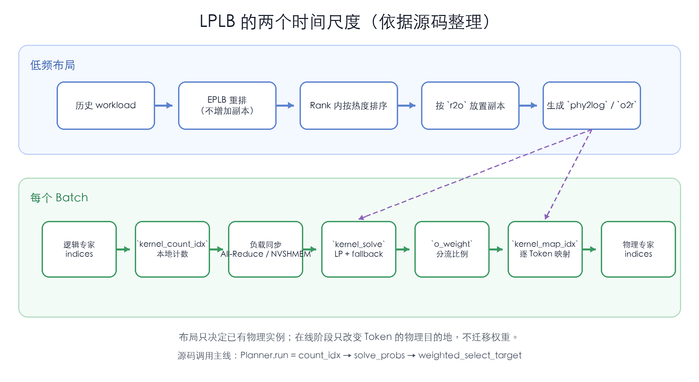
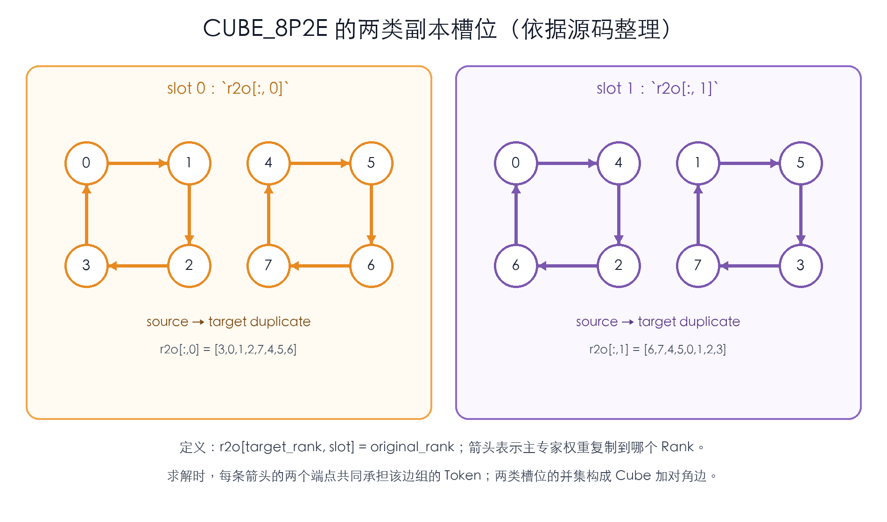

# LPLB：在固定副本图上实时分流 Token

## 动机

LPLB 把负载均衡拆成两个时间尺度：

- **低频准备副本图**：根据历史负载重新排列 Expert，选择值得复制的热 Expert，再按照预设的 Rank 连接关系放置副本。
- **每个 batch 实时分流**：根据当前 Router 结果，在已经存在的主实例与副本之间重新分配 token。

这样，历史统计只决定**提前准备哪些容量**，不直接决定当前 token 去哪里；当前 batch 的精确负载负责最后的分流，但不会临时搬动 Expert 权重。

本文依据本地 LPLB 源码仓库的 commit `0490f79`。仓库仍处于 early research stage，因此重点解释方法本身，不把实现说明当作完整系统结论。

## 方法

### 两个阶段的输入、输出与作用

| 阶段 | 输入 | 输出 | 作用 |
| --- | --- | --- | --- |
| 副本图阶段 | 历史 Expert 负载、每个 Rank 的 Expert 容量、用户选择的逻辑副本配对模板 | 一份包含主实例和副本的布局 | 决定哪些 Expert 可以在两个 Rank 上执行，从而限定在线分流的可行域 |
| 在线分流阶段 | 当前 batch 的 Router 结果、已经准备好的副本图 | 每个 token 对应的物理实例目的地 | 不改变逻辑路由，只决定当前 token 由主实例还是副本执行 |

副本图阶段输出的不是一份 token 分流方案，而是一张**容量图**：

- 图的顶点是 Rank。
- 一条边表示某个逻辑 Expert 在边的两个端点上各有一个物理实例。
- 当前 batch 中，这个 Expert 的 token 只能在这两个实例之间分配。

在线阶段输出的则是当前 batch 的实际执行方案。它保留 Router 选择的逻辑 Expert，只把“由哪个物理实例执行”补充完整。Token Dispatch、Expert 计算、梯度同步以及真正的权重迁移仍由上层训练系统负责。

### 副本图怎样生成

副本图不是直接由历史负载一步求出来的。LPLB 先生成一份没有副本的基础布局，再在这份布局上选择热 Expert，最后才用 Rank 连接拓扑决定副本放在哪里。

#### 先调用 EPLB：重排所有主实例

第一步调用 EPLB，但关闭 EPLB 的复制能力。输入是各 Expert 的历史负载，输出是一份**无冗余的重排布局**：

- 每个逻辑 Expert 仍然只出现一次。
- Expert 的主实例可能从原来的 Rank 移到另一个 Rank。
- 各 Rank 获得相同数量的 Expert。
- EPLB 尽量避免把多个长期热点集中在同一 Rank。

为什么不能直接保留初始布局，只复制最热的 Expert？

- LPLB 的在线阶段只能沿已有副本边转移部分负载。
- 没有副本的 Expert 仍然完全固定在主实例所在 Rank。
- 如果基础布局本身把多个热点堆在同一 Rank，即使给其中少数 Expert 建立副本，剩余固定负载也可能让这张卡始终最忙。

因此 EPLB 的目的不是完成最终均衡，而是先把**不可在线移动的基础负载**摆得合理，为后面的成对副本分流留下空间。

假设有 4 个 Rank、8 个逻辑 Expert。EPLB 可能得到下面的中间布局：

| Rank | 无副本的 EPLB 中间布局 |
| --- | --- |
| Rank 0 | Expert 0、Expert 5 |
| Rank 1 | Expert 2、Expert 7 |
| Rank 2 | Expert 1、Expert 4 |
| Rank 3 | Expert 3、Expert 6 |

这里 8 个 Expert 各出现一次，还没有任何副本。从这一步开始，“某 Expert 的主实例所在 Rank”指它在 EPLB 重排后的 Rank，而不是模型初始化时的位置。

#### 再选热 Expert：决定有限副本给谁

LPLB 随后在每个 Rank 内按照历史负载排列本地 Expert，把有限的副本槽位优先给更热的 Expert。

沿用上面的例子，如果每个 Rank 只能增加一个副本，就可能选出：

- Rank 0 的 Expert 0。
- Rank 1 的 Expert 2。
- Rank 2 的 Expert 1。
- Rank 3 的 Expert 3。

到这里，只决定了**复制谁**，还没有决定副本的目标 Rank。

#### “拓扑”是副本配对规则，不是物理网络

这里的“拓扑”不是 GPU 之间真实的 NVLink、NVSwitch 或 RDMA 连接。它是一张人为规定的**逻辑副本图**：

- 顶点是 Rank。
- 一条边连接一个主实例所在的 Rank 与它的副本 Rank。
- 这条边表示：该 Expert 的 token 可以在两个端点之间分流。

在还没有选择具体 Expert 时，这张图只是一副 Rank 骨架。历史负载决定每条边最终承载哪个热 Expert 后，它才成为实际的副本图。

源码用 `r2o` 保存这副骨架。它的索引方向是：

$$\mathrm{r2o}[\text{目标 Rank},\ \text{槽位}]=\text{主实例所在 Rank}.$$

也就是说，站在目标 Rank 的某个副本槽位上，`r2o` 回答“这个槽位应该复制哪个 Rank 选出的热 Expert”。如果要反过来从主实例所在 Rank 查询副本放到哪里，源码会使用它的反向映射 `o2r`。

`r2o` 不是 EPLB 的输出，也不是 LP 求出来的。它是用户预先选择的配对模板。用户通常会参考真实机器的网络结构选择它，例如尽量让大部分边落在同一节点；但逻辑副本图和物理网络仍是两回事。

先看最简单的 Ring。假设 4 个 Rank 各选出一个热 Expert，配对规则是：

- Rank 0 的热 Expert 复制到 Rank 1。
- Rank 1 的热 Expert 复制到 Rank 2。
- Rank 2 的热 Expert 复制到 Rank 3。
- Rank 3 的热 Expert 复制到 Rank 0。

把它应用到前面的候选 Expert 后，最终布局是：

| Rank | 主实例 | 新增副本 |
| --- | --- | --- |
| Rank 0 | Expert 0、Expert 5 | Expert 3 的副本 |
| Rank 1 | Expert 2、Expert 7 | Expert 0 的副本 |
| Rank 2 | Expert 1、Expert 4 | Expert 2 的副本 |
| Rank 3 | Expert 3、Expert 6 | Expert 1 的副本 |

这张环形副本图只表示实例在哪里：

- Expert 0 只存在于 Rank 0 和 Rank 1，因此它的 token 只能在这两张卡之间分。
- Expert 2 只存在于 Rank 1 和 Rank 2，因此它的 token 只能在这两张卡之间分。
- Expert 4–7 没有副本，所有 token 必须留在唯一的主实例所在 Rank。

一个 token 不会沿 Ring 从 Rank 0 逐跳走到 Rank 2 或 Rank 3。对单个 Expert 来说，它始终只有一条“主实例—副本”边。Ring 的意义是让**不同 Expert 的边首尾衔接**：Rank 1 可以替 Rank 0 承接 Expert 0，同时把自己 Expert 2 的部分负载交给 Rank 2，于是多条独立的分流共同把负载向更大范围传播。

#### 一条 Rank 边也可以承载多个 Expert

Rank 连接数和物理副本槽位数不一定相同。当每个 Rank 的副本槽位多于拓扑连接数时，LPLB 会让多个热 Expert 共享同一条 Rank 边：

- 这些 Expert 都在相同的两个 Rank 上拥有实例。
- 它们的当前负载先合并成一条“边组”的负载。
- 在线 LP 为整个边组求一个共同分流比例。
- 这个比例再分别应用到组内每个 Expert。

这样做使 LP 大小只取决于 Rank 数和拓扑边数，而不随合并了多少 Expert 增长。代价是组内 Expert 不能各自选择不同的最优比例。

一份配对模板只覆盖 `group_size` 个 Rank。如果整个 EP group 更大，LPLB 会把它切成

$$n_{\text{group}}=\frac{\text{EP size}}{\text{group size}}$$

个独立的副本图子组。每个子组复用同一套配对模板并单独求解 LP，不同子组之间没有副本边，因而不能在在线阶段互相借用容量。

#### Cube、Hypercube 与 Torus 只是三套配对模板

Ring 中每个 Rank 只选一组热 Expert，并把它复制给一个伙伴。Cube、Hypercube 和 Torus 的共同变化是：**每个 Rank 把热 Expert 分成两组，两组分别复制给两个不同伙伴。**

一组 Expert 属于哪条边由它所在的组决定；同一个 Expert 仍然只会复制到一个目标 Rank，不会因为整张图有很多边就出现很多副本。

##### Cube：在 8 个 Rank 内提供两种配对方向

Cube 模板覆盖 8 个 Rank。第一组 Expert 沿下面两条四卡环放置副本：

- `0 → 1 → 2 → 3 → 0`。
- `4 → 5 → 6 → 7 → 4`。

第二组 Expert 使用另一套交叉连接：

- `0 → 4 → 2 → 6 → 0`。
- `1 → 5 → 3 → 7 → 1`。

两套边叠加以后，8 个 Rank 被连接成仓库所称的 Cube with diagonal edges。下图把两组边分开画出；箭头只表示“源 Rank 的这组热 Expert 在目标 Rank 上建立副本”。

Cube 的直觉不是“token 沿立方体传很多跳”，而是：

- 每个 Rank 有两组热 Expert，可以分别借用两个不同 Rank 的容量。
- 它也会从另外两个 Rank 接收副本。
- 多组 Expert 的负载转移互相腾挪，使 8 张卡可以联合均衡。

如果这 8 个 Rank 恰好位于一个 8-GPU 节点内，Cube 可以把副本与在线分流限制在节点内。若 Rank 编号跨节点，同一模板同样可能产生跨节点通信；名字本身不保证通信局部性。

##### Hypercube：把同样的想法扩到 16 个 Rank

Hypercube 覆盖 16 个 Rank，也让每个 Rank 的两组热 Expert 使用两套不同伙伴：

- 第一套连接把 `0–3`、`4–7`、`8–11`、`12–15` 分别连成四卡环。
- 第二套连接跨越这些小组，例如把 `0 → 4 → 8 → 12 → 0` 连起来；其他相同位置的 Rank 也形成对应环。

第一套负责小组内交换，第二套把四个小组连接起来。两套边合并后，16 个 Rank 构成仓库所称的 Hypercube。它比 8-Rank Cube 覆盖更大的均衡范围，但副本放置和 token 通信也可能跨越更远的设备。

##### Torus：把 Rank 排成可环绕的二维网格

Torus 先把 Rank 想象成一个二维网格：

- 每个 Rank 的第一组热 Expert 复制到纵向邻居。
- 第二组热 Expert 复制到横向邻居。
- 网格边界首尾相接，因此最上方与最下方、最左侧与最右侧也相邻。

如果把网格的一维对应“节点”、另一维对应“节点内 GPU”，就可以让一类边连接节点内 Rank，另一类边连接相邻节点。这是一种人为安排，仍取决于 Rank 编号怎样映射到机器。

三种名字描述的是逻辑图形，而不是三套不同的 LP。后面的在线优化完全相同，变化的只有哪些 Rank 之间已经准备了同 Expert 副本：

| 模板 | 覆盖范围 | 适合表达的取舍 |
| --- | --- | --- |
| Cube | 固定的 8 Rank 子组 | 优先在较小范围内均衡，常用于对应单个 8-GPU 节点 |
| Hypercube | 固定的 16 Rank 子组 | 用更大图获得更多负载传播路径 |
| Torus | 可参数化的二维 Rank 网格 | 显式区分两种邻接方向，便于映射节点内与节点间连接 |

LPLB 的 LP 不直接知道 NVLink、RDMA 或节点距离。因此选择模板，本质上是在求解前确定两个边界：

- 哪些空闲 Rank 有资格帮助某个热 Expert。
- 为获得更大均衡空间，愿意承担多远的权重放置和 token 通信。

### 在线 LP：在已有边上分配当前 Token

副本图固定后，每个 batch 只改变各 Expert 收到的 token 数。当前负载按下面的路径进入 LP：

- 每个 Rank 在 GPU 上统计本地 Router indices，得到逐逻辑 Expert 的本地 token 数；无效的 `-1` 不计入负载
- EP group 内把各 Rank 的本地计数求和，得到全局逐 Expert 负载；普通 process group 使用 All-Reduce，与 DeepEP 集成时可以把这次同步并入 GPU 求解路径
- 全局负载交给各副本图子组的 LP；与此同时，本地统计还保留 Expert 内部的 token 序号，供求解后生成逐 token 目的地

这些负载分为两类：

- **固定负载**：来自没有副本的 Expert，只能留在主实例所在 Rank。
- **可分流负载**：来自已经建立副本的 Expert，可以在对应边的两个端点之间拆分。

LP 不把每个 token 都设成变量，而是为每条边组求一个比例：

- 多少负载留在主实例所在 Rank。
- 多少负载交给副本 Rank。

设 $f_r$ 是 Rank $r$ 上不能转移的固定负载，$w_{r,d}$ 是该 Rank 第 $d$ 条边组的当前负载，$a_{r,d}$ 是留在主实例所在 Rank 的比例，$p_d(r)$ 是副本所在 Rank。LPLB 最小化所有 Rank 中的最高负载：

$$
\begin{aligned}
\min\quad & t \\
\text{s.t.}\quad
& f_r
  + \sum_d a_{r,d}w_{r,d}
  + \sum_{(u,d):\,p_d(u)=r}(1-a_{u,d})w_{u,d}
  \le t, && \forall r,\\
& 0\le a_{r,d}\le 1.
\end{aligned}
$$

第一条约束中的三部分分别是：

- 本 Rank 无法移走的固定负载。
- 自己名下的边组留下的负载。
- 其他 Rank 沿副本边转移进来的负载。

LP 会同时协调多条边，而不是简单地让每个热 Expert 对半分。例如：

- Rank 0 的热 Expert 可以把一部分 token 转给 Rank 1。
- Rank 1 又可以把自己另一条边上的负载转给 Rank 2。
- 第二次转移为 Rank 1 腾出空间，使它能够替 Rank 0 承接更多 token。

这说明图上的边虽然只连接两个 Rank，多条边联合起来仍能把负载传播到更大的范围。但传播始终受固定图约束；没有相应 Expert 副本的 Rank 无法被 LP 使用。

LPLB 只最小化 token 数峰值。它没有进一步建模：

- Grouped GEMM 耗时与 token 数之间的非线性关系。
- token 的源 Rank 以及本地命中率。
- 节点内和跨节点通信成本的差异。

因此更均衡的 token 数通常有助于降低计算长尾，但不保证通信时间也达到最优。

### 从分流比例到每个 Token 的目的地

LP 只给出边组比例，Dispatch 需要的是每个 token 的确切物理实例。LPLB 的落地过程可以概括为：

- 对当前源 Rank 上选择同一逻辑 Expert 的 token 编号。
- 根据该 Expert 所在边组的比例，决定其中多少 token 留在主实例。
- 剩余 token 改写为副本的物理实例 ID。
- 对序号做确定性打散，避免连续 token 整段落到同一目的地。

最终输出与 Router indices 形状相同，但含义不同：

- Router 输出“这个 token 选择了哪个逻辑 Expert”。
- LPLB 输出“这个 token 应由该逻辑 Expert 的哪个物理实例执行”。

未复制 Expert 的 token 始终映射到唯一主实例。被复制 Expert 的 token 才会根据 LP 比例在两个物理实例间拆分。

连续比例最终必须落到整数 token。LPLB 没有先构造一份严格的全局整数配额，而是让每个源 Rank 在自己的本地 token 上独立应用同一比例：各 Rank 分别得到一个整数划分，主实例与副本的全局 token 数再由这些本地结果相加。因此，全局结果可能与“全局负载乘连续比例”存在少量离散化误差。

### 为什么在线求解足够小

LPLB 能把 LP 放进每个 batch 的关键路径，关键不只是使用 GPU，而是先通过副本图压缩了问题：

- 每个被选 Expert 只有主实例与一个副本。
- token 只能沿预设边在两个端点之间分流。
- 同一 Rank 边上的多个 Expert 可以合并并共享比例。
- 因此 LP 规模只由拓扑子组的 Rank 数和每 Rank 的连接数决定，不随 batch token 数增长。

仓库使用一个小型 GPU 内点求解器，并采用固定迭代次数，使执行时间不会随收敛速度大幅波动。求解结果若没有通过可用性检查，该拓扑子组就退回主实例与副本各承担一半的确定性方案。

这种设计追求的不是高精度通用 LP，而是：

- 问题规模固定。
- 在线延迟可预测。
- 求解失败时仍有立即可用的退路。

README 将节点内求解描述为约 $100\,\mu s$，但仓库没有给出包含负载同步、Token All-to-All、Expert 计算和布局迁移的完整端到端训练结果。

## 代价与适用条件

LPLB 的主要优势是把两种波动分开处理：

- 历史统计负责决定长期值得准备的副本容量。
- 当前 Router 结果负责吸收逐 batch 波动。
- 在线阶段只改 token 目的地，不移动模型状态。

对应的限制是：

- **历史选择仍可能过时**：当前突然变热、但历史阶段没有副本的 Expert 无法获得额外容量。
- **每个热 Expert 只有一个副本**：极端单 Expert 热点最多只能使用两个 Rank。
- **可行域由静态图锁定**：图外的空闲 Rank 无法参与。
- **边组共享比例会损失精细度**：多个 Expert 的最优分流比例可能并不相同。
- **拓扑只间接控制通信**：LP 本身只均衡 token 数。
- **低频布局不是免费操作**：真正更新副本图时仍需迁移参数；训练还要处理梯度和 optimizer state。
- **源码只覆盖规划部分**：完整数据平面和布局更新协议需要由外部系统补齐。

## 问题

当前仓库没有完整回答三项系统问题：

- Rank 连接拓扑应该怎样根据实际节点结构和通信代价自动选择，而不是由用户预先给定？
- 多久重新统计历史负载并更新副本图，才能让收益覆盖模型状态迁移成本？
- 连续 LP 比例分别落到各源 Rank 的整数 token 后，怎样给出全局精确配额或误差上界？

这些问题不改变 LPLB 的核心思路：先用历史信息准备一张小而固定的副本图，再用当前负载在图上实时分流；但它们决定了研究原型怎样接入完整训练系统。
