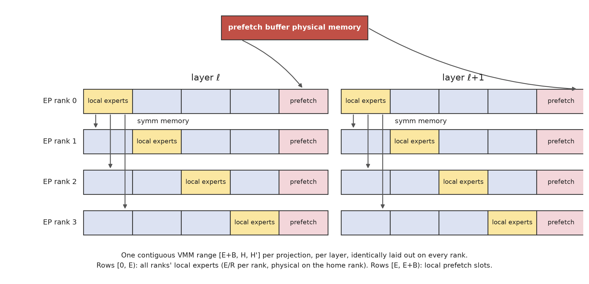
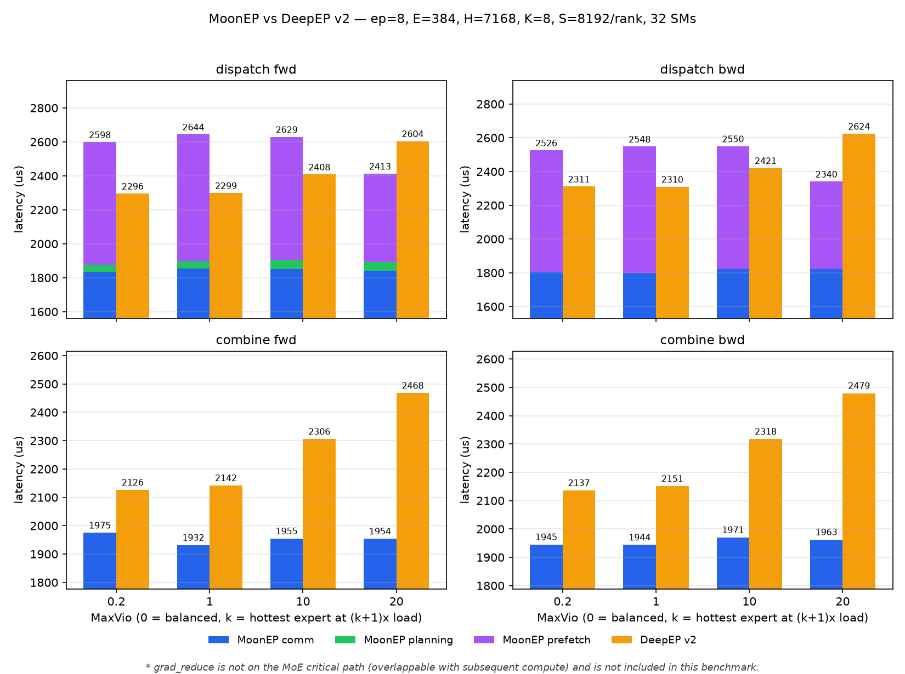

# MoonEP：用精确分流固定每个 Rank 的负载

## 背景

MoonEP 是 Moonshot AI 的 EP 通信与执行系统，不是一个可以单独摘出来的 planner。它使用对称内存，让每个 Rank 可以通过一致的地址布局访问本地或远端的通信 buffer、Expert 权重与梯度 buffer。

## 动机

MoonEP 不只想压低最忙 Rank 的峰值，而是要把每个 Rank 的当前负载精确固定为同一个常量，并把这一结果兑现成静态 shape 与零拷贝。支撑这个目标的是三件互相咬合的事：

- 在线规划：用当前 microbatch 的精确路由，算出一份「哪个专家的哪些 token 落到哪个 Rank」的完整分配表
- 动态冗余 Expert：需要被分担的远端 Expert，权重在 Expert 计算前预取到本地的固定槽位，而不是重排主实例
- 静态形状与零拷贝：因为每个 Rank 收到的 token 数恒定，通信 buffer 固定，形状在编译期已知

之所以说互相咬合，是因为收益并不是三份独立的收益相加。恒定的 token 数才让形状静态化成为可能，静态形状才让「直接写到最终位置」成为可能。具体收益会在后文的零拷贝章节逐项展开。

### 从压低峰值到消灭峰值

设每个 Rank 输入 $S$ 个 token，路由 top-$k$ 为 $K$，EP 规模为 $R$。MoonEP 要求的是：每个 Rank 的负载精确等于 $S \times K$，容量上限等于平均负载。

$$L_r = S \times K \quad (\forall r)$$

这里的 $S\times K$ 是每个 Rank 真正执行的 routed token 数。MoonEP 实际分配的通信与计算 buffer 记为 `NvS`，它还会在每个 VM group 的 token 段后加入 padding，因此 `NvS` 通常大于 $S\times K$。前者描述逻辑工作量，后者描述固定的物理槽位数，后文不能把两者混为一谈。

## 方法

MoonEP 的控制面与数据面共用同一份当前路由计划：它同时决定 token 的目的地、需要临时预取的远端 Expert，以及固定 buffer 中各段应使用的权重。本文不再用一张总图承载所有实现细节，而按分配、权重、执行时序、反向和零拷贝依次展开。

### 分配表怎么算出来

规划器的产出有三样，回答三个不同的问题：

- **分配表** $\mathrm{alloc}[e][d]$：专家 $e$ 的 token 里有多少落到 Rank $d$ —— token 往哪走
- **借用清单**：每个 Rank 要向哪几个远端专家借权重 —— 权重往哪走
- **`cu_seqlens`**：每一份权重负责哪一段 token —— 计算怎么对上

这一节只讲分配表，后两样属于权重章节。

规划开始前，每个 Rank 已经根据本地 Router 输出统计出一份 `tokens_per_expert`。各 Rank 将这份本地计数发布到 Rank 0 可访问的对称元数据区；Rank 0 汇集成「源 Rank × Expert」的全局精确负载，再集中生成分配表、借用清单和各个 token 段的元数据。规划结果写回所有 Rank 都能访问的对称内存，其他 Rank 在发布同步完成后直接消费同一份结果，不需要把数据拉回 host。

分配表由两级贪心求出，两级优化的目标并不相同：第一级决定 Rank 之间收发多少 token，把均衡做到底；第二级决定这些额度由哪些 Expert 出，优化的是要借的权重份数。

--- 

**第一级：定 Rank 之间的收发额度。** 把主实例位于同一 Rank 的 $E/R$ 个 Expert 看作一个主实例组，先算出每个组收到的 token 总数，减去容量得到盈亏：

$$\mathrm{balance}_h = \mathrm{group\_tokens}_h - S \times K$$

这里的“主实例组”按 **Expert 权重归属**划分，不按 token 的来源划分。一个组的 `group_tokens` 汇总的是所有源 Rank 路由到这组 Expert 的 token。所以下文所说某个主实例组是“发送方”，意思是把其中一部分 Expert 计算从主实例所在 Rank 转交给另一个 Rank；它不是说这些 token 原本都由这个 Rank 持有，也不是让 token 沿着 Rank 之间的边逐跳转发。真正的源 Rank 只在后面的逐 token 目的地映射中出现。

显然 $\sum_h \mathrm{balance}_h = 0$，盈余与亏空必然配对存在。于是反复取最盈余的主实例组与最亏空的目标 Rank 配对，**搬运量取接收方的全部亏空——不看发送方有没有这么多盈余**。搬完接收方的盈亏归零，发送方则扣掉这个搬运量，可能因此变成负数。

允许发送方欠账是这个循环成立的关键。假设三个 Rank 的盈亏是 $-20, +10, +10$，最亏空的要 20 而最盈余的只有 10，看起来凑不齐：

```text
初始      A: -20    B: +10    C: +10
第 1 轮   B → A 搬 20         A 归零，B 被抽到 -10
          A:   0    B: -10    C: +10
第 2 轮   C → B 搬 10         B 归零，C 恰好归零
          A:   0    B:   0    C:   0    退出
```

B 先当发送方、超额送出之后转为接收方，再由 C 补齐。**这样每一轮都能把一个 Rank 的盈亏永久置零**，最多 $R$ 轮就结束，不需要任何回溯或凑数的逻辑。

这个策略还有一个后面要用到的性质：**每个 Rank 作为接收方最多出现一次。** 它的 balance 被置零之后就不会再变——既不可能再被选为接收方（若 0 已是最小值，则所有值非负，而总和为 0 意味着全为 0，循环已退出），也不可能被选为发送方（同理会触发退出）。而作为发送方可以出现多次，只要盈余没被抽完。所以上例中 B 虽然两次参与，但**它收 token 只从 C 这一个主实例组收**。这一点在权重章节会用到。

***

**第二级：把额度拆到具体专家。** 额度只给了数量，没给身份。举个例子，设容量为 100，Rank 0 名下四个专家的 token 数是 70、60、30、20，共 180，超出 80，第一级判定它要向 Rank 2 送 60、向 Rank 3 送 20。这 80 个 token 从哪几个专家身上出，第一级没说。**我们希望拆出的专家数量尽可能少**。

考虑两种拆法：

- 每轮取最热的专家：专家 0 出 60 给 Rank 2，专家 1 出 20 给 Rank 3。**动了 2 个专家**
- 挑小的搬：专家 2 出 30、专家 3 出 20、专家 1 出 10 凑成 60 给 Rank 2，专家 1 再出 20 给 Rank 3。**动了 3 个专家**

两种拆法送出的 token 数完全一样，各 Rank 最终负载也完全一样。均衡质量在第一级就已经锁定，第二级怎么拆都不会让任何 Rank 的负载差一个 token。

差别在**被动过的专家种类数**：2 种还是 3 种。这个数字要紧，是因为接收方要算这些 token 就得持有对应专家的权重，而它能同时持有的份数有上限。**token 数与权重份数是两笔独立的开销**，第一级管住了前者，后者只由种类数决定。

于是第二级的规则是每轮取最大的剩余额度与本地剩余 token 最多的专家，搬走两者的较小值。取最热的直觉是**凑一个固定的总量，用大块拼比用小块拼需要的块数少**：要搬 80 个 token，如果有一个专家一个人就有 70 个，一次就解决了大部分。它不保证种类数全局最优，但方向对，且一步都不用回溯。

***

**从分配表到每个 token 的目的地。** 与 UltraEP 的区间查找同构，区别是这里的编号是全局的。每个 routed token 在它的目标 Expert 内部有一个全局序号，等于本 Rank 内的局部序号加上前面所有源 Rank 在该 Expert 上的 token 数前缀和；对 $\mathrm{alloc}[e][\cdot]$ 沿 Rank 维求前缀和得到一串边界，序号落在哪个区间就送往对应的 Rank。因为各 Rank 分到的份额之和恰好等于该 Expert 的 token 总数，每个 token 必然落在唯一一个区间里。最终目的地被编码成一个整数：高位是 Rank 号，低位是该 Rank 内的偏移。

***

**求解本身在 GPU 上、不落回 host。** MoonEP 由 rank 0 集中求解，结果通过对称内存分发给所有 Rank，整个过程在一次 cooperative kernel 内完成。这与 UltraEP 的「各 Rank 拿相同输入独立算出相同结果」是两种消除同步的办法：集中求解需要一次结果分发，但只算一遍。

### 权重：预取到固定槽位，而不是迁移

分配表定完，token 的归属就固定了，随之出现一个新问题：有些 token 落到了不持有对应专家权重的 Rank 上。这一节从头到尾只讲这一件事——**接收方怎么拿到这些权重**。

**为什么不重排主实例。** 一个思路是把过热 Expert 的主实例整体重排到闲卡上，但那要改变参数的归属，训练时还得跟着改优化器状态与梯度归约的目标，而这个归属每个 microbatch 都在变。MoonEP 的选择是主实例永远待在自己的 Rank 上，接收方只**临时借一份拷贝**，算完就扔。

借这件事分四步：留出地方放、决定借哪几个、把权重搬过来、让 GEMM 用上。



#### 留出地方：一段连续的 $[E+B]$ 行

每层的每个投影（gate/up/down 各一个矩阵）都持有一段连续的权重，共 $E+B$ 行，且**在所有 Rank 上的布局完全一致**：

```text
行 0 .. E-1        全部 Rank 的主实例，每个 Rank 占 E/R 行
                   这段不是拷贝——它就是各主实例所在 Rank 自己的参数显存，
                   通过对称内存映射到每张卡的同一个地址区间上
行 E .. E+B-1      本机的 B 个预取槽位，每步填入这一次借来的远端专家
```

后 $B$ 行就是**预取槽位**，$B$ 决定一个 Rank 同时最多能借几个远端专家，它是这一节的核心参数。

前 $E$ 行的性质要说清：它**不占额外显存**。每个 Rank 只真实持有属于自己的那 $E/R$ 行，其余部分是对称内存映射过来的远端地址。所以这张「全局权重表」在每张卡上看起来都是完整的 $E+B$ 行，但物理上只有自己那一段加上 $B$ 个槽位是本地内存。

连续是硬要求，因为 group GEMM 靠行号寻址：它拿到一段 token 和一个行号就去算，不做任何地址转换。**寻址方式如此原始，才有了后面「换一个行号就换一份权重」的效果。**

#### 决定借哪几个：规划阶段按热度截断

一个 Rank 这一步需要的远端专家可能不止 $B$ 个。规划器的处理是把这些专家按 token 数排序，循环恰好 $B$ 次，每次取当前最热的填进一个槽位、取完置零，剩下的直接标记为不借。

没拿到槽位的那些 Expert 称为**溢出**。它们的权重不被复制，GEMM 直接从主实例所在 Rank 读。

两个要点：

- **截断发生在规划阶段，不是运行时。** 交给 GEMM 的时候，哪些专家在本地槽位、哪些不在已经全部定好，运行时没有任何判断分支。溢出是规划的正常输出，不是 fallback
- **按热度排序是唯一的选择依据**，理由是被舍弃的必然是 token 最少的那些专家，代价作用在最小的计算量上

#### 把权重搬过来

预取是一个独立的 kernel，按借用清单把选中的远端 Expert 从主实例所在 Rank 的参数显存复制进本地槽位。因为源和目标都在对称内存里，这就是一次跨卡的连续块拷贝，没有任何元数据交换。

**它必须在本层 GEMM 开始前完成，而可用的时间窗口很窄。** 这个时序约束以及能不能被藏起来，见后面关键路径一节。

#### 让 GEMM 用上：`cu_seqlens`

group GEMM 需要知道每一行权重要处理哪一段 token。这个信息由 `cu_seqlens` 给出：它是一个长度 $E+B$ 的数组，第 $g$ 项是第 $g$ 行对应的 token 段在 token buffer 里的结束偏移，相邻两项之间就是这一行要算的 token。

规划器把某个专家的 token 段挂到哪一行，就决定了这些 token 由哪份权重来算：

| 专家的情况 | token 段挂在哪一行 | 权重实际来自 |
| --- | --- | --- |
| 本地主实例 | 它自己那一行（$< E$） | 本地显存 |
| 借来的远端专家 | 一个预取槽位（$[E, E+B)$） | 本地显存，已复制进来 |
| 溢出的远端专家 | **它原本那一行**（$< E$） | 对称内存映射的远端地址 |

三种情况对 GEMM 完全一样：拿一个行号去读权重。第三种之所以不需要任何特殊代码，正是因为前 $E$ 行本身就是全局映射——**同一个行号，在本地卡上读到的就是远端那份权重**。

于是**一次 group GEMM 同时算完了本地专家、借来的专家和溢出的专家**，计算侧不需要分支，甚至不知道哪些专家不是自己的。

#### $B$ 取多少

**推理只需要前向，$B$ 可以很小**，取 3 到 4 就够，超出的部分靠溢出兜住。

**训练必须取 $B = E/R$**，也就是必须保证不发生溢出。理由是反向要把借来 Expert 的梯度归约回主实例所在 Rank，这要求梯度产生在本地一块可控的 buffer 里；溢出 Expert 的权重是远程读来的，本地没有对应槽位，梯度就无处安放。

$E/R$ 这个数字不是随手取的上界，它来自第一级那个性质：**每个 Rank 作为接收方最多出现一次**，也就是它收到的 token 只来自一个主实例组，而一个主实例组只有 $E/R$ 个 Expert，所以任何 Rank 需要借的种类数都不超过 $E/R$。取 $B = E/R$ 就一定不溢出。

三件事在这里咬合起来：第一级的配对策略给出了种类数的**上界**，第二级的取最热压低了种类数的**实际值**，$B$ 决定了超出部分的**处理方式**。

#### 显存代价：$B$ 份权重的总量，不是每层 $B$ 份

预取槽位的物理显存来自一个**进程级的全局 pool，所有层共用一份**。因为任一时刻只有一层在算，用完就还，下一层接着用同一块。所以额外显存是 $B$ 份专家权重的总量，与层数无关。

代价是每一层都必须在自己的计算开始前把权重物化到位，物化因此落在关键路径上，成为一个逐层的 deadline。它付出的代价是：**把一个显存容量问题换成了一个时序问题。**

### 关键路径

一层 MoE 前向的时间线：

<CriticalPathTimeline
  planning="集中在线规划"
  weight-movement="Weight Prefetch"
  compute="VM Grouped GEMM"
  note="Planning → Weight Prefetch → Token Dispatch → Grouped GEMM → Combine。"
  resource-note="Weight Prefetch 与 Token Dispatch 可以并行，但会竞争 NVLink 带宽；时间线默认采用串行的保守画法。"
/>

**规划是无法重叠的串行前缀。** dispatch 要用它算出的目的地偏移，prefetch 要用它选出的专家列表，两者都必须等它。而规划自己又必须等 Router 出分。这是「用当前实例的精确信号」这个选择的固有代价：信号在最后一刻才可得，基于它的决策就只能排在它后面。

**预取与 dispatch 竞争带宽，虽然可以并行执行，但是没有性能收益。** 两者都排在规划之后、GEMM 之前，且互不依赖——一个搬 token，一个搬权重。MoonEP 把它们放在通信流上异步发起，靠事件在 GEMM 前汇合。

剩下三种重叠也都不成立：

- **不能与本层 GEMM 重叠。** GEMM 摸到预取槽位时权重必须已经在位，这是硬依赖
- **不能与前一层的计算重叠。** 预取哪些专家取决于本层的 Router 输出，而本层 Router 要等前一层算完。想提前预取就必须提前知道信号，那等于退回到历史统计
- **不能提前几层开始预取。** 槽位的物理显存来自跨层共享的 pool，此刻正被上一层占着

溢出 Expert 的权重在 GEMM 内远程读取，其成本取决于计算强度；具体适用条件见后文。

### 反向：借来的梯度必须还回去

前向借权重是只读的，代价只有搬运。反向不一样：借来的那份权重会在本地产生梯度，而这份梯度在物理上属于别人的参数。**如果不还回去，训练结果就与无副本的形态不等价了**。

所以反向必须多做一件前向没有的事：把散落在各个 Rank 预取槽位上的梯度收集回主实例所在 Rank。

#### 梯度为什么需要一套独立的 buffer

最省事的做法是让梯度缓冲完整镜像权重的布局：同样连续的 $[E+B]$ 行，前 $E$ 行是各 Rank 的参数梯度，后 $B$ 行是预取槽位的梯度。MoonEP 的布局确实是这样，但**后 $B$ 行背后不能是参数梯度的一部分**。

原因在框架侧：训练框架自己会做一遍梯度归约，它的做法是扫描所有注册的参数梯度并做 AllReduce。如果预取槽位的梯度混在这片区域里，框架会把它们当成某个参数的梯度一起归约掉——而这些梯度本来就要被 MoonEP 自己送回主实例所在 Rank，于是同一份梯度被累加了两次。

所以这 $B$ 行背后是一块**独立的 reduce buffer，对框架完全不可见**。它的物理显存同样来自跨层共享的 pool，与预取槽位一样。这里体现的是一个一般性的麻烦：**任何在框架背后自行管理梯度的机制，都必须保证自己的中间产物不落在框架会扫描的区域里。**

#### 归约靠远程读，而不是让持有方发回去

收集梯度有两个方向可选，MoonEP 选了后者：

- **持有方推**：借了别人 Expert 的 Rank 主动把梯度写回主实例所在 Rank。问题是谁借了谁是逐 microbatch 变化的，每个主实例所在 Rank 事先不知道会有几个人给它写、什么时候写完，需要一套计数或信号机制来判断「我的梯度齐了没有」
- **归属方拉**：每个 Rank 主动去所有 Rank 的 reduce buffer 里找属于自己专家的那些槽位，读回来累加。谁该读什么由分配表决定，而分配表所有 Rank 都有一份，**于是不需要任何额外的协商**

具体做法是每个 Rank 把所有 $R$ 个 Rank 的 reduce buffer 映射成一个统一的 $[R, B, \cdots]$ 视图——这正是对称内存直接给出的能力。然后各自去读那些持有自己专家梯度的槽位，累加进本地参数梯度。读完之后还要清零自己的槽位，因为下一个 microbatch 要重新往里累加，残留的旧值会污染结果。

#### 清零由各 Rank 在本地做，而不是顺便远程写

读阶段每个 Rank 都在从远端拉数据，占的是读方向的带宽；写方向看起来是空闲的。于是一个自然的优化是在远程读的同时顺手把读完的远端槽位写零，把清零这个阶段完全省掉。

MoonEP 选择由各 Rank 单独运行本地清零；共享带宽对这个选择的影响见后文。

### 零拷贝：完美均衡是它的前提

这一节讲的是收益的兑现方式。前面把每 Rank 负载钉成常量，直接效果只是消掉了等待；但它同时把「形状」从运行时变量变成了编译期常量，而这件事解锁的东西比均衡本身更多。

#### 恒定的 token 数带来了什么

每个 Rank 每层真正执行的 routed token 数恒为 $S \times K$；加上每个 VM group 的固定 padding 后，通信与 Grouped GEMM 看到的物理槽位数恒为 `NvS`。于是三件事同时成立：

- 通信 buffer 可以固定为 `NvS` 行，不必按运行时峰值逐层重新分配
- 后续算子的形状不再依赖运行时的实际计数，**于是不需要每层把计数同步回 host 再决定形状**。常规实现里这个同步是逐层的，它会把 GPU 的执行流打断，让 CPU 追不上 GPU 的下发节奏
- 每一层每一步的激活形状都相同，显存分配模式稳定

第三点的分量容易被算少。常规实现里高不均衡下的 OOM 往往不是显存总量不够，而是**碎片化**的结果：形状反复变化，分配器不断申请和释放大小各异的块，最终留下一堆无法合并的空洞。形状恒定之后这类 OOM 从原理上消失了，与显存总量够不够无关。

#### 零拷贝本身：把偏移提前算出来

常规的 EP 实现里，一次 MoE 层要做三次数据搬动：

```text
dispatch 收到 token（按源 Rank 排列）
    │
    ├─ permute ──→ 重排成按专家分组的顺序，group GEMM 才能用
    │
    ├─ 专家计算
    │
    ├─ unpermute ─→ 排回 token 原本的顺序
    │
    └─ 从通信 buffer 拷一份到用户 buffer
```

这三次搬动都是纯开销，它们存在的原因是**通信只负责把数据送到，不负责送到对的位置**。而要送到对的位置，就得事先知道每个 token 在目标 Rank 的专家分组布局里的确切偏移——这个偏移取决于所有源 Rank 送来的 token 怎么排布，在动态形状下运行时才能确定。

MoonEP 的分配表恰好就是这个信息：前文那个「全局序号落在哪个区间」的计算，产出的不只是目的 Rank，还有该 Rank 内的精确偏移。于是**源 Rank 可以直接把 token 写到它在远端专家分组布局里的最终位置**，不需要在接收端再做一次按 Expert 的 permute。

不过，“直接把通信 buffer 交给计算”是 `zero_copy=True` 的集成路径，不是默认接口自动具备的性质：

- 默认 `zero_copy=False` 时，Dispatch 返回新张量；Combine 也会先把 FFN 输出复制进本地 NVLink shard，再启动通信
- `zero_copy=True` 时，Dispatch 返回通信 buffer 的视图，FFN 必须直接读取并原地写回这块视图；Combine 会检查输入确实与该 shard 共用同一地址
- 只有后一条路径消除了 FFN 与通信边界上的 copy，并把“通信结果就是计算输入/输出”真正兑现为零拷贝



MoonEP 的 combine 柱子是纯蓝的，没有 planning 和 prefetch。这是因为 combine 复用 dispatch 存下来的 plan，不必再规划；权重也已经在槽位里，不必再预取。

零拷贝在 Combine 上收益最大。MoonEP 不是让远端 Rank 主动把所有 Expert 输出推回 token 的源 Rank，再在源 Rank 上另做一次 unpermute；它复用 Dispatch 保存的目的偏移，按下面的数据流直接恢复 token-major 输出：

- Expert 计算结果留在目的 Rank 的 NVLink shard；在 `zero_copy=True` 下，这就是 FFN 原地写入的那块对称内存
- 如果同一 token 的多个 top-$k$ Expert 落在同一目的 Rank，目的 Rank 先运行 `combine_prologue`，把这些重复行在本地以 FP32 累加到代表行
- 所有 Rank 完成本地发布后进入一次跨 Rank 同步，保证远端 shard 已可见
- token 的源 Rank 根据 Dispatch 保存的目的 Rank 与行偏移，直接远程读取代表行，并按 token 的 $K$ 个结果累加成 $[S,H]$ 的 token-major 输出；这一步同时完成跨 Rank 收集、unpermute 和 top-$k$ 行求和

当前实现**没有在 Combine kernel 内用路由权重乘 Expert 输出**。`route_weights_nvs` 沿独立路径被收集回 `[S,K]`，交给上层单独使用。因此这里能说“融进通信路径”的是 unpermute 与 top-$k$ 输出求和，不能写成“按路由权重归约”。与 DeepEP 相比，`zero_copy=True` 还消除了 Combine 前把 FFN 输出拷入通信 shard 的边界 copy。

#### 同一 token 的多个 topk 落到同一个 Rank 时只传一份

一个 token 有 $K$ 个目标专家，这些专家可能有好几个落在同一个 Rank 上。这时要传的 payload 完全相同——就是这个 token 的 hidden state，把它传 $K$ 遍是纯浪费。

做法是在每个目的 Rank 内只保留第一次出现的位置作为代表，真正传输；其余位置标记为重复，跨卡只传一次，到目的地之后再本地展开成多行。

标记不能简单地填一个哨兵值，因为**原来的偏移必须可恢复**：每个 token-topk 条目有自己的路由权重，combine 时权重要逐条对上，所以必须知道这个重复条目原本该落在哪一行。做法是把偏移 $x$ 编码为 $-x-1$：

- 取负是为了让重复条目一定为负，一次符号判断就能识别，不需要额外的标记数组
- 减一是因为 $0$ 是一个合法偏移，而 $-0 = 0$ 无法与它区分；减一之后整个合法偏移区间 $[0, \infty)$ 被映射到 $(-\infty, -1]$，两边不再重叠

这是个小技巧，但它的意义在于**把「是否重复」和「原偏移是多少」两个信息压进了同一个整数**，省掉了一个与 token 数同长的辅助数组。真正的行复制在目的地本地展开，只花本地显存带宽，不占跨卡带宽。

## 代价与适用条件

### Prefill、Decode 与溢出代价

溢出 Expert 的权重访存能与计算重叠，而且这是它代价可控的原因。溢出的那部分权重要从远端读，但这次读发生在 GEMM 内部，而 GEMM 本来就是一条「取权重块 → 算 → 取下一块」的流水线。远端读只是把某些权重块的来源换成了 NVLink，延迟更长但流水线结构不变，可以被同一个 kernel 里其他块的计算掩盖。

能不能真的掩盖住，取决于计算强度：

- **Prefill 或大 batch 训练**：每份权重要服务大量 token，单块权重的计算时间长，足以盖住 NVLink 的延迟，溢出的代价接近于零
- **Decode 或小 batch**：Expert GEMM 本来就是权重访存主导的，本地 HBM 都盖不住，换成带宽低一个量级的 NVLink 只会让瓶颈更紧

所以推理下把 $B$ 调到 3 到 4 这个建议是有前提的：它假定计算强度足够高，能把远端读的延迟盖住。**溢出的代价与 batch 大小强相关**，小 batch 下它不再是可以忽略的一点访存。

需要强调的是，溢出**不影响均衡也不影响正确性**。token 的分配在第一级就定了，槽位够不够只改变权重从哪里读，不改变任何 Rank 承担多少 token，$\rho$ 仍然恒等于 1。溢出只是一笔可控的访存代价，而不是均衡质量的退化。

### 共享带宽与 Buffer 生命周期

预取与 dispatch 可以并行，但这个重叠不是免费叠加：**两者都吃 NVLink**，共享的带宽预算意味着重叠只能填掉彼此的延迟空隙，不能把两份流量压进一份时间。

反向中，一个自然的优化是在远程读的同时顺手把读完的远端槽位写零，把清零这个阶段完全省掉。这个优化是负收益的。**同一块 GPU 上同时进行的远程读与远程写共享同一份 NVLink 预算，每个方向大约各得一半。** 借用写方向不是白拿，它会把读阶段本身拉长，而拉长的时间超过本地清零那点开销——本地清零是纯显存带宽操作，根本不上 NVLink。

一般化的结论是：**NVLink 的两个方向不是两条独立的管道，反方向不能当成免费资源来用。** 判断一个「顺手做掉」的优化是否值得，要看它借用的资源是否真的空闲，而不是看那个阶段的名义方向。

零拷贝视图的生命周期受通信节奏约束：下一次通信会覆盖同一块 buffer，所以视图不能跨通信调用持有。需要 autograd 长期保存激活的场景必须退回到拷贝模式。这是一个典型的取舍——**零拷贝的本质是让上层直接使用底层的内存，所以底层的生命周期规则必然传染给上层。**

### 为什么 MaxVio=20 反而更快

comm 确实与 skew 无关，蓝色柱子在 1820–1860 之间几乎是平的。缩短的是紫色的 prefetch：从约 730 掉到约 523，降了近三成。原因在于一个容易被忽略的事实：prefetch 的成本只由「借了几种 Expert」决定，与「搬了多少 token」无关。

一份 Expert 权重的大小是固定的，跟它服务多少 token 毫无关系。所以 prefetch 的量 = 借用的 Expert 种类数 × 单份权重大小。

于是回到第二级贪心那个直觉——凑一个固定的总量，用大块拼比用小块拼需要的块数少：

- **MaxVio=20**：一个 Expert 的负载是平均的 21 倍。接收方的亏空，靠这一个超热 Expert 的 token 就能填满 → 只借 1 种 Expert → 1 份权重
- **MaxVio=1 或 10**：盈余分散在多个中等热度的 Expert 上，要凑够同样的亏空得动好几个 Expert → 借 2–3 种 → 2–3 份权重

极端 skew 让第二级贪心的工作变得更容易了。负载越集中，用来填坑的「块」越大，需要的块数越少，要搬的权重份数也越少。

这正好是一条反直觉的结论：对 MoonEP 来说，skew 不是敌人，分散的中度 skew 才是最贵的情形。它的时间曲线不是单调的，而是在中段最高、两端更低——左端因为总搬运量小，右端因为搬运的种类少。
