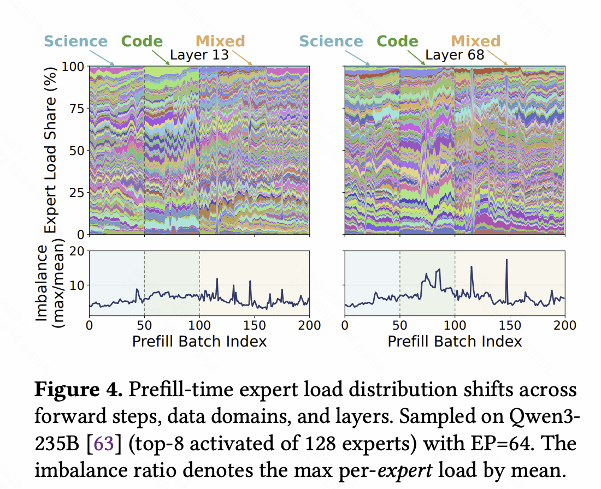
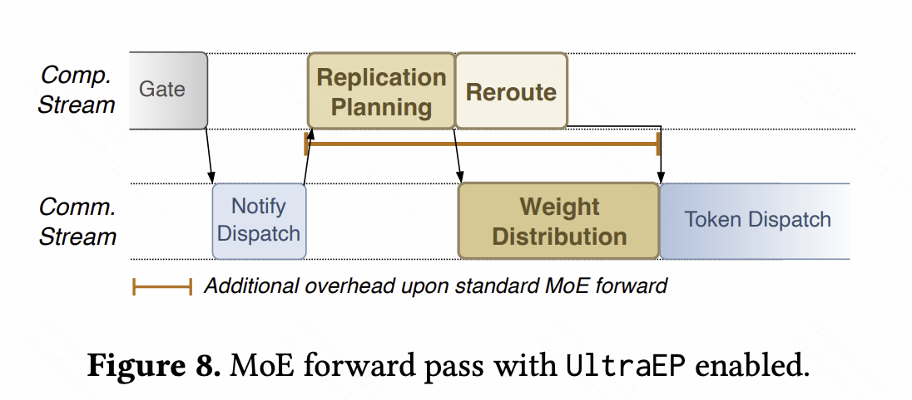

# EP 负载均衡：问题、动机、典型范式

## 问题与动机

MoE 把 Transformer 的 FFN 换成 $E$ 个并列的 Expert，每个 Expert 是一个独立 MLP。Router 给每个 token 打分，只挑出 Top-$k$ 个逻辑 Expert 参与计算：

```text
token → Router → 打分 → 选出 Top-k 个逻辑 Expert
                          │
                          ▼
                    只有这 k 个 Expert 参与计算
                    其余 E - k 个不激活
```

当全部 Expert 权重塞不进一张 GPU 时，就得把它们摊到多个 Rank 上，这就是 Expert Parallelism。进入 MoE 层之前，上游计算已经在各 Rank 上产生了一批本地 activation；对当前 MoE 层而言，这些 activation 就是该 Rank 持有的 token。这里说一个 token “属于”某个 Rank，意思是该 Rank 保存着它的当前状态，Combine 后还要在这里继续执行残差连接和后续层，并不意味着系统必须先使用 Sequence Parallel。

token 挑中的 Expert 可能位于别的 Rank，所以一层 MoE 通常要交换两次 token：

```text
Token-Owned 布局（每个 Rank 持有自己的 token）
        │
        ▼
Router / Top-k，得到每个 token 的目标逻辑 Expert
        │
        ▼
系统侧负载均衡：选择可执行的物理实例与 token 目的地
        │
        ▼
Dispatch：把 token 送到目标物理实例所在的 Rank
        │
        ▼
Expert-Owned 布局，本地执行 Grouped GEMM
        │
        ▼
Combine：把 Expert 输出送回 token 原来的 Rank
        │
        ▼
Token-Owned 布局，按 Router 权重加权合并
```

**token 在逻辑 Expert 之间的分布可能很不均匀**，这就是**负载不均衡**：少数 Expert 收下大量 token，成为热点。这会沿计算、通信、显存与后续执行产生几类直接后果：

- **计算长尾与利用率下降**：热点 Rank 的 Grouped GEMM 最晚结束，轻载 Rank 提前完成后只能等待，整层时间由最慢执行路径决定。
- **激活显存压力**（训练）：一个 Rank 收到的 token 越多，要保存的中间激活越大，严重时会触发 OOM。

解决办法分两类，分别作用在链路的两个不同环节：

- 算法侧负载均衡：训练时用 auxiliary loss、router bias 等手段，让 Router 一开始就给出比较均匀的分布。
- 系统侧负载均衡：在 Router 与 token dispatch 之间插一个负载均衡器，把逻辑 Expert 虚拟化成物理 Expert，让物理实例之间的 token 负载尽量均匀。
    - 这是我们关心的对象。

两类手段通常组合使用：算法侧主要防止极端失衡（比如某些 Expert 彻底死亡），残余的不均衡仍要靠系统侧去消化。

## 负载分布的特征

要设计负载均衡器，先看它面对的是什么样的负载。EP 的负载分布完全由 Router 输出决定.



负载在两个维度上表现出明显不同的规律，这两条规律最终决定了各家工作的范式分歧。

### 时间维度特征

分布可能在一段时间里保持相似（temporal locality）：最近几步的历史可以预测未来，一次均衡能连续服务多步。

分布也可能快速漂移，每一步都和上一步差很远，这时就只能逐 step 均衡。

**到目前为止，各家在这一问题上没有共识，这正是它们范式分歧的来源。**

### Layer 维度特征

不同 layer 的负载分布通常不一样。

这一点上形成了共识：均衡都逐 layer 独立进行。

## 现有工作的典型范式

在介绍两种范式之前，先厘清系统侧负载均衡器到底做哪两件事。它们是理解所有后续工作的坐标轴。

<style>
.ep-map {
  --ep-blue: #4f6bed;
  --ep-violet: #8b5cf6;
  --ep-green: #0f9f7f;
  margin: 1.45rem 0 2rem;
  padding: clamp(1rem, 2.4vw, 1.5rem);
  border: 1px solid var(--kb-border);
  border-radius: 1rem;
  background:
    radial-gradient(circle at 10% 0%, color-mix(in srgb, var(--ep-blue) 10%, transparent), transparent 35%),
    var(--kb-surface-muted);
}

.ep-map * {
  box-sizing: border-box;
}

.ep-map__eyebrow {
  margin-bottom: 0.75rem;
  color: var(--kb-muted);
  font-size: 0.76rem;
  font-weight: 750;
  letter-spacing: 0.08em;
  text-transform: uppercase;
}

.ep-map__actions {
  display: grid;
  grid-template-columns: minmax(0, 1fr) auto minmax(0, 1fr);
  align-items: stretch;
  gap: 0.75rem;
}

.ep-map__action,
.ep-map__paradigm {
  min-width: 0;
  border: 1px solid var(--kb-border);
  border-radius: 0.85rem;
  background: var(--kb-surface);
}

.ep-map__action {
  padding: 1rem 1.05rem;
}

.ep-map__action--placement {
  border-top: 3px solid var(--ep-violet);
}

.ep-map__action--reroute {
  border-top: 3px solid var(--ep-blue);
}

.ep-map__index {
  display: inline-flex;
  width: 1.65rem;
  height: 1.65rem;
  margin-right: 0.42rem;
  align-items: center;
  justify-content: center;
  border-radius: 999px;
  color: white;
  background: var(--ep-violet);
  font-size: 0.72rem;
  font-weight: 800;
  vertical-align: 0.08rem;
}

.ep-map__action--reroute .ep-map__index {
  background: var(--ep-blue);
}

.ep-map__action strong {
  color: var(--kb-text);
  font-size: 1.03rem;
}

.ep-map__action p {
  margin: 0.55rem 0 0;
  color: var(--kb-muted);
  font-size: 0.87rem;
  line-height: 1.58;
}

.ep-map__action-arrow {
  display: flex;
  width: 5.4rem;
  flex-direction: column;
  align-items: center;
  justify-content: center;
  color: var(--kb-muted);
  font-size: 0.72rem;
  font-weight: 700;
  line-height: 1.35;
  text-align: center;
}

.ep-map__action-arrow b {
  color: var(--kb-accent);
  font-size: 1.35rem;
  font-weight: 500;
}

.ep-map__split {
  display: flex;
  margin: 1rem 0 0.8rem;
  align-items: center;
  gap: 0.75rem;
  color: var(--kb-muted);
  font-size: 0.76rem;
  font-weight: 700;
  text-align: center;
}

.ep-map__split::before,
.ep-map__split::after {
  height: 1px;
  flex: 1;
  content: "";
  background: var(--kb-border);
}

.ep-map__paradigms {
  display: grid;
  grid-template-columns: repeat(2, minmax(0, 1fr));
  gap: 0.85rem;
}

.ep-map__paradigm {
  overflow: hidden;
}

.ep-map__paradigm header {
  padding: 0.85rem 1rem 0.75rem;
  border-bottom: 1px solid var(--kb-border);
  background: color-mix(in srgb, var(--ep-green) 8%, var(--kb-surface));
}

.ep-map__paradigm--realtime header {
  background: color-mix(in srgb, var(--ep-blue) 9%, var(--kb-surface));
}

.ep-map__paradigm h4 {
  margin: 0;
  font-size: 0.98rem;
}

.ep-map__paradigm header p {
  margin: 0.28rem 0 0;
  color: var(--kb-muted);
  font-size: 0.78rem;
  line-height: 1.45;
}

.ep-map__lanes {
  display: grid;
  gap: 0.52rem;
  padding: 0.9rem;
}

.ep-map__lane {
  display: grid;
  grid-template-columns: minmax(0, 1fr) auto minmax(0, 1fr);
  align-items: center;
  gap: 0.4rem;
}

.ep-map__node {
  min-width: 0;
  padding: 0.55rem 0.58rem;
  border: 1px solid var(--kb-border);
  border-radius: 0.58rem;
  color: var(--kb-text);
  background: var(--kb-surface-muted);
  font-size: 0.76rem;
  font-weight: 650;
  line-height: 1.35;
  text-align: center;
}

.ep-map__node--placement {
  border-color: color-mix(in srgb, var(--ep-violet) 45%, var(--kb-border));
  background: color-mix(in srgb, var(--ep-violet) 9%, var(--kb-surface));
}

.ep-map__node--reroute {
  border-color: color-mix(in srgb, var(--ep-blue) 45%, var(--kb-border));
  background: color-mix(in srgb, var(--ep-blue) 9%, var(--kb-surface));
}

.ep-map__arrow {
  color: var(--kb-muted);
  font-size: 0.95rem;
}

.ep-map__join {
  display: grid;
  grid-template-columns: minmax(0, 1fr) auto minmax(0, 1fr);
  align-items: center;
  gap: 0.4rem;
  padding: 0.9rem;
}

.ep-map__joint {
  grid-column: 1 / -1;
  padding: 0.58rem;
  border: 1px solid color-mix(in srgb, var(--ep-blue) 45%, var(--kb-border));
  border-radius: 0.58rem;
  color: var(--kb-text);
  background: color-mix(in srgb, var(--ep-blue) 9%, var(--kb-surface));
  font-size: 0.78rem;
  font-weight: 700;
  text-align: center;
}

.ep-map__down {
  grid-column: 1 / -1;
  color: var(--kb-muted);
  line-height: 1;
  text-align: center;
}

.ep-map__tags {
  display: flex;
  padding: 0 0.9rem 0.9rem;
  flex-wrap: wrap;
  gap: 0.35rem;
}

.ep-map__tag {
  padding: 0.18rem 0.5rem;
  border-radius: 999px;
  color: var(--kb-muted);
  background: var(--kb-surface-muted);
  font-size: 0.68rem;
  font-weight: 700;
}

@media (max-width: 720px) {
  .ep-map__actions,
  .ep-map__paradigms {
    grid-template-columns: 1fr;
  }

  .ep-map__action-arrow {
    width: auto;
    min-height: 2.7rem;
  }

  .ep-map__action-arrow b {
    transform: rotate(90deg);
  }
}
</style>

<div class="ep-map" role="img" aria-label="EP 负载均衡的两个基本动作与两种典型范式">
  <div class="ep-map__eyebrow">共同决策空间：先决定容量在哪里，再决定流量往哪里走</div>
  <div class="ep-map__actions">
    <section class="ep-map__action ep-map__action--placement">
      <span class="ep-map__index">1</span><strong>布局 placement</strong>
      <p>决定每个逻辑 Expert 有哪些物理实例，以及它们分别位于哪些 Rank。具体动作是重排主实例或增加副本。</p>
    </section>
    <div class="ep-map__action-arrow"><span>划定分流<br>可行域</span><b>→</b></div>
    <section class="ep-map__action ep-map__action--reroute">
      <span class="ep-map__index">2</span><strong>分流 reroute</strong>
      <p>Router 已选定逻辑 Expert 后，在布局允许的物理实例之间分配当前 token，产出配额或逐 token 目的地。</p>
    </section>
  </div>
  <div class="ep-map__split">两个动作不变，分歧在于布局使用什么信号、何时生效</div>
  <div class="ep-map__paradigms">
    <section class="ep-map__paradigm">
      <header>
        <h4>历史布局 + 实时分流</h4>
        <p>慢路径提前准备容量，快路径吸收当前 batch 的偏差。</p>
      </header>
      <div class="ep-map__lanes">
        <div class="ep-map__lane">
          <div class="ep-map__node">历史 / 已观察负载</div><span class="ep-map__arrow">→</span><div class="ep-map__node ep-map__node--placement">低频或异步布局</div>
        </div>
        <div class="ep-map__lane">
          <div class="ep-map__node">当前 Router 输出</div><span class="ep-map__arrow">→</span><div class="ep-map__node ep-map__node--reroute">在已生效布局内实时分流</div>
        </div>
      </div>
      <div class="ep-map__tags">
        <span class="ep-map__tag">EPLB：只实现布局慢路径</span>
        <span class="ep-map__tag">LPLB</span>
        <span class="ep-map__tag">FineMoE</span>
        <span class="ep-map__tag">LAER-MoE</span>
      </div>
    </section>
    <section class="ep-map__paradigm ep-map__paradigm--realtime">
      <header>
        <h4>全实时布局 + 实时分流</h4>
        <p>当前精确负载同时驱动两个动作，规划与容量准备进入关键路径。</p>
      </header>
      <div class="ep-map__join">
        <div class="ep-map__node">当前 Router 输出</div><span class="ep-map__arrow">+</span><div class="ep-map__node">当前精确负载</div>
        <div class="ep-map__down">↓</div>
        <div class="ep-map__joint">当前层实时联合决策</div>
        <div class="ep-map__down">↓</div>
        <div class="ep-map__node ep-map__node--placement">当前布局 / 临时副本</div><span class="ep-map__arrow">+</span><div class="ep-map__node ep-map__node--reroute">当前 token 分流</div>
      </div>
      <div class="ep-map__tags">
        <span class="ep-map__tag">UltraEP</span>
        <span class="ep-map__tag">MoonEP</span>
      </div>
    </section>
  </div>
</div>

### 布局与分流：系统侧的两个基本动作

**布局（placement）**回答一个问题：每个逻辑 Expert 有哪些物理实例，各放在哪个 Rank。它包含两种动作：

- **重排（replacement）**：改变主实例的 Rank 归属。代价很大——要搬权重甚至 optimizer state，还会打乱已有的局部性，因此只能低频执行。
- **复制（replication）**：给同一逻辑 Expert 增加多份物理实例。代价是额外显存；训练时副本产生的梯度必须归约回主专家。

**分流（reroute）**回答另一个问题：布局不动的前提下，当前这批 token 各自由哪个物理实例执行——主实例还是某个副本。它不改变 Router 选出的逻辑 Expert，也不搬运任何权重，代价小，可以每步都做。

一句话总结：**布局决定“容量在哪里”，分流决定“流量往哪走”。**

### 历史布局 + 实时分流

这类方法承认历史统计猜不准当前的 token，但仍认为它能回答一个更粗的问题：**哪些容量值得提前准备，哪些 Rank 之间允许互相分担。**最后一公里的精确分流交给当前 Router 结果。

- **LPLB**：用历史负载调 DeepSeek EPLB 做重排，并挑出值得建副本的热专家；`r2o` 固定的副本图划定可行域；当前 batch 用精确计数在 GPU 上求解线性规划，得出 token 配额。
- **FineMoE**：初始用对称 placement，或按历史预测周期性 adaptive replacement；当前 microbatch 用精确负载，在已有 EDP 副本之间通过线性规划求 token 配额。
- **LAER-MoE**：CPU layout tuner 依据已观察到的负载异步生成下一版布局。GPU token dispatcher 依据当前生效的布局，立刻决定每个 token 去哪个副本。

这类方法一般是 2 phase 设计，在两个时间尺度上分工：

- 大尺度：每隔多步，根据历史路由信息重排一次布局（replacement），搬运 Expert 权重。
- 实时尺度：每步在已有布局上，根据当前 Router 输出的 token 分布做在线分流（re-route），给每个 token 定物理目的地。

> DeepSeek EPLB 是这类工作里 scope 更局限、也更早期的一个。其余工作既做布局的重排与复制，也给出 token -> 物理专家的分流方案，上承 Router、下接 token dispatch；EPLB 则是一个接收历史信息、输出布局方案的纯函数（跑在 CPU 上的 Python 脚本），不管权重怎么搬，也不管 token 怎么分。
>
> 但 EPLB 同样假定历史统计能预测未来负载，所以仍归入这一类。

### 全实时布局 + 分流

这类方法认为热点可能逐 batch、逐层快速漂移，历史 placement 哪怕只滞后一小段也可能空转，甚至帮倒忙：

- **UltraEP** 用当前 microbatch、当前层的精确负载，同时定下动态副本、quota 与 reroute。
- **MoonEP** 用当前 microbatch 的完整路由，生成 token 分配表和需要借用的远端 Expert 清单。
- 两者不把预测误差留给下一层补救，而是把求解与参数准备直接放进当前层的关键路径。

它们能做到 exact 且实时，代价是**规划开销和 Expert 权重搬运开销直接进入关键路径**。



## 训练、Prefill 与 Decode

负载均衡值不值得做，还要看部署阶段。

训练和 Prefill 里 routed token 多，均衡的收益明显；训练额外要求梯度归约正确——如果存在副本，副本梯度必须归约回主专家。

Decode 里可供均衡的 token 少得多，收益随之变小。
