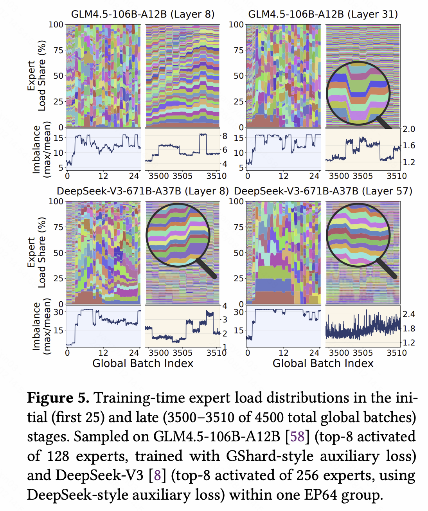

## 问题与动机

MoE 把 Transformer 的 FFN 换成 $E$ 个并列的 Expert，每个 Expert 是一个独立 MLP。Router 给每个 token 打分，只挑出 Top-$k$ 个逻辑 Expert 参与计算：

```text
token → Router → 打分 → 选出 Top-k 个逻辑 Expert
                          │
                          ▼
                    只有这 k 个 Expert 参与计算
                    其余 E - k 个不激活
```

当全部 Expert 权重塞不进一张 GPU 时，就得把它们摊到多个 Rank 上，这就是 Expert Parallelism。一个 token 属于产生它的 Rank，但它挑中的 Expert 可能住在别的 Rank，所以一层 MoE 通常要交换两次 token：

```text
Token-Owned 布局（每个 Rank 持有自己的 token）
        │
        ▼
Router / Top-k，得到每个 token 的目标逻辑 Expert
        │
        ▼
系统侧负载均衡：选择可执行的物理实例与 token 目的地
        │
        ▼
Dispatch：把 token 送到目标物理实例所在的 Rank
        │
        ▼
Expert-Owned 布局，本地执行 Grouped GEMM
        │
        ▼
Combine：把 Expert 输出送回 token 原来的 Rank
        │
        ▼
Token-Owned 布局，按 Router 权重加权合并
```

token 在逻辑 Expert 之间的分布可能很不均匀：少数 Expert 收下大量 token，成为热点。这带来两个直接后果：

- **长尾**：热点 Expert 的通信与计算拖得特别久，其余 Rank 只能干等。
- **激活显存压力**（训练）：一个 Rank 收到的 token 越多，要存的激活越大。

解决办法分两类，分别作用在链路的两个不同环节：

- 算法侧负载均衡：训练时用 auxiliary loss、router bias 等手段，让 Router 一开始就给出比较均匀的分布。
- 系统侧负载均衡：在 Router 与 token dispatch 之间插一个负载均衡器，把逻辑 Expert 虚拟化成物理 Expert，让物理实例之间的 token 负载尽量均匀。
    - 这是我们关心的对象。

两类手段通常组合使用：算法侧主要防止极端失衡（比如某些 Expert 彻底死亡），残余的不均衡仍要靠系统侧去消化。

## 负载分布的特征

要设计负载均衡器，先看它面对的是什么样的负载。EP 的负载分布完全由 Router 输出决定，下面是两个真实的分布例子：




负载在两个维度上表现出明显不同的规律，这两条规律最终决定了各家工作的范式分歧。

### 时间维度特征

分布可能在一段时间里保持相似（temporal locality）：最近几步的历史可以预测未来，一次均衡能连续服务多步。

- 专家有分工：有些专家处理代码任务时活跃，有些在处理数学任务时活跃。

分布也可能快速漂移，每一步都和上一步差很远，这时就只能逐 step 均衡。

**到目前为止，各家在这一问题上没有共识，这正是它们范式分歧的来源。**

### Layer 维度特征

不同 layer 的负载分布通常不一样。

这一点上各家形成了共识：均衡都逐 layer 独立进行。

## 现有工作的典型范式

在介绍两种范式之前，先厘清系统侧负载均衡器到底做哪两件事。它们是理解所有后续工作的坐标轴。

### 布局与分流：系统侧的两个基本动作

**布局（placement）**回答一个问题：每个逻辑 Expert 有哪些物理实例，各放在哪个 Rank。它包含两种动作：

- **重排（replacement）**：改变主实例的 Rank 归属。代价很大——要搬权重甚至 optimizer state，还会打乱已有的局部性，因此只能低频执行。
- **复制（replication）**：给同一逻辑 Expert 增加多份物理实例。代价是额外显存；训练时副本产生的梯度必须归约回主专家。

**分流（reroute）**回答另一个问题：布局不动的前提下，当前这批 token 各自由哪个物理实例执行——主实例还是某个副本。它不改变 Router 选出的逻辑 Expert，也不搬运任何权重，代价小，可以每步都做。

一句话总结：**布局决定“容量在哪里”，分流决定“流量往哪走”。**

### 历史布局 + 实时分流

这类方法承认历史统计猜不准当前的 token，但仍认为它能回答一个更粗的问题：**哪些容量值得提前准备，哪些 Rank 之间允许互相分担。**最后一公里的精确分流交给当前 Router 结果。

- **LPLB**：用历史负载调 DeepSeek EPLB 做重排，并挑出值得建副本的热专家；`r2o` 固定的副本图划定可行域；当前 batch 用精确计数在 GPU 上解 LP，得出分流比例。
- **FineMoE**：初始用对称 placement，或按历史预测周期性 adaptive replacement；当前 microbatch 用精确负载，在已有 EDP 副本之间求 token 配额。历史信号对付长期偏斜，实时 LP 吸收瞬时波动。
- **LAER-MoE**：GPU token dispatcher 依据当前生效的布局，立刻决定每个 token 去哪个副本；CPU layout tuner 依据已观察到的负载异步生成下一版布局。它未必依赖很长的统计窗口，但新布局只服务未来的参数恢复，不会回头改写已经发出的 token。

这类方法一般是 2 phase 设计，在两个时间尺度上分工：

- 大尺度：每隔多步，根据历史路由信息重排一次布局（replacement），搬运 Expert 权重，基本都在 CPU 上做。
- 实时尺度：每步在已有布局上，根据当前 Router 输出的 token 分布做在线分流（re-route），给每个 token 定物理目的地。

> DeepSeek EPLB 是这类工作里 scope 更局限、也更早期的一个。其余工作既做布局的重排与复制，也给出 token -> 物理专家的分流方案，上承 Router、下接 token dispatch；EPLB 则是一个接收历史信息、输出布局方案的纯函数（跑在 CPU 上的 Python 脚本），不管权重怎么搬，也不管 token 怎么分。
>
> 但 EPLB 同样假定历史统计能预测未来负载，所以仍归入这一类。

### 全实时布局 + 实时分流

这类方法认为热点可能逐 batch、逐层快速漂移，历史 placement 哪怕只滞后一小段也可能空转，甚至帮倒忙：

- **UltraEP** 用当前 microbatch、当前层的精确负载，同时定下动态副本、quota 与 reroute。
- **MoonEP** 用当前 microbatch 的完整路由，生成 token 分配表和需要借用的远端 Expert 清单。
- 两者不把预测误差留给下一层补救，而是把求解与参数准备直接放进当前层的关键路径。

它们能做到 exact 且实时，代价是**规划开销和 Expert 权重搬运开销直接进入关键路径**。


## 训练、Prefill 与 Decode

负载均衡值不值得做，还要看部署阶段。

训练和 Prefill 里 routed token 多，均衡的收益明显；训练额外要求梯度归约正确——如果存在副本，副本梯度必须归约回主专家。

Decode 里可供均衡的 token 少得多，收益随之变小。
