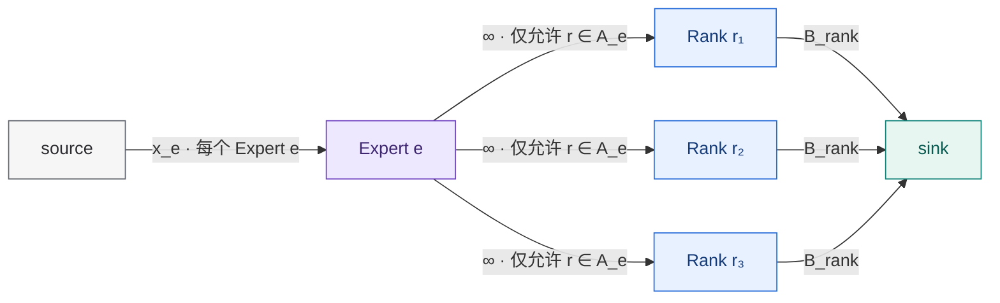

# EP 负载均衡：数学建模

## 目标

**给定一条随时间变化的 Expert 负载分布和目标 Rank imbalance，分析负载分布的特征，得到一些核心指标，再据此判断候选负载均衡方案的性能收益。**

## 问题 Setup

先固定**一个 layer、一个 step**。设：

- 有 $E$ 个 logical experts。
- 有 $R$ 个 ranks。
- Expert $e$ 当前收到 $x_e$ 个 expert-token assignments。为简洁起见，下面仍称为 token。
- 总 token 数为 $N=\sum_e x_e$；Expert $e$ 的负载占比为 $x_e/N$。
- Expert $e$ 当前可以在一组 ranks 上执行，记作 $A_e$。
  - 如果没有 replica，$|A_e|=1$。
  - 如果有两个物理实例，$|A_e|=2$。
- reroute 决定这 $x_e$ 个 token 怎么在 $A_e$ 中分。

先采用一个理想化的 compute 模型：所有 token 的计算代价相同、所有 ranks 同构，并且暂时忽略通信拓扑和小 batch 对 kernel efficiency 的影响。

> 负载不均衡只存在于 token 的接收侧，发送侧每个 rank 的 token 数量都是一样的，所以这里的建模不考虑 token 的发送侧，以避免引入不必要的复杂性。

### Rank 负载不均衡度

如果分给 Expert $e$ 在 rank $r$ 上的实例 $y_{er}$ 个 token，那么 rank $r$ 一共处理 $\sum_e y_{er}$ 个 token。这一层 Expert compute 的完成时间由 $\max_r\sum_e y_{er}$ 决定。

如果完全理想，所有 rank 一样忙，那么每个 rank 应该处理 $N/R$ 个 token（理想平均值）

定义**Rank 负载不均衡度**：**最忙 Rank 的工作量是理想平均值的多少倍。**

$$
\rho
=
\frac{\max_r\sum_e y_{er}}{N/R}.
$$

- $\rho=1$：完美均衡。
- $\rho=1.2$：最慢 Rank 比理想情况多做 20%。
- $\rho=2$：整个 expert compute 至少浪费接近一半并行能力。

它直接对应当前理想模型中的 expert compute critical path，但还不是端到端时间。

---

## 负载分布的特征

本节从负载均衡分布本身提取简单、直观、容易计算的指标，用来观察和刻画负载分布的特性。后文我们将基于这些特性指导负载分布方案的选择。

### Expert 负载不均衡度

**最热 Expert 是平均 Expert 负载的多少倍。**

$$
\operatorname{PeakSkew}(t)
=
E\max_e\frac{x_e(t)}{N_t}.
$$

>   ### Expert 负载集中度
> 
>   把 Experts 按负载从高到低排好，负载集中度衡量**最热的 $m$ 个 Experts 一共吃掉多少负载。**
> 
>   令 $x_{(i)}(t)$ 表示第 $i$ 热 Expert 的负载，则：
> 
>   $$
>   \operatorname{TopShare}_m(t)
>   =
>   \sum_{i=1}^{m}\frac{x_{(i)}(t)}{N_t}.
>   $$
> 
>   例如两种分布：
> 
>   - A：一个 Expert 50%，其他很均匀。
>   - B：四个 Experts 各 12.5%，其他很均匀。
> 
>   它们可能 peak load 类似，但对 placement 的要求完全不同。
> 
>   $\operatorname{TopShare}_m$ 曲线说明额外 capacity 是集中在一个 Expert，还是分散在一组 Experts 上。它可以提示 placement 需要覆盖多少个热点，但不能单独决定 replica 数量或具体 layout。

### Target-aware Replica Pressure

Expert 负载不均衡度 $S$ 和负载集中度 $C_m$ 描述了负载形状，但还没有把它连接到系统的 rank 数和目标 balance。给定目标 $\rho$，每个 rank 允许承担的最大负载为：

$$
B_{\rm rank}^{\rm target}=\rho\frac NR.
$$

Expert $e$ 至少需要能够在以下数量的 ranks 上执行：

$$
n_e^{\rm loc}(t;\rho)
=
\left\lceil\frac{x_e(t)}{B_{\rm rank}^{\rm target}}\right\rceil
=
\left\lceil\frac{R\,x_e(t)}{\rho N_t}\right\rceil.
$$

相对一份基础实例，它产生的额外 replica pressure 为：

$$
n_e^{\rm extra}(t;\rho)
=
\max\left(0,n_e^{\rm loc}(t;\rho)-1\right).
$$

由此得到三个空间指标：

$$
\begin{aligned}
n_{\max}^{\rm loc}(t;\rho)
&=\max_e n_e^{\rm loc}(t;\rho),\\
E_{\rm replica}(t;\rho)
&=\left|\left\{e:n_e^{\rm extra}(t;\rho)>0\right\}\right|,\\
K_{\rm replica}(t;\rho)
&=\sum_e n_e^{\rm extra}(t;\rho).
\end{aligned}
$$

- $n_{\max}^{\rm loc}$：单个 Expert 至少需要的最大 execution-location 数。
- $E_{\rm replica}$：负载已经超过单实例目标容量、确定需要 replication 的 Experts 数量。
- $K_{\rm replica}$：仅由单 Expert overload 导致的总额外 execution-location pressure。

由 $\operatorname{PeakSkew}$ 的定义可得：

$$
n_{\max}^{\rm loc}
=
\left\lceil
\frac{R\operatorname{PeakSkew}}{E\rho}
\right\rceil.
$$

这使 $\operatorname{PeakSkew}$ 获得直接的系统含义：它决定最极端热点至少需要多深的 replication。$n_{\max}^{\rm loc}$ 高而 $E_{\rm replica}$ 小，表示少数超级热点需要深 replication；$n_{\max}^{\rm loc}$ 较低而 $E_{\rm replica}$ 大，表示较宽的热点集合需要浅而广的 replication。$\operatorname{TopShare}_m$ 则继续提供完整的 concentration curve。

$K_{\rm replica}$ 是 target-aware 的一阶 layout pressure，不是全局精确最小 replica 数。它没有考虑多个 Experts 的 packing、可访问 Rank 邻域、placement domain 和 Rank memory；这些因素显著时，需要使用文末的 Global Layout Oracle。

### 负载分布的时间变化：细粒度

可以看一个非常简单的 lag-$\Delta$ drift：**隔了 $\Delta$ 个 step 后，有多少比例的负载质量“搬到了别的 Experts”。**

$$
\operatorname{LoadDrift}(\Delta)
=
\mathbb E_t
\left[
\frac12
\sum_e
\left|
\frac{x_e(t)}{N_t}
-
\frac{x_e(t-\Delta)}{N_{t-\Delta}}
\right|
\right].
$$

- $\operatorname{LoadDrift}(\Delta)\approx0$：分布非常稳定。
- $\operatorname{LoadDrift}(\Delta)$ 很大：历史精确负载已经没有多少参考意义。

对于 historical placement，应该在它实际使用的 layout age 上观察 $\operatorname{LoadDrift}(\Delta)$：$\Delta$ 包括负载统计、placement 计算和 layout 生效之间的延迟，也会随 placement 的更新周期变化。Realtime placement 则直接使用当前 step 的负载重新决定当前 step 的 layout，不依赖历史 lag。

---

### 负载分布的时间变化：粗粒度

因为 placement 并不一定需要预测“Expert 17 下一步到底是 5372 个还是 6141 个 token”。

它可能只需要预测“**Expert 17 下一段时间是不是仍然属于热点、值得多准备一个 replica**”。

所以应该再定义一个**更粗粒度的 temporal locality**.

> **隔 $\Delta$ 个 step 后，Top-$m$ 热点 Expert 还有多少仍然是热点。**
> 
> $$
> \operatorname{HotspotOverlap}_m(\Delta)
> =
> \frac{
> |\operatorname{Top}_m(t)\cap\operatorname{Top}_m(t-\Delta)|
> }{m}.
> $$

$\operatorname{HotspotOverlap}_m$ 是直观的 hotspot identity 指标，但它没有区分热点需要一份还是多份额外 capacity。为直接衡量与目标 $\rho$ 相关的 placement freshness，先定义平滑的连续 replica pressure：

$$
c_e^{\rm replica}(t;\rho)
=
\max\left(0,\frac{R\,x_e(t)}{\rho N_t}-1\right).
$$

$c_e^{\rm replica}$ 表示 Expert $e$ 超过单实例目标容量多少 rank-equivalent capacity。它避免整数 $n_e^{\rm extra}$ 在 replication threshold 附近出现 $0\to1\to0$ 的跳变。

定义 replica-demand overlap：

$$
\operatorname{ReplicaOverlap}(\Delta;\rho)
=
\mathbb E_t
\left[
\frac{
\sum_e\min\left(
c_e^{\rm replica}(t;\rho),
c_e^{\rm replica}(t-\Delta;\rho)
\right)
}{
\sum_e c_e^{\rm replica}(t;\rho)
}
\right].
$$

均值只包含 $\sum_e c_e^{\rm replica}(t;\rho)>0$ 的 steps；当前没有 replication demand 的 steps 不参与该统计。$\operatorname{ReplicaOverlap}$ 回答：**当前真正需要的额外 capacity 中，有多少仍然落在 $\Delta$ steps 前认为应该复制的 Experts 上。**

三个时间指标因此各有职责：

- $\operatorname{LoadDrift}(\Delta)$ 高：精确流量比例变化快，realtime reroute 更有价值。
- $\operatorname{HotspotOverlap}_m(\Delta)$：保留为易解释的粗粒度 hotspot identity 指标。
- $\operatorname{ReplicaOverlap}(\Delta;\rho)$ 高：与目标 balance 相关的 replica demand 稳定，historical placement 仍可能有效。

因此，$\operatorname{LoadDrift}$ 高而 $\operatorname{ReplicaOverlap}$ 高时，适合 historical placement + realtime reroute；$\operatorname{ReplicaOverlap}$ 低时，旧 replicas 很快失效，需要更高 placement freshness；两者都稳定时，低频 historical placement 通常已经足够。

---

## 解耦 Layout 和 Reroute

> 本章的目标是把“layout 好不好”和“reroute 算法好不好”彻底解耦。
> 前一章已经用 workload statistics 判断了方案需要的空间能力和时间能力。本章转向实际 candidate：用候选方案的 layout oracle 计算出最优 reroute 下的负载不均衡度 $\rho^*(x,G)$。将候选方案的负载不均衡度 $\rho$ 与 $\rho^*(x,G)$ 对比，即可定位主要性能损失来自 layout 还是 rerouter。
> 这种解耦极大地优化了数学建模的复杂度，避免了对 layout + reroute 联合建模。

给定当前负载 $x$ 和一个候选方案已经产生的 placement $G=\{A_e\}$，先定义这个 layout 上的合法 reroute：

$$
\begin{aligned}
&y_{er}\ge 0,\\
&y_{er}=0, \qquad r\notin A_e,\\
&\sum_{r\in A_e}y_{er}=x_e.
\end{aligned}
$$

这里先允许连续分流。若 $x_e$ 是整数，也可以要求 $y_{er}$ 为整数；在当前网络流模型中，整数最优解仍然可以精确求出。评价候选方案时，oracle 与实际结果必须使用同一种连续或整数 token 模型。

定义固定 layout 下的最优 bottleneck load：**placement 固定以后，哪怕给我世界上最好的分流算法，最少还能剩多少负载不均衡。**

$$
B_{\rm rank}^*(x,G)
=
\min_{\text{合法 reroute}}
\max_r\sum_e y_{er},
\qquad
\rho^*(x,G)=\frac{B_{\rm rank}^*(x,G)}{N/R}.
$$

### 给定 layout 的最优 reroute 可以精确求出

对于一个候选 Rank bottleneck load $B_{\rm rank}$，构造下面的 flow network：

如果最大流能够送出全部 $N$ 个 token，那么 $B_{\rm rank}$ 可行。对 $B_{\rm rank}$ 做搜索，就能得到精确的 $B_{\rm rank}^*(x,G)$。当 token 数和容量都是整数时，网络流的整数性保证结果也是整数 reroute。

在当前“同构 ranks、token 等价、无额外边容量”的模型下，还可以写成：

$$
B_{\rm rank}^*(x,G)
=
\max_{\varnothing\ne\mathcal E_{\rm sub}\subseteq\{1,\ldots,E\}}
\frac{
\sum_{e\in\mathcal E_{\rm sub}}x_e
}{
|\operatorname{ReachableRanks}_G(\mathcal E_{\rm sub})|
},
$$

其中 $\mathcal E_{\rm sub}$ 是任意 Expert 子集，并且：

$$
\operatorname{ReachableRanks}_G(\mathcal E_{\rm sub})
=
\bigcup_{e\in\mathcal E_{\rm sub}}A_e.
$$

整数 token 情况对右侧整体取 ceiling。实际计算不需要枚举所有 Expert 子集，max-flow 会隐式找到造成瓶颈的集合。

因为给定 layout 之后最优 reroute 相对比较好求，这一部分的讨论比较简略。

---
## 从负载特征判断并评价负载均衡方案

**先看负载有多偏、热点有多宽、变化有多快，再判断方案需要多深的 replication、多宽的覆盖范围和多高的更新频率；最后再看实际方案有没有做到，以及为此付出的系统成本是否值得。**

---

### 观察负载分布的特征

空间上主要看：

* $\operatorname{PeakSkew}$、$\operatorname{TopShare}_m$：负载有多集中。
* $n_{\max}^{\rm loc}$：最热 Expert 至少需要多深的 replication。
* $E_{\rm replica}$：有多少 Expert 需要额外 replica。
* $K_{\rm replica}$：由单 Expert overload 导致的一阶总 replication pressure。

据此得出一阶判断：

* $n_{\max}^{\rm loc}$ 高、$E_{\rm replica}$ 小：负载集中在少数超级热点，适合对少数 Experts 做**深 replication**。
* $n_{\max}^{\rm loc}$ 较低、$E_{\rm replica}$ 大：热点比较分散，需要对更宽的 Expert 集合做**浅 replication**。
* $K_{\rm replica}$ 较大：Candidate 必须提供足够的 replica budget；预算明显低于这个 pressure 时，不可能达到目标 balance。
* $K_{\rm replica}=0$ 并不表示当前 placement 已经合适。即使没有单个 Expert overload，重新组合基础 Expert 的 rank 归属仍可能改善 balance。

时间上主要看：

* $\operatorname{LoadDrift}(\Delta)$：隔了 $\Delta$ 时间后，精确负载变化了多少。
* $\operatorname{HotspotOverlap}_m(\Delta)$：过去和现在的 Top-$m$ 热点 Expert 是否还是同一批。
* $\operatorname{ReplicaOverlap}(\Delta;\rho)$：旧 placement 准备的 replicas 对当前 replica demand 还覆盖多少。

其中真正和 placement freshness 直接相关的是 $\operatorname{ReplicaOverlap}$。

因此：

* $\operatorname{LoadDrift}$ 高、$\operatorname{ReplicaOverlap}$ 高：精确 token 比例变化很快，但需要额外容量的 Expert 基本没变。此时比较适合 **historical placement + realtime reroute**。
* $\operatorname{ReplicaOverlap}$ 低：过去准备的 replicas 已经放错地方，需要提高 placement freshness。
* $\operatorname{LoadDrift}$ 和 $\operatorname{ReplicaOverlap}$ 都稳定：频繁重算 placement 通常没有足够的 workload-side 必要性。

这里的 realtime placement 始终指：

> **当前 step 使用当前负载重新计算当前 step 的 layout。**

它不要求热点未来继续存在。

这些轻量指标只描述 workload 对方案性质的一阶要求，并不负责构造具体 placement。它们告诉我们需要多少 replication、覆盖多宽、多久更新一次，但不处理 Expert 到 Rank 的具体组合。

---

### 用 Fixed-layout Oracle 定位 Candidate 的 Balance 缺口

确定 workload 大致需要什么能力以后，再看实际 Candidate。

设方案 $s$ 在 step $t$ 实际产生：

* placement $G_t^s$；
* reroute $y_t^s$；
* 最终不均衡度 $\rho_s(t)$。

如果完全不限制 layout，允许任意 Expert 在所有 ranks 上执行，那么得到理想 balance 下界 $\rho_{\rm ideal}(t)$。

连续分流时它为 1。

如果 token 必须整数分配，则理论上即使完美均衡，也可能无法把 token 完全平均分给 $R$ 个 ranks。此时：

$$
\rho_{\rm ideal}(t)
=
\frac{\lceil N_t/R\rceil}{N_t/R}.
$$

自然语言来说，就是：**总 token 数不能被 rank 数整除时，最忙 rank 至少要比平均值多承担不到一个 token，因此理想 imbalance 可能略高于 1。**

接下来固定 Candidate 自己产生的 layout $G_t^s$，只把 rerouter 换成 exact oracle。

记这个 layout 上能够达到的最好不均衡度为：

$$
\rho^*(x_t,G_t^s).
$$

自然语言来说，就是：**保持 Candidate 的 Expert placement 完全不动，只问如果 token 分流做到最优，这个 layout 最多能均衡到什么程度。**

这样 Candidate 相对于理想状态的总损失可以严格拆成两部分：

$$
\rho_s(t)-\rho_{\rm ideal}(t)
=
\underbrace{
\rho^*(x_t,G_t^s)-\rho_{\rm ideal}(t)
}_{\text{layout residual}}
+
\underbrace{
\rho_s(t)-\rho^*(x_t,G_t^s)
}_{\text{reroute gap}}.
$$

自然语言来说：

* **layout residual**：这个 placement 本身留下了多少无法通过 reroute 补救的 imbalance。
* **reroute gap**：placement 本来允许做到更好，但实际 rerouter 没有充分利用这些自由度。

两者对应不同的问题：

* layout residual 大：优先检查 placement 的 replica budget、覆盖范围、freshness 和 rank 组合。
* layout residual 小、reroute gap 大：主要问题才在实际分流算法。

连续 token 和整数 token 是两套不同的评价模型。$\rho_{\rm ideal}$、$\rho^*$ 和 Candidate 的实际结果必须始终使用同一套模型，否则 decomposition 没有可比性。

---

### 用负载指标解释 Layout Residual

Fixed-layout oracle 告诉我们“layout 有问题”，但还没有告诉我们为什么有问题。

这时再回到前面的 workload metrics。

**先检查空间能力。**

对照 $n_{\max}^{\rm loc}$、$E_{\rm replica}$、$K_{\rm replica}$ 和 $\operatorname{TopShare}_m$：

* 少数 Expert 极热：Candidate 是否把足够多 replicas 集中给这些 Expert？
* 热点较宽：Candidate 是否覆盖了足够多 Expert，而不是继续给少数 Expert 堆 replica？
* $K_{\rm replica}$ 较高：Candidate 的 replica budget 是否至少达到这一阶需求？

如果明显没有满足这些条件，layout residual 的来源通常很好解释。

**再检查时间能力。**

真正应该比较的是 Candidate 的实际 **layout age**。

如果一个 placement 从统计负载到真正生效相隔 $\Delta$ 个 step，就应该观察：

* $\operatorname{LoadDrift}(\Delta)$；
* $\operatorname{ReplicaOverlap}(\Delta;\rho)$。

这样才能判断 stale placement 到底损失了什么：

* $\operatorname{LoadDrift}$ 高但 $\operatorname{ReplicaOverlap}$ 高：旧 layout 仍准备了正确的容量，只需要当前 reroute 去适应精确流量变化。
* $\operatorname{ReplicaOverlap}$ 低：旧 layout 连“容量应该放在哪些 Expert”都已经判断错了，提高 placement freshness 才有意义。

这里必须保证 replay 因果正确：

* historical placement 只能使用当时已经观察到的信息，并施加真实的统计、planning、更新和生效延迟；
* realtime placement 可以使用当前 step 的负载产生当前 $G_t^s$；
* clairvoyant Global Layout Oracle 可以看未来，但只能作为理论边界单独报告，不能冒充 historical policy 的结果。

---

### 什么时候需要 Global Layout Oracle

轻量指标主要描述单 Expert overload 和热点覆盖问题，但实际 placement 还有组合效应。

例如：

* 多个热点 Expert 的 replicas 落到了同一批 ranks；
* 基础 Expert 的 remap 不合理；
* placement domain 限制了可访问 ranks；
* Rank memory capacity 限制了 replica 选择；
* Expert packing 导致局部容量冲突。

因此即使：

$$
K_{\rm replica}\approx 0,
$$

自然语言来说，就是：**从单 Expert overload 看，似乎没有明显需要新增 replica 的压力。**

Candidate 的 layout residual 仍然可能很大。

同样，如果 Candidate 已经提供了 $K_{\rm replica}$ 所要求的 replication 深度和宽度，但 fixed-layout residual 依然很高，也说明问题已经超出这些一阶指标的解释能力。

此时才有必要调用 Global Layout Oracle：

* 如果 Global Layout Oracle 能明显降低 residual，说明问题确实来自 placement 的组合方式。
* 如果 Global Layout Oracle 也改善有限，则说明当前资源约束下本来就没有多少可利用的 balance 空间。

这样可以避免让所有 workload 默认进入复杂的 MILP / global optimization 流程。

---

### Balance 改善是否值得系统成本

前面的分析只回答“balance 能改善多少”。真正决定方案值不值得使用的，是端到端时间。

假设当前 step 在完美均衡时 Expert compute 需要时间 $C$。

原始不均衡度为 $\rho_0$，Candidate 降低到 $\rho_1$。

那么 Expert compute 时间大致是：

$$
T_0^{\rm expert}\approx\rho_0 C,
\qquad
T_1^{\rm expert}\approx\rho_1 C.
$$

自然语言来说，就是：**最忙 Rank 比平均负载高多少，Expert 阶段的完成时间就大致被拉长多少。**

如果只考虑 Expert compute，Candidate 的理想 speedup 是：

$$
\text{Speedup}_{\rm expert}
\approx
\frac{\rho_0}{\rho_1}.
$$

自然语言来说，例如 imbalance 从 $1.5$ 降到 $1.1$，Expert compute 部分最多大约可以获得 $1.5/1.1$ 倍加速。

但真实系统中，负载均衡还会改变：

* 通信量和通信拓扑；
* placement / reroute planning 开销；
* Expert weight preparation / movement；
* 单个 Expert GEMM 的 batch size 和 kernel efficiency。

因此更有意义的是 Candidate 带来的净关键路径收益：

$$
\Delta T_{\rm net}
=
(\rho_0-\rho_1)C
-\Delta T_{\rm comm}
-H_{\rm plan}^{\rm exposed}
-H_{\rm move}^{\rm exposed}
-\Delta T_{\rm kernel}.
$$

自然语言来说，就是：**减少 imbalance 省下来的 Expert compute 时间，扣掉新增通信、真正暴露在关键路径上的 planning 和 weight movement，以及因为 token 被切得更碎导致的 kernel 性能损失。**

其中：

* $\Delta T_{\rm comm}$：reroute 后通信时间的变化，可以为正，也可以为负。
* $H_{\rm plan}^{\rm exposed}$：placement / reroute planning 中真正暴露在 critical path 上的部分。
* $H_{\rm move}^{\rm exposed}$：weight preparation / movement 中真正暴露在 critical path 上的部分。
* $\Delta T_{\rm kernel}$：更多 replicas 导致单个 GEMM 变小、kernel fragmentation 等产生的时间变化。

只有：

$$
\Delta T_{\rm net}>0
$$

时，Candidate 才真正带来端到端性能收益。

自然语言来说，就是：**balance 省下来的时间必须比为了 balance 新付出的时间更多。**

这里只应该计算 **exposed cost**。已经和其他计算或通信重叠的 duration，不能再次完整计入关键路径。

---

### 不同方案的适用边界

这套分析也可以解释常见方案为什么适用于不同 workload。

* **Training / Prefill**：Expert compute 的 $C$ 通常较大，减少 imbalance 能省下更多绝对时间，因此更容易覆盖 planning、通信和 movement 成本。
* **Decode**：每一步 token 少，Expert compute saving 较小，复杂的实时 placement 未必值得。
* **Historical placement + realtime reroute**：把较贵的 placement 和 weight movement 移出当前 critical path，但要承担 stale-layout residual。
* **Realtime placement**：不承担历史滞后，但必须在当前 step 内支付 planning / weight preparation 成本，因此只有当 fresh layout 能显著降低 $\rho$ 时才值得。

最终不应该把不同方案压成一个脱离资源约束的总分。

更合理的选择方式是：

> **先筛掉无法满足 workload 所需 replication depth、coverage 和 freshness 的方案，再在剩余方案中比较 memory、movement、communication 和 E2E latency，选择合适的 Pareto 点。**

因此整个评价过程可以归纳为：

* workload metrics 判断**需要什么能力**；
* fixed-layout oracle 判断**Candidate 的损失来自 layout 还是 rerouter**；
* workload metrics + layout age 解释**为什么这个 layout 好或不好**；
* Global Layout Oracle 只在简单指标解释不了 residual 时做精确验证；
* 最后用 critical-path cost 判断**这种 balance 改善到底值不值得**。

## 附录：精确 Global Layout Capability Oracle（Work In Progress）

前文根据负载分布的简单指标判断 candidate layout 是否具有正确的 replication 深度、宽度和 placement freshness。它们是轻量、直观、容易计算的，但是无法包括 packing、重叠的 Rank 邻域等复杂因素。附录包含一份 MILP oracle，给出在当前 layout constraints 下，给定负载和目标 imbalance 时理论上能够达到的最优 layout。

Fixed-layout oracle $\rho^*(x,G)$ 用于正文中的常规 candidate 诊断。本附录进一步优化 placement 本身，只在简单 replica pressure 无法解释结果、怀疑 packing / placement-domain / memory pathology，或确实需要精确 resource frontier 时使用。它不是所有 workload 都必须执行的主流程。

正文的 $K_{\rm replica}$ 同时也是本附录中 Global Layout Requirement 的单 Expert 下界。附录沿用同一个名字，不再为它引入第二套符号。

用：

$$
\mathcal C_{\rm layout}=
\left(
\{U_e\},
\{M_r\},
\text{remap permission}
\right)
$$

描述系统允许的 layout 空间。其中 $U_e$ 是 Expert $e$ 的合法 Rank 域，$M_r$ 是 rank $r$ 的 instance 上限，remap permission 表示基础实例能否离开当前位置。令 $z_{er}\in\{0,1\}$ 表示 Expert $e$ 是否在 rank $r$ 上存在实例，则合法 placement 满足：

$$
\begin{aligned}
&z_{er}=0, &&r\notin U_e,\\
&\sum_r z_{er}\ge1, &&\forall e,\\
&\sum_e z_{er}\le M_r, &&\forall r.
\end{aligned}
$$

设当前基础 placement 为 $z^0$：不允许 remap 时再要求 $z_{er}\ge z_{er}^0$；fixed current layout 则直接要求 $z=z^0$。

### 给定资源能做到多好：$\rho_{\rm layout}^*(K)$

令 $\mathcal G(K;\mathcal C_{\rm layout})$ 表示满足上述 layout constraints、且额外实例数不超过 $K$ 的所有 layouts：

$$
\sum_{e,r}z_{er}-E\le K.
$$

在每个合法 layout 上使用前一章的 exact reroute oracle，定义：

$$
\rho_{\rm layout}^*(x,K;\mathcal C_{\rm layout})
=
\min_{G\in\mathcal G(K;\mathcal C_{\rm layout})}
\rho^*(x,G).
$$

> **核心输出：$\rho_{\rm layout}^*(x,K;\mathcal C_{\rm layout})$。** 它表示给定 $K$ 个额外 instances 时，在 layout constraints $\mathcal C_{\rm layout}$ 下理论上能够达到的最低 Rank imbalance。

扫描 $K$ 得到 layout resource frontier。少量 $K$ 就使曲线快速下降，说明 workload 只缺少少量热点 capacity；曲线很早进入平台，则继续增加 replicas 的边际收益有限。

这条曲线需要配合三个参考点阅读：

- **fixed current layout**：固定 $z=z^0$，输出 $\rho^*(x,G_0)$。
- **remap-only**：令 $K=0$，但允许在 $U_e$ 内重新选择每个基础实例的位置。
- **remap + replication**：令 $K>0$，同时决定基础实例和 replicas 的位置。

因此 $K=0$ 只表示“不增加 replica”，不表示 layout 不动。Fixed 与 remap-only 的差距衡量重新摆放基础实例的价值；remap-only 与 $K>0$ 曲线的差距衡量 replication 的价值。

### 达到目标需要多少资源：$K_{\rm req}$

给定目标 $\rho_{\rm target}$，令：

$$
B_{\rm rank}^{\rm target}
=
\rho_{\rm target}\frac NR.
$$

在合法 placement 上加入当前 step 的流守恒和 Rank load 约束：

$$
\begin{aligned}
&\sum_r y_{er}=x_e, &&\forall e,\\
&0\le y_{er}\le Nz_{er}, &&\forall e,r,\\
&\sum_e y_{er}\le B_{\rm rank}^{\rm target}, &&\forall r.
\end{aligned}
$$

定义：

$$
K_{\rm req}
(x,\rho_{\rm target};\mathcal C_{\rm layout})
=
\min_{z,y}
\left(
\sum_{e,r}z_{er}-E
\right).
$$

> **核心输出：$K_{\rm req}(x,\rho_{\rm target};\mathcal C_{\rm layout})$。** 它表示在给定 layout constraints 下，当前负载达到目标 imbalance 至少需要多少额外 Expert instances。

它不是新的独立模型，而是上一节 resource frontier 的反问题：

$$
K_{\rm req}(x,\rho;\mathcal C_{\rm layout})\le K
\quad\Longleftrightarrow\quad
\rho_{\rm layout}^*(x,K;\mathcal C_{\rm layout})\le\rho.
$$

如果 token 必须整数分流，$y_{er}$ 取整数，Rank 上界等价于 $\sum_e y_{er}\le\lfloor B_{\rm rank}^{\rm target}\rfloor$。当 $\rho_{\rm target}<\rho_{\rm ideal}$ 时，目标本身不可行。

**单 Expert 下界。** Expert $e$ 至少需要能够到达 $\lceil x_e/B_{\rm rank}^{\rm target}\rceil$ 个 ranks，因此：

$$
K_{\rm replica}(x,\rho)
=
\sum_e
\max\left(
0,
\left\lceil
\frac{x_e}{B_{\rm rank}^{\rm target}}
\right\rceil-1
\right)
\le K_{\rm req}.
$$

完美均衡时等价于 $|A_e|\ge\lceil R x_e/N\rceil$。例如一个 Expert 占全局 25% token、系统有 8 张 GPU，则它至少需要能在 2 张 GPU 上执行。

**Interaction / packing 解释。** 定义辅助诊断量：

$$
K_{\rm interaction}=K_{\rm req}-K_{\rm replica}.
$$

在一般 layout constraints $\mathcal C_{\rm layout}$ 下，它还可能包含 placement domain 和 Rank memory 的影响；只有在全 placement domain、Rank memory 不绑定的基准模型中，才可将其称为 $K_{\rm packing}$。

例如 $R=3$、5 个 Experts 各占 $N/5$、目标 $B_{\rm rank}^{\rm target}=N/3$。每个 Expert 单独看都不需要 replica，所以 $K_{\rm replica}=0$；但一个 rank 无法容纳两个完整 Experts，因为 $2N/5>N/3$，因此至少两个 Experts 必须拆分，得到 $K_{\rm req}\ge2$。两个额外实例也确实足够：

$$
\begin{aligned}
e_4 &: \left(\frac{2N}{15},\frac N{15},0\right),\\
e_5 &: \left(0,\frac N{15},\frac{2N}{15}\right).
\end{aligned}
$$

配合前三个 Experts 各自占据一个 rank，三个 ranks 的总负载都恰好为 $N/3$，所以该例中 $K_{\rm req}=K_{\rm packing}=2$。

**Expert 子集诊断。** 对任意 Expert 子集 $\mathcal E_{\rm sub}$，达到目标 Rank bottleneck $B_{\rm rank}^{\rm target}$ 必须满足：

$$
\sum_{e\in\mathcal E_{\rm sub}}x_e
\le
B_{\rm rank}^{\rm target}
\left|
\operatorname{ReachableRanks}_G(\mathcal E_{\rm sub})
\right|.
$$

如果多个热点 Experts 共享过小的 Rank 邻域，单独看每个 Expert 的 replica 数可能都够，联合起来仍然不可行。Max-flow 找到的最紧 Expert 子集可以解释 $K_{\rm req}$ 或候选 layout residual 的来源，但它不是另一个核心输出。

### Layout 复用多个 Steps 需要多少资源：$K_{\rm trace}$

单 step 的 requirement 直接使用 $K_{\rm req}(x_t,\rho;\mathcal C_{\rm layout})$，不再为它引入另一套符号。

现在要求一套 layout 固定复用 $\tau_{\rm layout}$ 个 steps。设 trace 有 $T$ 个 steps，epoch phase offset 为 $\phi_{\rm epoch}\in\{0,\ldots,\tau_{\rm layout}-1\}$，并用 $\operatorname{EpochSteps}(j;\phi_{\rm epoch},\tau_{\rm layout})$ 表示 epoch $j$ 包含的 steps。Epoch $j$ 使用固定 placement $z^{(j)}$，但每个 step 仍可依据当前负载独立 reroute。

令 $h_t^{\rm target}\in\{0,1\}$ 表示 step $t$ 是否达到目标，并令 $B_{\rm rank}^{\rm target}(t)=\rho_{\rm target}N_t/R$。对 $t\in\operatorname{EpochSteps}(j;\phi_{\rm epoch},\tau_{\rm layout})$，要求：

$$
\begin{aligned}
&z_{er}^{(j)}=0, &&r\notin U_e,\\
&\sum_r z_{er}^{(j)}\ge1, &&\forall e,\\
&\sum_e z_{er}^{(j)}\le M_r, &&\forall r,\\
&\sum_{e,r}z_{er}^{(j)}-E\le K,\\
&\sum_r y_{er,t}=x_e(t), &&\forall e,\\
&0\le y_{er,t}\le N_tz_{er}^{(j)},\\
&\sum_e y_{er,t}
\le
B_{\rm rank}^{\rm target}(t)
+N_t(1-h_t^{\rm target}), &&\forall r.
\end{aligned}
$$

$h_t^{\rm target}=0$ 只取消当前 step 的目标 bottleneck 上界，token 仍必须由流守恒约束全部执行。Trace coverage 要求：

$$
\frac1T\sum_{t=1}^T h_t^{\rm target}
\ge q_{\rm coverage},
\qquad
q_{\rm coverage}=0.95,
$$

并同时报告 strict $q_{\rm coverage}=1$ 结果。最终定义：

$$
K_{\rm trace}
(\tau_{\rm layout},\rho,q_{\rm coverage};
\mathcal C_{\rm layout},\phi_{\rm epoch})
=
\min_{K,\{z^{(j)}\},\{y_t\},\{h_t^{\rm target}\}}K.
$$

> **核心输出：$K_{\rm trace}(\tau_{\rm layout},\rho,q_{\rm coverage};\mathcal C_{\rm layout},\phi_{\rm epoch})$。** 它表示 layout 每 $\tau_{\rm layout}$ 个 steps 更新一次时，为让至少 $q_{\rm coverage}$ 比例的 steps 达到目标 $\rho$，离线最优至少需要多少额外 instances。

$\tau_{\rm layout}=1$ 允许每步根据当前负载生成当前-step layout，是 realtime placement 的 workload boundary；$\tau_{\rm layout}>1$ 要求同一 layout 覆盖多个不同负载。$\tau_{\rm layout}$ 是 layout reuse interval，不是热点寿命。

该 oracle 可以看到对应 epoch 的完整负载，因此是 clairvoyant capability boundary，不是 historical policy。Historical candidate 只能使用当时已有历史，必须在后文通过 causal replay 单独评价。

不同 phase offset 会改变 epoch 边界。通用 workload characterization 对同一个核心指标报告：

$$
K_{\rm trace}^{\rm median}
=
\operatorname{median}_{\phi_{\rm epoch}}
K_{\rm trace}
(\tau_{\rm layout},\rho,q_{\rm coverage};
\mathcal C_{\rm layout},\phi_{\rm epoch}),
\qquad
K_{\rm trace}^{\rm worst}
=
\max_{\phi_{\rm epoch}}
K_{\rm trace}
(\tau_{\rm layout},\rho,q_{\rm coverage};
\mathcal C_{\rm layout},\phi_{\rm epoch}).
$$

具体 candidate 则使用其真实 update boundary，不对 offset 取 oracle。给定 memory budget $K$ 时，也可以从同一条 frontier 反读：

$$
\tau_{\rm layout}^{\max}
(K,\rho,q_{\rm coverage};\mathcal C_{\rm layout})
=
\max\left\{
\tau_{\rm layout}:
K_{\rm trace}^{\rm worst}
(\tau_{\rm layout},\rho,q_{\rm coverage};
\mathcal C_{\rm layout})\le K
\right\}.
$$

$\tau_{\rm layout}^{\max}$ 只是 $K_{\rm trace}$ 的反向读法，不是第四个独立指标。正文的 workload metrics 只用于解释 frontier 的形状，不能直接推出具体 placement。

最后，$K_{\rm trace}$ 只刻画给定 trace，不声称预测未来 workload。应使用 contiguous block bootstrap 报告该 frontier 的置信区间，以保留局部时间相关性；这同样不引入热点轮转或热点寿命假设。
