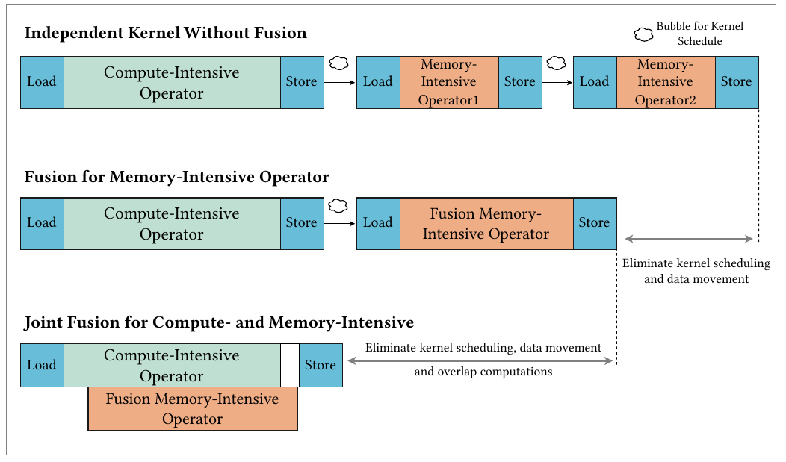
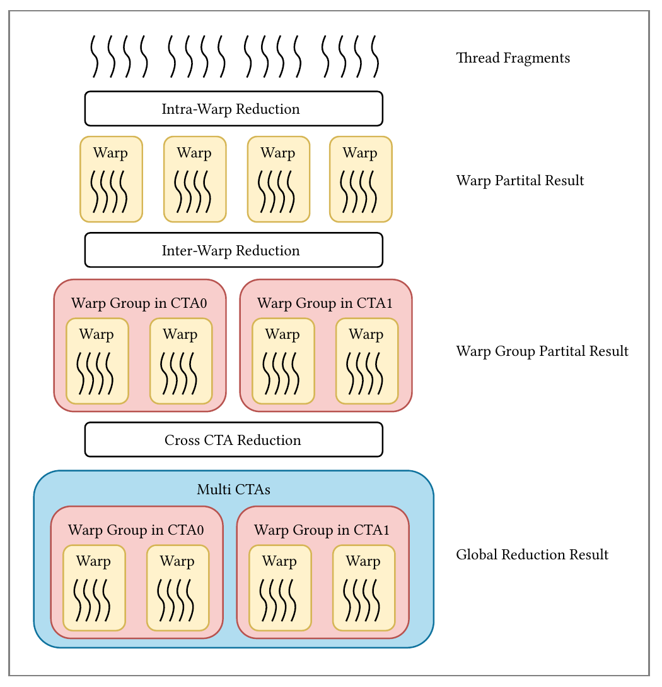
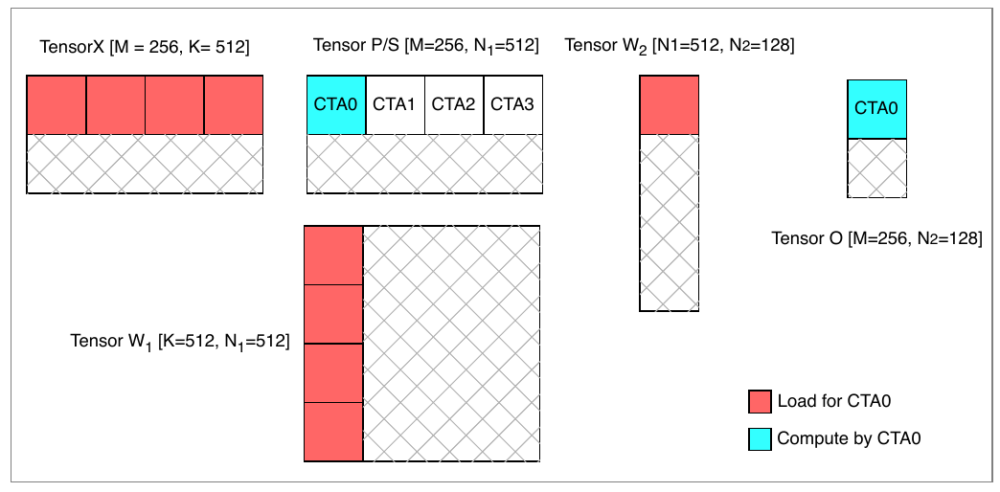
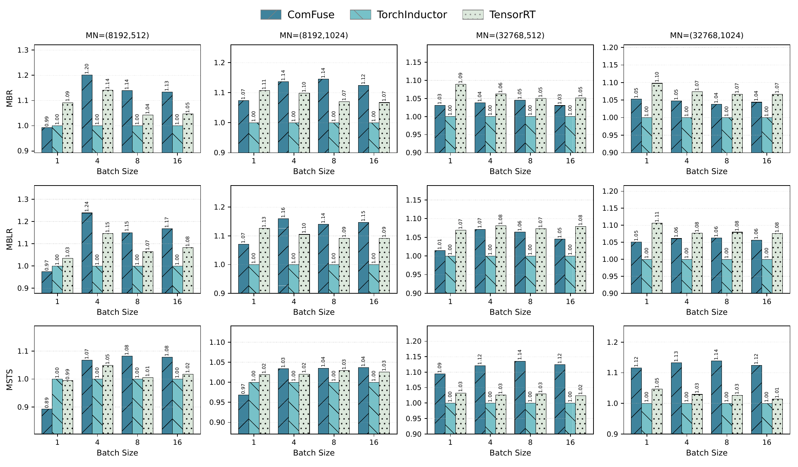
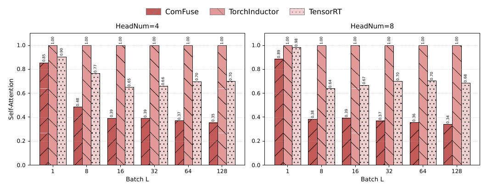

# ComFuse：如何把矩阵乘法与复杂后处理融合成 GPU Kernel

矩阵乘法之后，经常还要加 Bias、做归一化或计算激活函数。如果这些操作分别启动 GPU kernel，中间结果就可能反复写入显存、再被读回。**ComFuse 希望让矩阵乘法产生的结果直接在片上完成后处理，并由编译器自动生成这样的融合 kernel。**

难点在归一化这类需要汇集多个元素的操作：矩阵乘法分块产生结果，而均值、方差可能依赖多个块。ComFuse 建立在 CUTLASS 及其 EVT 后处理机制上，重点补上了**跨 CTA 归约完成后，继续消费完整统计量和原来保留的片上数据**的能力。它为此设计了 Stage-Stream 执行方式，再将这种执行方式接入编译流程。本文用 **MatMul → Bias → LayerNorm** 贯穿两部分，最后介绍它怎样扩展到连续两次 MatMul。

本文依据 [ComFuse v1](https://arxiv.org/pdf/2608.03537v1) 编写。原图保留论文图号；中文机制图用于解释数据依赖，性能数字均来自论文实验。

## 背景：从算子表达式到 GPU 执行

### 算子、kernel 与融合

算子描述要完成的数学运算，例如矩阵乘法、加法和求均值。kernel 是提交给 GPU 执行的程序，规定哪些线程处理哪些数据、数据放在哪里、线程之间何时交换结果。

两者不必一一对应。一次 LayerNorm 可以由多个 kernel 完成；一次矩阵乘法、Bias 和 LayerNorm 也可以放进同一个 kernel。编译器需要在数学结果正确的前提下，选择合适的实现。

> **论文图 1。** Load、Store 分别表示数据读入与写出。三行展示不同融合范围；最下方还画出了计算重叠的机会。这是定性示意，方块长度不代表实测时间。

例如，分开执行 MatMul 和 LayerNorm 时，MatMul 的结果通常要写入显存，下一 kernel 才能读取。融合后，后处理可以直接消费当前分块的结果，减少这一次中间张量的写入和读取。节省多少访存，取决于原来的执行方案已经融合到了哪一步。

融合也有代价。中间值需要在片上保留更久，可能增加寄存器占用；跨线程汇总结果需要通信与同步。因此，算子数量减少并不保证总耗时下降。

### 数据放在哪里

GPU 无法把任意大的张量都放在片上。矩阵乘法通常把输出矩阵切成小块，每个块称为 **tile**，再安排一组线程合作计算。

| 存储位置 | 谁可以使用 | 在本文中的用途 |
|---|---|---|
| 寄存器 | 由线程持有；跨线程传递需要相应指令 | 保留当前计算的少量元素、局部累加结果 |
| 共享内存，SMEM | 同一线程块中的线程可以协作访问 | 暂存数据、交换局部统计量 |
| 全局内存，GMEM，通常位于显存 | 不同 kernel、线程块都可通过地址访问 | 保存输入、权重、最终输出和需要落地的中间张量 |

一个线程块也称为 **CTA**。它包含若干组线程，并负责一个或一组 tile。多个 CTA 可以同时处理矩阵的不同区域。后文的关键问题是：如果同一行被分给多个 CTA，怎样在片上求出这一整行的均值？

> 算子编译器除了处理表达式，还必须选择分块大小、线程分工、数据布局和执行顺序。同一个计算图可以对应多种 GPU 实现；计算图中的一条边本身并不规定数据一定要写入显存。

### CUTLASS：组装矩阵乘法与后处理

**CUTLASS** 是 NVIDIA 提供的 GPU 矩阵运算组件库。它实现了分块计算、数据搬运和流水线等基础机制，开发者可以选择并组合这些部件，生成适合目标 GPU、数据类型和形状的 kernel。矩阵乘法在这里通常称为 **GEMM**。

CUTLASS 3.x 将一个 GEMM kernel 的主要工作分为两部分：

- **MainLoop**：反复加载相乘所需的数据块，沿相乘求和的维度累积，得到当前输出 tile 的结果。
- **Epilogue**：接收累加结果，完成缩放、加 Bias、激活、类型转换和写出等输出处理。

两部分组合在同一个 kernel 中。因此，开发者可以复用已有的矩阵乘法主体，为它接上不同的后处理。ComFuse 就以这套执行基础为起点。[CUTLASS 3.x GEMM 设计](https://docs.nvidia.com/cutlass/latest/media/docs/cpp/gemm_api_3x.html#cutlass-gemm-components)

### EVT：把后处理组织成可组合的节点

**EVT（Epilogue Visitor Tree）** 是 CUTLASS 中表达后处理的一种机制：将取值、广播、计算和存储组织成相互连接的节点。例如，MatMul 后接 Bias 和 ReLU 时，可以按下表理解它们的依赖。ReLU 将负数变为 0，其余值保持不变。

| 节点 | 接收或取得什么 | 交给后续节点什么 |
|---|---|---|
| 累加结果入口 | 当前线程负责的 MatMul 结果 | 一小组待处理的值 |
| Bias 广播 | 当前列对应的 Bias | 与这组值逐元素对应的偏移量 |
| 加法 | 累加结果与 Bias | 加上偏移后的值 |
| ReLU 与存储 | 加法结果 | 激活后的最终输出 |

每个线程持有的一小组值称为 **fragment**。计算节点处理 fragment，产生的中间值可以继续供下一个节点使用，无需把每一步都写成一张显存中的完整张量。各线程在既有的 tile 分工上重复这套处理，便覆盖整个输出矩阵。

EVT 提供这些部件和组合接口；从高层算子图生成对应节点，还需要后文介绍的编译流程。

## 动机：归约为什么让融合变难

先固定本文的计算任务。为突出数据依赖，例子省略 LayerNorm 最后的可学习缩放与偏移，也将论文图 3 中 MatMul 后的标量缩放设为 1。

- $M$：输入的行数，每行独立做归一化。
- $K$：矩阵乘法的输入特征维度。
- $N$：输出特征维度，也是 LayerNorm 的归约长度。
- $A\in\mathbb{R}^{M\times K}$、$W\in\mathbb{R}^{K\times N}$：输入和权重。
- $b\in\mathbb{R}^{N}$：Bias，同一组 $N$ 个数沿行方向广播。
- $\varepsilon>0$：防止除零的小常数。

矩阵乘法先产生 $P$，再给每一行加上 Bias，得到 $Z$：

$$
P=AW,\qquad Z_{ij}=P_{ij}+b_j.
$$

$P$ 和 $Z$ 的形状都是 $[M,N]$。加 Bias 时，每个输出元素只需要自己的 $P_{ij}$ 和对应列的 $b_j$。因此，一个 tile 算完后就可以立即处理。

LayerNorm 需要先求每一行的均值，再计算偏离均值的程度。接下来使用以下记号：

- $\mu_i$：第 $i$ 行的均值。
- $D_{ij}$：第 $i$ 行、第 $j$ 列的值减去该行均值后的结果。
- $v_i$：第 $i$ 行的方差。
- $Y_{ij}$：对应位置的归一化结果。

每行先减去均值，再除以由该行方差确定的分母：

$$
\begin{aligned}
\mu_i &= \frac{1}{N}\sum_{j=1}^{N} Z_{ij},
& D_{ij} &= Z_{ij}-\mu_i,\\
v_i &= \frac{1}{N}\sum_{j=1}^{N}D_{ij}^{2},
& Y_{ij} &= \frac{D_{ij}}{\sqrt{v_i+\varepsilon}}.
\end{aligned}
$$

这里的求均值属于 **归约（reduction）**：沿一个轴汇集许多元素，得到更少的结果。

| 数据 | 形状 | 发生的变换 |
|---|---|---|
| $P,Z$ | $[M,N]$ | MatMul 后加 Bias，形状不变 |
| $\mu$ | $[M,1]$ | 沿 $N$ 轴求均值，保留长度为 1 的轴 |
| $D$ | $[M,N]$ | $\mu$ 沿 $N$ 轴广播，再逐元素相减 |
| $v$ | $[M,1]$ | 将 $D$ 逐元素平方，再沿 $N$ 轴求均值 |
| $Y$ | $[M,N]$ | 每行共享同一个分母，沿 $N$ 轴广播 |

假设一个 tile 只覆盖某行的一部分列，它可以算出这部分元素的和，却不能独自确定整行的均值。它需要等其他列的结果汇总完毕。同时，均值计算完成后还要重新使用 $Z$；方差计算完成后还要使用 $D$。**融合必须同时解决统计量的汇集和逐元素数据的保留。**

> 标准 LayerNorm 还可以在 $Y$ 上逐列乘以缩放参数、加上偏移参数，两者形状均为 $[N]$。这部分属于逐元素后处理，不改变本文讨论的归约依赖。

### EVT 已有归约，ComFuse 补上什么

CUTLASS 的现成 EVT 节点已经支持一些跨 CTA 归约。例如，Hopper 的标量归约节点可以在处理 fragment 时累计局部统计量，最后通过全局内存中的原子更新合并各 CTA 的贡献。各 CTA 提交自己的贡献后便可以结束，完整统计量作为额外输出供后续使用。

LayerNorm 还要求各 CTA 在完整统计量产生后继续处理自己的数据。原子更新完成只代表当前 CTA 已提交贡献，其他 CTA 的结果可能尚未到齐。仅连接一个归约节点，不能自动解决何时继续执行、统计量对谁可见，以及原始数据是否仍然可用的问题。

**ComFuse 要补上的是“归约完成后继续消费”的执行机制。** 下面依次说明阶段如何划分、CTA 如何汇总统计量，以及下一阶段怎样接着使用片上数据。

> 这里的已有能力以 CUTLASS 的 [Hopper 标量归约实现](https://github.com/NVIDIA/cutlass/blob/main/include/cutlass/epilogue/fusion/sm90_visitor_store_tma_warpspecialized.hpp)为例：它在处理片段时传回原 fragment，最终统计量经另一条输出路径汇总。这个例子说明 EVT 能进行跨 CTA 归约；不同节点和专用 kernel 的支持范围仍需分别判断。本文沿输出列轴 $N$ 求统计量，也与 GEMM 主体沿 $K$ 轴的乘加累积不同。

## 方法：Stage-Stream 如何跨过归约边界

ComFuse 观察到，沿列归约只要求处理同一组行的 tile 相互配合。不同组行可以独立执行。它据此把协作范围限制在有关的 tile 之间，并以归约为边界，把后处理切成连续阶段。

### 用归约划分阶段

在 LayerNorm 例子中，计算均值、计算方差、完成归一化形成三个阶段。它们在同一个融合 kernel 内执行。下图将一行 8 个值分给两个 CTA，每个 CTA 保留自己的 4 个值，合作求出整行统计量。图中的 **cluster** 是参与这次归约的 CTA 协作组，通信方式在下一小节展开。

<ComFuseDiagram view="stages" />

> 依据论文 III 节构造的教学示例。上标 $(0)$、$(1)$ 表示两个 CTA 各自持有的列段。原图 3 的旁路连线疑点见文末。

进入某个阶段后，每个线程先处理自己持有的 fragment。例如，第一阶段先加 Bias，再求局部和。阶段结束时，参与当前归约的线程必须完成汇总，准备好下一阶段需要的完整统计量。

### 从线程局部结果到跨 CTA 归约

**warp** 是 NVIDIA GPU 组织线程执行的基本单位，包含 32 个线程；多个 warp 可以组成协作的 **warp group**。ComFuse 逐层汇总局部结果：先在 warp 内交换，再通过共享内存汇集同一 CTA 中相关 warp 的结果，最后合并参与同一归约的 CTA。

> **论文图 4。** 从上往下读：线程局部值 → warp 局部结果 → CTA 内相关 warp group 的结果 → 参与归约的 CTA 的合并结果。底部的 Global Reduction Result 指当前归约范围的完整结果，并不表示整个 GPU 上的所有 CTA 都参加。

最后一级需要硬件提供跨 CTA 的协作能力。论文面向支持 **线程块集群（Thread Block Cluster）** 的架构，例如 Hopper 和 Blackwell。**分布式共享内存（DSMEM）** 允许同一 cluster 的成员访问彼此的共享内存，cluster 级同步用于协调执行。

ComFuse 将同一次归约涉及的 CTA 安排在同一个 cluster 中，通过 DSMEM 交换局部统计量。数据布局也要对齐：参与交换的位置必须对应同一逻辑行，否则还需要重排。

> 论文区分两种跨 CTA 汇总方式：参与者较少时，各方交换局部结果并各自完成合并；参与者较多时，由一个 leader 汇总，再广播结果。两者分别减少集中协调或过多互传的开销。

### 统计量与原始数据怎样进入下一阶段

归约把一行中的许多值压缩成一个统计量，后续逐元素计算仍需要那些值。ComFuse 因此同时保留两条数据路径：图中的橙色路径负责汇总和分发统计量，蓝色旁路保留各 CTA 本地的逐元素值，供后继阶段继续使用。

- **均值完成后**：各 CTA 得到同一行的完整均值 $\mu$，将本地保留的 $Z$ 减去 $\mu$，产生中心化值 $D$，再计算局部平方和。
- **方差完成后**：各 CTA 得到完整方差 $v$，用它确定归一化分母，再缩放本地保留的 $D$。这里要保留的是 $D$，平方后的值只用于求方差。

在一行 8 个值的图例中，每个 CTA 始终只负责自己的 4 列。跨 CTA 汇集的是局部和与局部平方和；后续需要的 $Z$、$D$ 保留在本地寄存器中。旁路由此省去了这些中间值的写出与读回，也避免在下一阶段重新计算它们。

整个 $[M,N]$ 张量按分块调度，片上只保留当前处理的 tile。需要跨越的阶段越多，中间值可能存活越久，寄存器容量和占用也会限制可采用的分块与并行度。

### 配套优化：工作区复用与计算重叠

**工作区复用。** 前一阶段完成统计量交换、相关使用结束后，下一阶段可以复用同一块归约通信 SMEM 工作区，无需每个阶段各留一份。旁路值的寄存器占用、输入缓冲和其他存储仍然存在。

**不同 tile 的计算重叠。** MainLoop 主要使用 Tensor Core，epilogue 则包含普通算术、特殊函数、归约和同步。ComFuse 交错推进不同 tile，让一个 tile 做后处理时，另一个继续做矩阵乘法。同一 tile 内的依赖顺序仍须满足；收益取决于两侧工作量、可用资源，以及是否有足够多的 tile 维持流水。

## 方法：编译器如何自动生成这套执行过程

前面说明了一个融合 kernel 应该怎样执行。接下来的问题是：用户写出不同的后处理表达式时，如何自动生成对应的阶段和数据传递？

ComFuse 的编译流程负责把高层算子图转换为扩展后的 EVT，再与 CUTLASS 的 MatMul 实现组合。归约完成后的阶段衔接和旁路传值，也必须体现在生成的节点连接中。

这里假设输入表达式已经展开为加减、平方、求均值等基础操作，追踪后能看到这些操作的依赖。论文没有完整说明任意框架中的高层 LayerNorm 调用如何自动分解，因此下面直接从已展开的均值支路讲起。

<ComFuseDiagram view="compiler" />

> 依据论文 V 节绘制。图中同一条均值支路依次变成 IR 中的归约记录和后端的 StreamReduction 节点；后继阶段仍需接收 $Z$ 与 $\mu$。

### 前端：把表达式变成带依赖的 IR

前端通过符号追踪捕获算子及其依赖，定位 MatMul，并整理后处理部分。这里需要保留的不只是“有一个加法”，还包括加法的两个输入从哪里来、形状怎样对齐。

| 原表达式中的对象 | Fusion Spec 需要表达的信息 | 对执行的影响 |
|---|---|---|
| MatMul 的结果 $P$ | 累加结果入口 | 后处理从当前 MatMul tile 取值 |
| Bias $b$ | 外部参数、向量广播 | 将 $[N]$ 的数据对应到当前 tile 的列 |
| 加法、减法、平方、倒平方根 | 计算节点及输入依赖 | 决定每个 fragment 上计算什么 |
| 求均值 | 归约操作、范围、后继阶段 | 当前统计量完整后才能进入下一阶段 |
| 跨阶段使用的 $Z,D$ | 旁路入口及连接关系 | 保留后续仍需使用的逐元素值 |

ComFuse 将这些信息组织为 **Fusion Spec IR**：它记录节点顺序、依赖关系、输出位置、外部参数，以及嵌套的归约后续阶段。这个表示把后处理的数学关系转成了后端可以组装的结构。

遇到归约时，前端将后续计算组织为嵌套阶段，并按依赖建立统计量和旁路入口。图中的均值支路因此对应一条归约记录，以及接收 $\mu$、$Z$ 的后继阶段记录。

### 后端：从 IR 到可执行 kernel

后端将 IR 中的节点对应到 CUTLASS 的 EVT 实现，再接到 MatMul 模板中。EVT 的“Visitor”按依赖调用节点：先取得子节点的结果，再执行当前运算。配套的 epilogue 调度规定加载、计算、归约和收尾等执行位置，节点通过回调接入这些位置。[CUTLASS Hopper EVT 实现](https://github.com/NVIDIA/cutlass/blob/main/include/cutlass/epilogue/fusion/sm90_visitor_tma_warpspecialized.hpp)

ComFuse 新增的 **StreamReduction** 节点通过 **PostOp** 关联后继阶段：归约完成后，节点驱动 PostOp 执行，并传入统计量与旁路值。均值节点关联方差阶段，方差节点再关联归一化阶段。前端得到的嵌套阶段由此变成了可执行的节点结构。[论文 V 节](https://arxiv.org/pdf/2608.03537v1#page=7)

这些节点连接、广播方式和目标实现在编译时确定；运行时传入输入张量、权重、Bias 的地址及相应参数，GPU 执行编译后的程序。同一 kernel 可以在相同编译约束下处理不同的数据值。

最后，NVCC 将生成的 CUDA 实现编译为可加载的程序模块，图执行器负责调用它。不能由 ComFuse 支持的节点模式表达的算子，会回到常规编译路径。因此，支持多种后处理组合仍然依赖它已有的节点种类和调度能力。

> CUTLASS 大量使用 C++ 模板来组合实现。可以把这里的模板理解为“带有可替换部件的 kernel 实现”：ComFuse 根据 IR 选择并连接部件，同时准备调用时的参数。理解这个职责划分即可继续阅读，无需先掌握模板元编程。

## 方法扩展：两次 MatMul 如何衔接

如果后处理之后紧接着另一次矩阵乘法，保存中间结果的成本会继续出现。论文把这类连续两次矩阵乘法的融合称为 **B2BGEMM**。

先定义这一节使用的输入、权重和维度：

- $X\in\mathbb{R}^{M\times K}$：第一轮输入。
- $W_1\in\mathbb{R}^{K\times N_1}$、$W_2\in\mathbb{R}^{N_1\times N_2}$：两轮权重。
- $N_1$：第一轮输出宽度，也是第二轮相乘求和的维度。
- $N_2$：最终输出宽度。
- $F$：两次 MatMul 之间的后处理，保持中间张量形状。

第一轮结果经过后处理后，直接成为第二轮输入：

$$
P_1=XW_1,\qquad S=F(P_1),\qquad O=SW_2.
$$

中间结果 $P_1,S$ 的形状为 $[M,N_1]$，最终输出 $O$ 为 $[M,N_2]$。

第一轮沿 $N_1$ 方向分工后，各 CTA 只持有 $S$ 的一部分列。第二轮的一个输出元素却需要沿整个 $N_1$ 求和。ComFuse 将这次求和拆开：各 CTA 用自己持有的 $S$，乘以 $W_2$ 中对应的行，得到局部乘积，再合并这些局部乘积。

- $\mathcal C$：共同计算当前输出 tile 的 CTA 集合。
- $S^{(c)}$：CTA $c$ 持有的中间列段。
- $W_2^{(c)}$：与该列段对应的权重行段。
- $O^{(c)}$：这一段相乘得到的局部输出，形状与目标输出 tile 相同。

分块矩阵乘法满足：

$$
O^{(c)}=S^{(c)}W_2^{(c)},\qquad
O_{\mathrm{tile}}=\sum_{c\in\mathcal C}O^{(c)}.
$$

用一个较小的教学例子看这种分工：$S$ 为 $[2,8]$，$W_2$ 为 $[8,3]$。两个 CTA 各处理相乘求和维度中的 4 项，各自产生一个 $[2,3]$ 的局部乘积。两份结果覆盖相同的输出位置，需要按元素相加。

<ComFuseDiagram view="b2b" />

这样，第二轮可以直接消费本地保留的中间值。需要在末尾合并的是局部乘积。若 $F$ 本身包含跨 CTA 归约，各 CTA 还要先按 Stage-Stream 完成它所需的统计量交换，才能得到正确的 $S^{(c)}$。

> **数据准备与计算分工。** 生产者 warp group 提前将输入和权重搬入共享内存循环缓冲；第二轮的 $S$ 已在片上，主要需要继续准备 $W_2$。消费者组执行两轮 MatMul、中间后处理及最终合并与写回。两轮复用流水缓冲，不同消费者组交错推进；两轮 MatMul 对矩阵计算资源的争用仍会限制吞吐。

论文中的实际分工示例：张量尺寸与 CTA 分工（论文图 5）

| 数据 | 形状 | 论文图 5 的示例 |
|---|---|---|
| $X$ | $[M,K]$ | $[256,512]$ |
| $W_1$ | $[K,N_1]$ | $[512,512]$ |
| $P_1,S$ | $[M,N_1]$ | $[256,512]$ |
| $W_2$ | $[N_1,N_2]$ | $[512,128]$ |
| $O$ | $[M,N_2]$ | $[256,128]$ |

> **论文图 5。** 红色表示 CTA 0 需要加载的数据，青色表示其计算部分。各 CTA 持有中间张量的不同列段；右侧输出由正文中的局部乘积相加得到。原图把第一轮结果记为 $P$，对应本文的 $P_1$。

## 实验与适用范围

### 论文测量的是什么

论文在代表性算子子图上做微基准测试，比较 ComFuse、TorchInductor 和 TensorRT。这里的“整体性能”指所测子图的完整执行，不等同于一个模型或在线服务的端到端性能。

实验使用 CUDA Graphs 捕获和重放执行，减少固定的主机侧启动开销；每组配置预热 50 次，再测量 500 次取平均。TorchInductor 使用静态形状和最大自动调优，TensorRT 也采用静态形状优化。因此，这组结果更适合观察 GPU 执行差异，不能直接用于量化普通逐次启动时能省多少 CPU 调度时间。

> 软件环境为 Python 3.10.19、PyTorch 2.5.1、CUDA 12.4 和 TensorRT 10.3.0。影响复现的缺失信息集中列在文末。

### 完整子图的收益与反例

下表汇总论文相对 TorchInductor 报告的结果。“最高”只表示测试集合中的最佳点。

| 工作负载 | 论文报告的结果 | 阅读边界 |
|---|---|---|
| MatMul → Bias → RMSNorm | 平均加速约 $1.08\times$ | 图 7 中也存在未获益的配置 |
| MatMul → Bias → LayerNorm → ReLU | 平均约 $1.09\times$，最高 $1.24\times$ | 最接近本文的贯穿例子 |
| MatMul → Scale → TanhSoftcap → Softmax | 平均约 $1.07\times$ | 含更多后处理不意味着所有形状都更快 |
| Target-Attention | 最高 $1.97\times$ | 查询长度 4096、被查询序列长度 256 的配置 |
| DLRM Bottom MLP | 最高 $1.23\times$ | 所测特征维度为 $1024\to512\to128$ |
| Self-Attention | ComFuse 落后于 TorchInductor 基线 | 基线命中了专门优化的 FlashAttention 实现 |

查看完整实验图：三类子图、四组形状与不同 batch size（论文图 7）

> **论文图 7。** MBR、MBLR、MSTS 分别对应表中的前三类子图。每列标题给出 $M,N$，横轴为 batch size。本文按作者的加速比解释阅读：1.0 为 TorchInductor 基准，大于 1 表示更快，口径疑点见文末。可点击图片放大。

小规模配置中，调度和协调开销可能占据更大比例；tile 较少也难以维持稳定的流水执行。这是论文解释部分配置没有收益的原因。图 7 支持“收益依赖配置”，不支持将最佳点推广到所有输入。

Self-Attention 提供了另一种限制：通用融合方案还要面对专门算法的竞争。

> **论文图 9。** 两个面板的注意力头数分别为 4、8，横轴为 batch size；序列长度为 512，每头维度为 128。按论文的加速比解释，ComFuse 的柱子低于 1，表示比基线慢。

论文指出，TorchInductor 在这项测试中调用了 FlashAttention。作者将 ComFuse 的差距主要归因于 MatMul 与 Softmax 工作量不平衡：即使减少了中间访存，Softmax 中的归约和特殊函数计算仍可能拖慢流水线。这个例子说明，减少数据搬运需要与计算调度和专门算法一起评价。

### 怎样理解残余时间指标

为了观察 MatMul 之外的时间变化，论文另用**完整子图耗时减去单独 MatMul 耗时**，得到“残余时间”指标。

论文图 8 在这个指标上报告最高 $9.93\times$ 的改善。它与前面的完整子图加速比属于不同口径。融合执行存在重叠，也可能改变 MatMul 本身的调度，因此相减结果不能直接当作单独执行后处理的时间。扣除后数值很小时，比值还会对测量误差更敏感。

综合机制与实验，ComFuse 更适合在支持 cluster 协作的硬件上，评估包含复杂后处理、具有片上复用机会的子图。输入形状、片上容量、后处理占比和基线是否已有专门实现，都会改变收益。

## 原文尚未交代清楚的问题

- **图 3 的旁路连线。** Stage 2 顶部通往 Stage 3 的连线看起来从平方节点引出，但标准 LayerNorm 最后需要的是中心化值 $D$。本文按前述公式绘制从 $D$ 出发的旁路；仅凭这张图无法判断是否存在实现错误。
- **性能比值的定义。** 实验正文写到将基线执行时间归一化为 1，又把大于 1 的结果解释为加速。本文按作者对性能优劣的解释阅读图表；复现时需要核对实际分子、分母。图 7 中低于 1 的点也限定了正文中“始终优于基线”的概括。
- **复现所需信息。** v1 没有明确列出测试 GPU 型号、张量精度、完整 tile 配置，以及双模式跨 CTA 归约的切换阈值。机制依赖 Hopper/Blackwell 一类架构能力，实验数值不能直接外推到其他 GPU。
