# MPK：如何把模型推理编译成常驻 GPU 的任务调度程序

模型推理通常由一连串 GPU kernel 完成。某个矩阵乘法已经产生了一部分结果，后面的通信却可能还在等整个矩阵乘法结束。**MPK 将模型拆成细粒度任务，由编译器描述任务间的依赖，再让常驻 GPU 的运行时按数据就绪情况推进计算和通信。**

MPK 的全称是 **Mirage Persistent Kernel**。它把模型执行组织为一个持续运行的 mega-kernel，其中既有计算任务，也有调度与通信逻辑。本文沿 **MatMul → AllReduce** 解释这套机制：先看任务图保存什么，再看编译器怎样生成它，最后看 GPU 怎样执行它。

本文依据 [MPK v2（2026-06-10）](https://arxiv.org/pdf/2512.22219v2) 编写。论文原图保留图号；小尺寸例子与中文 Vue 图是教学解释，性能数据来自论文实验。

## 背景与动机：为什么需要常驻 kernel

### 从算子边界到任务依赖

算子描述数学运算，kernel 是 GPU 执行的程序。一个 kernel 包含多个线程块，每个线程块也称为 **CTA**。GPU 将 CTA 调度到 **SM（流式多处理器）** 上执行；SM 提供线程执行、寄存器、共享内存和矩阵计算等资源。为了并行处理大张量，算子通常将输出切成小块，每块称为 **tile**。

例如，同一 stream 上依次启动 MatMul kernel 和 AllReduce kernel，通常会在二者之间形成完整的执行边界：前者结束，后者才能开始。但某一块数据的通信，往往只需要等对应的 MatMul tile。等待所有 tile 会延迟已经能够进行的工作。

**CUDA Graphs** 可以把预先组织好的 kernel 调用及依赖一次提交、反复重放，减少主机侧启动开销。图中的操作仍是 kernel 等 GPU 操作，内部 tile 之间的依赖需要由更细粒度的实现表达。MPK 将这些依赖显式放进任务图，让运行时有机会更早推进后继任务。

> 这里讨论论文针对的常规执行方式。CUDA 也提供多 stream、协作启动和 Programmatic Dependent Launch 等机制，不能将动机理解为“CUDA 中所有 kernel 都只能串行”。MPK 的目标是由编译器和统一运行时组织细粒度协作。

### 编译器与运行时各自负责什么

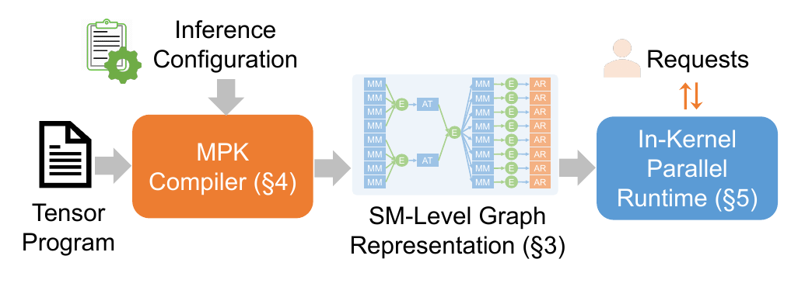

> **论文图 1。** 输入包括张量程序和推理配置。编译器生成 SM 粒度任务图，运行时接收请求并执行这些任务。图中的 In-Kernel 表示调度逻辑也位于 GPU kernel 内。

普通 kernel 执行完自己的工作后退出；**persistent kernel（常驻 kernel）** 的工作线程持续取任务、执行、通知完成，直到本次工作结束。MPK 的编译器负责生成任务图及每类任务的实现，GPU 内运行时负责选择就绪任务并派发给工作线程。

上一篇 [ComFuse](./ComFuse.md) 重点解释跨 CTA 归约后，怎样继续消费统计量和保留的片上数据。MPK 关注整个程序的任务组织与调度。合成一个 mega-kernel 后，中间张量、任务描述和同步状态仍可能位于显存；片上复用取决于具体任务实现。多 GPU 执行也需要各设备运行相应 kernel，并通过通信机制协作。

## 方法：从矩阵乘法到细粒度任务图

### 一个双 GPU 的计算例子

**AllReduce** 在这里执行逐元素求和，并让每个参与 GPU 都得到求和结果。假设矩阵乘法沿相乘求和的维度分到两个 GPU：每卡只计算一部分乘积，随后汇总。

- $A$：形状为 $[2,8]$ 的输入，沿列切成 $A^{(0)}$、$A^{(1)}$，每份为 $[2,4]$。
- $W$：形状为 $[8,4]$ 的权重，沿行切成 $W^{(0)}$、$W^{(1)}$，每份为 $[4,4]$。
- $g\in\{0,1\}$：GPU 编号；GPU $g$ 持有对应的输入和权重分片。
- $P^{(g)}$：该 GPU 算出的部分结果；$Y$ 为完整结果，两者形状均为 $[2,4]$。

两个 GPU 分别完成自己的乘加贡献，再按对应位置相加：

$$
P^{(g)}=A^{(g)}W^{(g)},\qquad
Y=P^{(0)}+P^{(1)}=AW.
$$

每个 GPU 还可以把自己的 MatMul 按输出行拆成两个任务：

| 数据或工作 | 每个 GPU 上的形状 | 依赖 |
|---|---|---|
| 第一行 MatMul | $[1,4]\times[4,4]\to[1,4]$ | 本地输入第一行与本地权重 |
| 第二行 MatMul | $[1,4]\times[4,4]\to[1,4]$ | 本地输入第二行与本地权重 |
| 第一行 AllReduce | 两卡各贡献 $[1,4]$，每卡得到 $[1,4]$ | 两卡第一行的部分结果 |
| 第二行 AllReduce | 两卡各贡献 $[1,4]$，每卡得到 $[1,4]$ | 两卡第二行的部分结果 |

如果本地第一行先完成，相关数据就可以进入通信流程，同时其他任务继续计算第二行。**本地就绪只允许推进相关通信；第一行的最终结果仍要等两卡的对应贡献到齐。** 这个例子展示依赖关系，不指定 AllReduce 必须采用哪种传输算法，也不表示小尺寸任务一定具有性能优势。

### tGraph：任务做什么，事件等什么

MPK 用 **tGraph** 表达上述工作。图中有两类节点：

- **Task，任务**：在单个 SM 上执行的一份计算或通信工作，例如产生一个 MatMul tile。它是 worker 调用的设备函数，执行每个任务不需要重新启动 CUDA kernel。
- **Event，事件**：记录一组前驱任务是否都已完成；全部完成后，依赖它的任务才能执行。这里的 event 是 MPK 的同步对象，不是主机侧的 CUDA Event API。

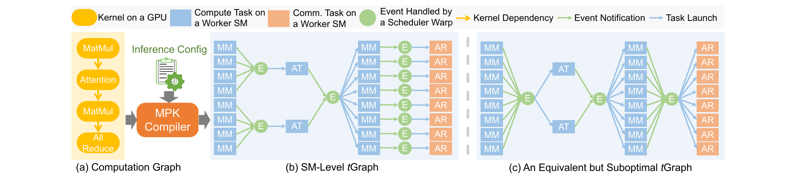

> **论文图 4。** 蓝色为计算任务，橙色为通信任务，绿色为事件。MM、AT、AR 分别表示 MatMul、Attention、AllReduce。(b) 保留局部依赖；(c) 让大量任务共同等待一个事件，限制了原本可以提前执行的工作。

图中的连线首先表达依赖：一个任务需要哪些前驱产生的数据。运行时再通过完成通知更新事件，并把可以执行的任务派发给 worker。**通知和派发传递的是控制信息，张量数据的读写与传输由任务本身完成。**

SM 粒度也不意味着每个任务在编译时都绑定了某个物理 SM。编译器确定任务及依赖，具体分配可以在运行时进行。多个任务会先后使用同一个 worker，这为负载均衡留下了空间。

## 方法：编译器怎样生成便于执行的任务图

### 分解算子，按读写区域建立依赖

编译器先划分算子的输出区域，让每个任务负责一个不重叠的输出块。分块既影响并行度，也影响同一份输入被反复加载的次数。MPK 根据形状和目标 GPU 选择划分，并允许用户指定各输出维度的并行度。

随后，编译器检查生产者写出的区域与消费者读取的区域。只有区域相交，才需要建立二者的依赖。前面的双行例子因此可以分别同步两行；如果后继任务要读取完整两行，它就必须等待两份结果。

此时直接为每对生产者、消费者建立事件，虽然能表达正确依赖，却可能产生大量重复同步对象。后面的图变换用于减少这部分管理成本。

### 事件融合：合并相同的等待条件

前面的双行例子用于说明局部依赖。为了看清哪些事件可以合并，这里借用论文中具有多个分支的 Attention 例子。

先看**相同消费者**：多个事件服务于同一组消费者，而消费者原本就要等这些事件全部就绪，因此可以把它们合成一个事件，由所有相关生产者共同触发。

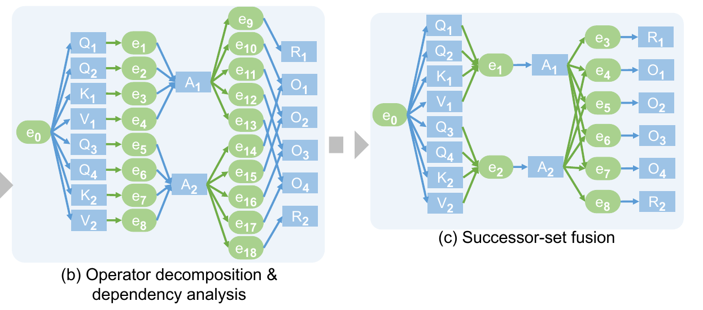

> **论文图 5(b)→(c)。** $Q_1,Q_2,K_1,V_1$ 的结果都是 $A_1$ 的输入，右图将四个等待条件合成事件 $e_1$，收到四份完成通知后释放 $A_1$。Q、K、V 为投影任务，A 为 Attention 任务，O 为输出投影任务，R 为 RMSNorm 任务。

再看**相同生产者**：上图 (c) 中，$e_4,e_5,e_6,e_7$ 都等待 $A_1$、$A_2$ 完成，分别释放 $O_1$ 到 $O_4$。它们的就绪条件完全相同，可以合成一个事件：收到两份通知后，一起释放四个 O 任务。下一张图的 (d) 展示了这个结果。

两种合并都依据生产者或消费者集合是否相同。仅仅因为两个事件属于同一个算子，就把它们合并，可能让原本可以提前开始的任务额外等待。事件融合应保留依赖允许的并行性。

### 规范化与线性化：让图描述更便宜

运行时频繁读取任务及事件描述。如果每个任务都携带长短不一的事件列表，访问和存储管理就会复杂。MPK 的**规范化**把图转成每个任务最多依赖一个事件、最多触发一个事件的形式。

遇到分叉或汇合时，编译器插入只转发完成关系的空任务。例如，原任务需要触发两个不同事件时，可以先触发一个新事件，再由两个空任务分别通知原来的两个事件。原有的等待关系保持不变，只是表示方式变得统一。

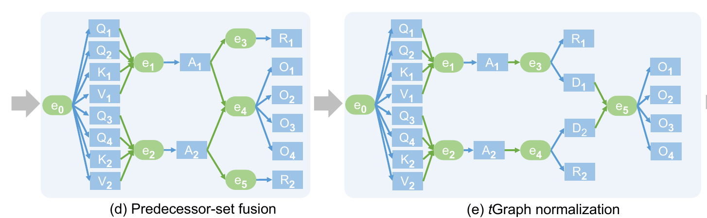

> **论文图 5(d)→(e)。** 左图中 $A_1$ 同时触发 $e_3$、$e_4$。右图让它只触发 $e_3$，由新加入的空任务 $D_1$ 向汇合事件 $e_5$ 转发通知；$A_2$ 一侧同理。R 分支仍可独立推进，O 分支仍需等待两路 Attention 完成。

查看规范化的分叉与汇合规则（论文图 6）

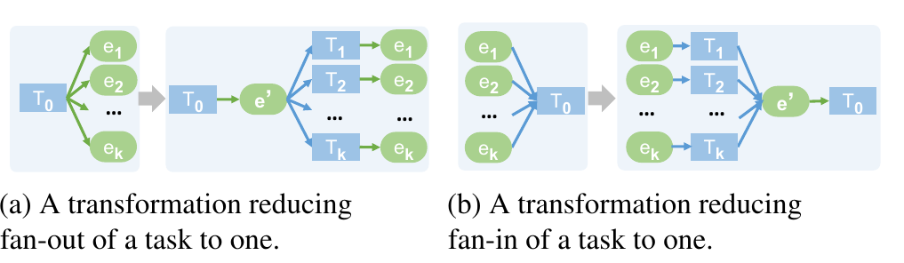

> **论文图 6。** (a) 处理一个任务触发多个事件；(b) 处理一个任务依赖多个事件。新增任务不执行张量计算，但仍承担通知工作。

接下来，**线性化**给任务重新编号，让同一个事件释放的任务排在连续编号区间。事件只需保存这个区间的起止编号，无需保存一整份后继任务列表。

| 对象 | 简化后的依赖信息 | 执行时怎样使用 |
|---|---|---|
| 任务 | 前驱事件编号、完成后触发的事件编号 | 判断能否执行，完成后通知后继 |
| 事件 | 所需通知次数、后继任务编号区间 | 通知到齐后，释放区间内的任务 |

这张表只列依赖字段。任务描述还包含数据地址和配置等执行参数。连续编号压缩的是图的存储表示，**不要求任务按编号逐个串行完成**。

查看完整编译转换及最终编号表（论文图 5）

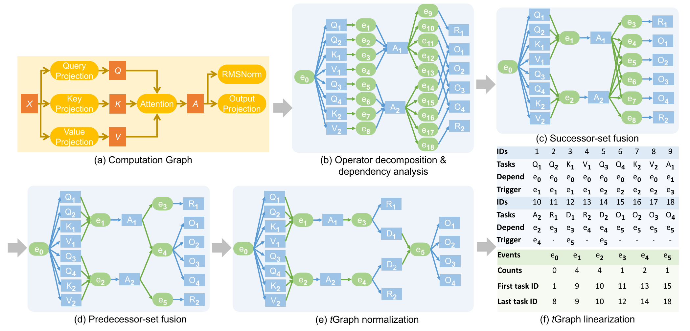

> **论文图 5。** (a) 输入算子图；(b) 分解及依赖分析；(c)(d) 两种事件融合；(e) 规范化；(f) 线性化后的任务与事件记录。Counts 表示事件需要接收的通知数，First/Last task ID 表示被释放任务的编号范围。

### 单个任务的计算实现从哪里来

任务图决定哪些工作可以执行，每个任务内部仍需要高效的 GPU 程序。MPK 复用既有 **Mirage superoptimizer**：根据参考计算搜索等价的线程块级实现，再生成 CUDA 设备函数。这里的“搜索”用于选择计算与数据安排，不需要读者先掌握搜索算法。

MPK 新增的任务图变换与 GPU 内调度组织整个程序；Mirage 的单任务优化处理布局、寄存器复用和任务内部流水等问题。手工优化的任务也可以接入，需符合 MPK 的任务调用约定。

## 方法：GPU 内运行时怎样推进任务

### Worker、scheduler 与完成通知

运行时在启动时划分两类角色。**Worker** 占用一个 SM，持续从队列取任务并执行；**scheduler** 以 warp 为单位管理事件和派发任务。一个 warp 是 GPU 一起调度的 32 个线程，同一个调度 SM 可以容纳多个 scheduler warp。角色在该次 kernel 执行期间固定，任务在 worker 之间分配。

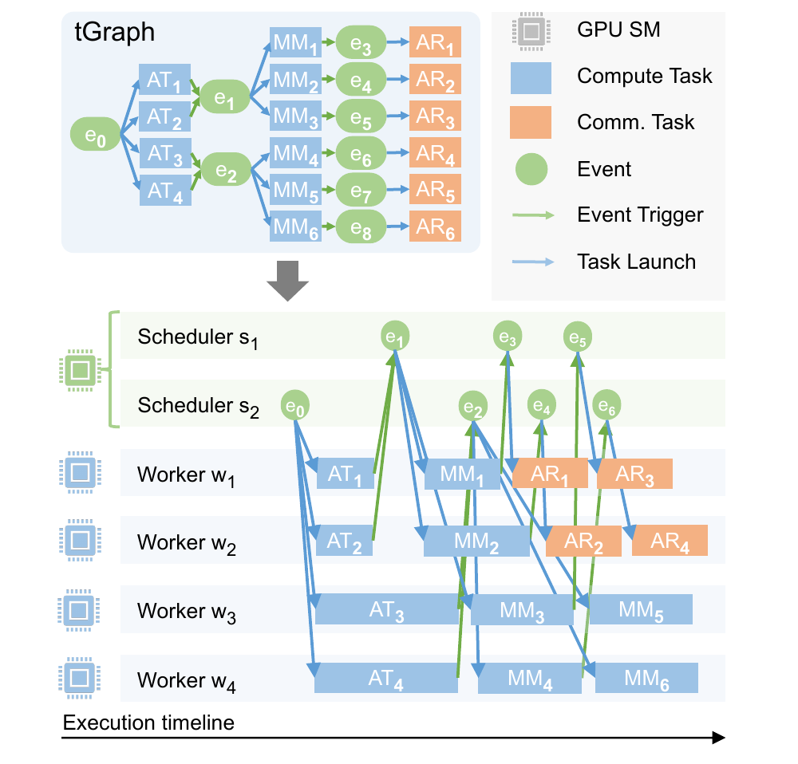

> **论文图 7。** 上方是依赖图，下方是 worker 与 scheduler 的执行示意。箭头表示事件触发和任务派发。时间线用于说明可能的执行交错，条形长度不作为本文的实测耗时。

回到双 GPU 的例子，先按“任务就绪后再派发”的方式，沿第一行结果看一次执行过程。开始事件无需等待前驱，可以释放初始的 MatMul 任务；随后：

- GPU 0 的 worker 算出 $P^{(0)}$ 的第一行，写出这份 $[1,4]$ 的部分结果，并通知对应事件。
- 本地事件就绪后，scheduler 可以派发相关通信任务，将这一行交给 GPU 1。GPU 1 对自己的 $P^{(1)}$ 第一行执行相应过程。
- 每卡的本地归约等待两份输入：自己的部分结果，以及对方传来且已可读取的部分结果。通信完成信息接入依赖通知，通知到齐后，归约任务才能执行。
- 归约任务逐元素相加，得到完整的 $[1,4]$ 第一行，再通知后继任务。第二行沿自己的依赖链推进。

这是用两卡互传并各自求和解释 AllReduce 依赖的教学过程；具体传输与信号实现见后文的通信说明。图 7 中的 MM → event → AR 展示了同样的局部推进关系：一块 MatMul 结果就绪，即可推进相关通信。

任务队列、事件队列和同步状态位于设备内存。GPU 内逻辑持续执行“完成任务、通知事件、派发后继”的循环。论文实验为每卡预留 4 个调度 SM，共运行 16 个 scheduler warp；其余 SM 作为 worker。多个 scheduler 分担事件处理与任务派发，减少集中调度的协调开销。

### JIT/AOT：何时分配任务，何时允许执行

前面的循环描述了任务就绪后再派发的方式。MPK 还允许提前把任务放入 worker 的队列，等依赖满足后再执行。这里的 **JIT/AOT 指任务派发时机**。

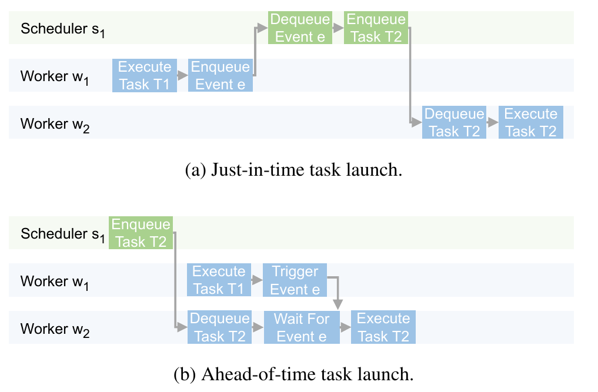

> **论文图 8。** JIT 路径需要经过 worker → scheduler → worker 的通知与派发；AOT 路径中后继任务已入队，worker 等待前驱事件。提前入队不等于提前执行。

| 方式 | 何时选择 worker 并入队 | 主要收益 | 代价 |
|---|---|---|---|
| JIT，就绪后派发 | 前驱事件就绪后 | 工作量不均时灵活分配后继任务 | 多一次调度交互 |
| AOT，提前派发 | 执行前分配并入队 | 减少逐任务派发开销 | 固定分配可能使 worker 等待 |

不同请求的 Attention 长度不同，执行时间也可能不同。论文将这类可能引入运行时不均衡的算子标为 JIT，并让下游保持 JIT，直到遇到汇集全部相关上游任务的屏障。其余部分采用 AOT，减少派发开销。这个选择按算子进行，同一算子拆出的任务使用相同模式。

每个 worker 分别维护 JIT 和 AOT 队列，优先执行已就绪的 JIT 任务；JIT 队列为空时，再检查 AOT 队首的依赖。这样，提前排入的未就绪任务不会阻止 worker 先处理队列中的 JIT 工作。

### 分页共享内存与跨任务流水

依赖允许多个任务交错执行，还需要给它们安排空间。共享内存是 SM 上供同一线程块内的线程协作使用的片上存储。若当前任务始终独占分配给 worker 的共享内存，下一个任务就无法提前加载数据。

MPK 将共享内存划分为固定大小的页，任务按需申请，用完后释放。论文将每个任务分为预加载和计算两部分：当前任务已发出自身全部加载指令，且空闲页足够时，就可以为下一任务预取输入；运行时通过 SM 内同步协调数据搬运。一旦任务开始释放页面，就不再申请新页，便于安排接下来的空间使用。

例如，同一 worker 先后执行两个 MatMul tile，任务 A 计算第一行，任务 B 计算第二行。两者的输入和权重都已可读，B 可以提前把自己所需的数据加载到空闲页。A 对前两页的最后一次读取结束后即可释放它们，同时继续用后两页完成计算：

<MPKDiagram />

这个例子中，B 不依赖 A 的输出，因此两者可以交错。如果后继任务需要读取前一任务尚未生成的数据，那部分输入仍须等到就绪后才能加载。

论文实验采用 32 KB 的 SMEM 页，A100 每 SM 为 5 页，H100、B200 为 7 页；上图采用四页教学配置，页数和 tile 尺寸没有比例关系。

> 运行时还提前把后续任务描述从设备内存取到共享内存，以减少取任务时的等待。这里预取的是任务地址、配置等元数据，和预取张量数据是两件事。

### 动态请求与多 GPU 通信

编译出来的 tGraph 可以固定，但运行时处理的请求可以变化。MPK 为代表性的 batch size 预生成多个图，在迭代开始时根据当前 batch 选择适用的图，并更新请求列表和 KV cache 元数据。已完成请求退出，新请求加入，Attention 任务再读取更新后的元数据。这种方式将图专门化与运行时变化结合起来，不能推导为任意新形状或控制流都无需重新编译。

前面的双 GPU 过程需要 kernel 内的通信支持。MPK 使用 **NVSHMEM** 提供跨 GPU 通信与信号协作，将 AllReduce 拆成跨 GPU 数据传递和本地归约等任务，接入同一事件驱动流程。

事件就绪时间反映数据何时可用。链路较慢时，直接受到影响的是依赖那份数据的后继任务；其他就绪任务仍有机会执行。最终能重叠多少，还取决于可用 worker、通信资源及图中是否存在独立工作。

> **MoE 延伸。** MPK 预先组织专家任务，再用路由产生的元数据调整运行时工作分配；它还将 token gather 接入 GEMM 的加载阶段，减少单独的数据整理任务。

## 实验与适用范围

### 测量设置与主要证据

论文测试 A100、H100 和 B200 上的五个模型，最大 batch size 为 1、2、4、8、16，采用 BF16。每个请求有 64 个输入 token，并生成 1024 个输出 token。**实验属于离线批处理推理**，控制了请求供给，不能直接据此判断在线服务的排队时间或尾延迟。

> Artifact 附录规定使用贪心解码，预热 4 次迭代后取 5 次运行的中位数。阅读结果时应保留这些测量条件。

主要基线包括 PyTorch、vLLM 和 SGLang。论文说明各系统启用了 paged attention 和 continuous batching；MPK 还把请求调度与页分配放到 GPU 内。因此，整体差异包含执行、通信和调度位置的共同影响，不能全部归因于某一个编译优化。

| 比较对象 | 条件与指标 | 论文报告的结果 | 怎样理解 |
|---|---|---|---|
| MPK 与最佳 vLLM/SGLang 基线 | 五模型，三代 GPU，batch 1–16；图 9 的归一化整体性能 | 标注加速比约 $1.0$–$1.7\times$ | 收益随模型、硬件和 batch 变化，部分点接近持平 |
| 单个延迟示例 | Qwen3-8B，A100；逐 token 解码延迟，原文该示例未明确标注 batch size | $14.5\,\mathrm{ms}\to12.5\,\mathrm{ms}$ | 与 vLLM/SGLang 等优化系统比较的延迟示例 |
| 通信重叠消融 | Qwen3-1.7B，4×H100，batch 1–16；每迭代耗时 | 开启重叠约 $1.1\times$ 加速 | 比较同一系统是否允许细粒度重叠 |
| 跨任务流水消融 | Qwen3-8B 最后线性层，B200，batch 1–16；局部耗时 | 图 12 标注 $1.14$–$1.29\times$ | 局部线性层收益，不是整个模型加速比 |
| 事件融合与线性化 | B200，三模型；事件数与后继编码占用 | 事件减少 $37$–$118\times$；编码占用减少 $4.4$–$15\times$ | 图表示更紧凑，不等于运行时间同比例缩短 |

图 9 中，较小模型通常更受益：例如 Qwen3-0.6B 在 H100、batch 2 时达到 $1.7\times$；Qwen3-30B-A3B 多数点约为 $1.1\times$，部分 batch 16 的点接近持平。论文将小模型的收益解释为计算量较少时，kernel 切换、流水空隙和主机调度的占比更高，减少这些开销更有效。

硬件代际也会改变收益，需结合具体模型比较。例如 Qwen3-0.6B、batch 2 在 A100、H100、B200 上分别标注 $1.5\times$、$1.7\times$、$1.4\times$。原文强调新 GPU 上减少固定开销的价值，但图中收益并不随硬件代际单调增加。

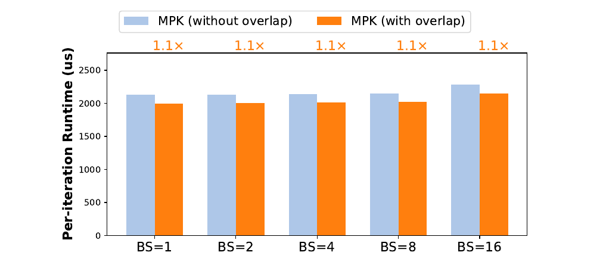

> **论文图 13。** Qwen3-1.7B 在 4 个 H100 上做张量并行。纵轴为每迭代耗时，单位微秒，越低越好；柱上数字为开启重叠的加速比。这组对照直接对应本文贯穿的计算与通信依赖。

完整整体结果与多 GPU 结果（论文图 9、11）

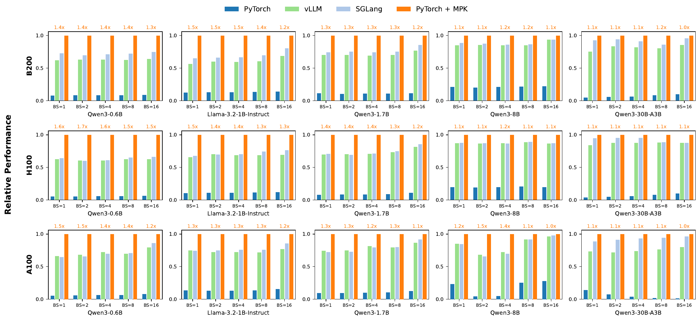

> **论文图 9。** 三行分别对应 B200、H100、A100，每列为一个模型，横轴为 batch size。MPK 归一化为 1，柱上数字表示它相对最佳基线的加速比。正文与附录对吞吐、延迟的表述差异见文末。

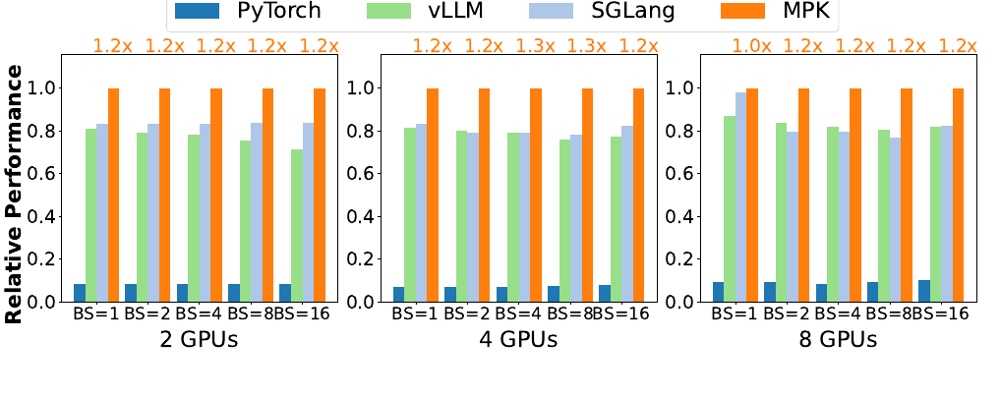

> **论文图 11。** Qwen3-1.7B 在 2、4、8 个 H100 上采用张量并行，MPK 归一化为 1。图中标注为约 $1.0$–$1.3\times$，应与对应 GPU 数和 batch 一起阅读。

跨任务流水与编译图优化的完整证据（论文图 12、表 2）

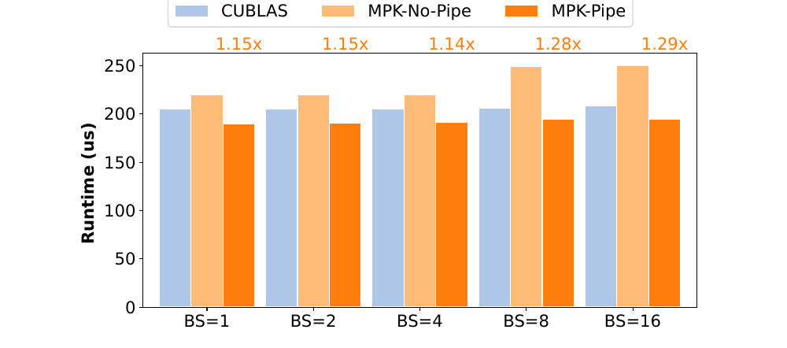

> **论文图 12。** Qwen3-8B 最后线性层，B200。纵轴为微秒，越低越好；柱上比值比较 MPK-Pipe 与 MPK-No-Pipe。按图中标注报告范围，避免用正文的概括范围替代每个测量点。

| 模型 | 算子数 | 平均每算子的任务数 | 最终事件数 | 事件数减少倍数 | 后继编码占用减少倍数 |
|---|---:|---:|---:|---:|---:|
| Qwen3-1.7B | 229 | 35.6 | 1,870 | $37\times$ | $4.4\times$ |
| Qwen3-8B | 293 | 47.3 | 2,366 | $68\times$ | $5.9\times$ |
| Qwen3-30B-A3B | 533 | 32.2 | 1,142 | $118\times$ | $15.0\times$ |

> **转述论文表 2，B200。** 线性化一列比较后继任务列表与连续编号区间的编码占用，不能扩展为整个模型显存占用的减少倍数。论文报告这些实际编译图中的分叉、汇合已经很少，规范化基本未增加工作；图 5 用更明显的分支演示它的必要性。

### 收益需要覆盖哪些代价

细粒度任务让后继工作更早开始，也带来取任务、通知和派发成本。论文实验固定预留 4 个 SM 用于调度，这些 SM 就不能同时作为计算 worker。工作足够细、原来边界开销占比较高时，更有机会覆盖这项成本；任务划分过细也可能增加管理负担。

共享内存可以按任务释放，但论文指出 mega-kernel 的每线程寄存器需求按各类任务中的最大值确定。因此，一个寄存器需求较高的任务类型可能影响其他任务的资源占用。图专门化和单任务优化也需要编译准备；运行时高效不代表编译成本可以忽略。

论文以读取 16 GB 权重、带宽 1.6 TB/s 估算约 10 ms 的访存下界，用于参照 A100 上的延迟。这是只考虑权重读取的粗略估算，未计入所有计算、KV cache 和同步成本，不能视为整个推理任务可达到的精确极限。

## 原文尚需澄清的问题

- **整体性能的口径。** §6.3 称图 9 为吞吐比较，摘要及 artifact 附录又强调逐 token 延迟。本文保留原图归一化性能，不自行换算为在线延迟；复现时需核对计时区间、输出 token 计数和归一化公式。
- **部分概括与图中数值不一致。** §6.5 概括多 GPU 相对服务系统的收益为 $1.1$–$1.4\times$，图 11 标注约为 $1.0$–$1.3\times$；流水消融也有正文概括与图 12 标注范围的差异。本文按具体图中的条件和数字陈述。
- **通信任务的具体实现。** §6.5 在介绍跨 GPU 数据传递任务时提到 NVSHMEM 的信号等待操作。等待信号说明何时可以继续，并不足以交代数据由谁传输、何时完成以及如何保证可见性。理解算法可以沿任务依赖阅读；精确还原通信实现还需要对照论文 artifact。

> 原文附录提供了冻结的 artifact 分支与版本，可用于后续复现。本文的图示与结果整理以论文 v2 为依据，未运行性能复现实验。
