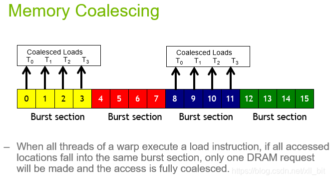
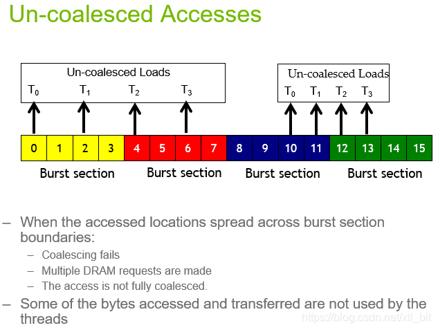
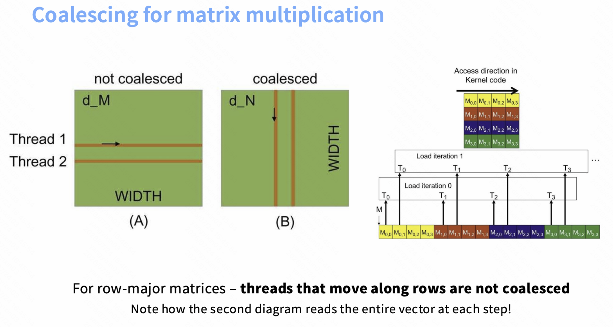
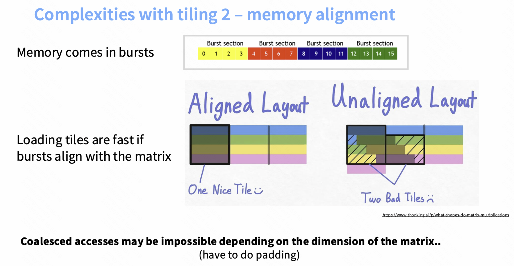

# Global Memory Coalescing

DRAM 的每次访问都会传输一整行数据（buy one get x free）。

同一个 warp 中，连续的线程访问连续的 global memory 地址时，硬件可以将这些访问合并。

上图中，如果在同一时刻每个线程访问矩阵的不同行，则它们访问的 global memory 地址不连续，硬件无法将这些访问合并。

应该总是将**连续的线程映射到矩阵的连续维度**。

一个 burst section 通常为 32 字节，需要保证 tile 的内存布局与 burst section 对齐。
***

Broadcasting：同一个 warp 的所有线程访问同一个 global memory 地址时，硬件可以将这些访问合并成对这个地址的单次访问，并将结果广播给所有线程。

## Warp Divergence

## Tile Swizzle

## Bank Conflict

**Bank conflicts** (shared memory):
- Shared memory is divided into 32 banks, each 4 bytes wide.
B00 B01 B02 B03 B04 B05 B06 B07 B08 B09 B10 B11 B12 B13 B14 B15 B16 B17 B18 B19 B20 B21 B22 B23 B24 B25 B26 B27 B28 B29 B30 B31
... ... ... ... ... ... ... ... ... ... ... ... ... ... ... ... ... ... ... ... ... ... ... ... ... ... ... ... ... ... ... ...
... ... ... ... ... ... ... ... ... ... ... ... ... ... ... ... ... ... ... ... ... ... ... ... ... ... ... ... ... ... ... ...
... ... ... ... ... ... ... ... ... ... ... ... ... ... ... ... ... ... ... ... ... ... ... ... ... ... ... ... ... ... ... ...
- Each cycle, each bank can only be accessed by one thread (if not the same exact location).
- If multiple threads access the same bank, accesses serialized (bank conflict).
- Worst case example: matrix where each row spans all banks; 32 threads accessing first column results in 32-way bank conflict!
- Unavoidable: when doing matmul A @ B, access rows of A and columns of B
- Solution: swizzling rearranges shared memory (e.g., row xor col) to avoid bank conflicts

## Wave Quantization

如果有 160 个 thread block，但是只有 128 个 SM，而且一个 SM 同时只能执行一个 thread block，那么必须分两个 wave 才能执行完所有 thread block。第二个 wave 的 occupancy 很低。
