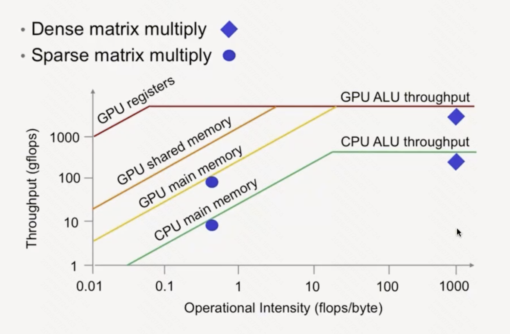

横轴是算术强度（Arithmetic Intensity），纵轴是吞吐量。
- 算术强度衡量单位数据上执行的计算量，即数据被复用的程度，单位是 FLOPS/Byte。
- 吞吐量衡量整体性能，单位是 FLOPS。

当算术强度较低时，计算单元需要等待内存操作，性能受限于内存带宽。随着算术强度逐渐提高，计算单元的利用率逐渐提高，从而使 kernel 整体吞吐量提高（对应图中的斜线部分）。
- 此时的吞吐量 $T = MemBW \times AI$

当算术强度提高至计算单元被充分利用，不再受限于内存带宽时，kernel 当吞吐量达到最高，即计算单元的峰值吞吐量（对应图中的水平线部分）。
- 此时的吞吐量 $T = PeakFlops$

斜线和水平线的交点称为 ridge point，此处有 $PeakFlops = MemBW \times AI_{ridge}$

在对数坐标下，斜线部分的斜率始终为 $1$，纵截距为 $\log(MemBW)$，水平线部分的纵截距为 $\log(PeakFlops)$。

## 算术强度

对矩阵乘法来说，增大 tile size 可以提高算术强度：
- 以 $\mathbf{C} = \mathbf{A} \times \mathbf{B}$ 为例。
- 加载单元每次搬运 $B\times K$ 的 A/B tile 到 Shared Memory，计算单元从 Shared Memory 读取这两个 tile，计算出一个 $B\times B$ 的 partial sum。
- 则算术强度为 $\frac{2B^2K}{2BK} = B$。tile size $B$ 越大，算术强度越高。

降低精度可以提高算术强度：计算量不变，数据量减少。
- 在 $\mathbf{C} = \mathbf{A} \times \mathbf{B}$ 中，一般 A/B/C 都用 BF16 存储，但累加时累加到 FP32 accumulator 中。
- 线性地降低了内存流量，又近似线性地提高了峰值计算吞吐量（对 tensor core 来说。但有 quantize-dequantize 的开销）。
- [MXFP8](https://docs.nvidia.com/deeplearning/transformer-engine/user-guide/features/low_precision_training/mxfp8/mxfp8.html)
