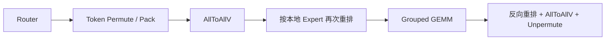

# DeepEP

DeepEP 是面向 MoE Expert Parallelism 的通信库。

普通 EP Dispatcher 通常把数据重排和通信拆成多个独立算子：



这种实现语义清晰，但会产生：

* 多次 HBM 读写和临时 Buffer；
* 多个 Permute、Pack 和 Collective Kernel；
* CPU、通信 Stream 与计算 Stream 之间的同步；
* 对 NVLink 和 RDMA 差异利用不足的扁平通信。

DeepEP 将 EP 的通信抽象为两个专用原语：

* **Dispatch**：根据 Top-$k$ 结果重排 token，并发送到目标 Expert Rank；
* **Combine**：把 Expert 输出送回原 Rank，并恢复原 token 布局。

它的主要收益是融合数据重排与通信、感知硬件拓扑、支持低精度传输，并可以显式控制通信占用的 SM。

***

## 统一示例 Setup

下面用一个简化但典型的 Top-2 MoE 例子，对照同一个 token 在 DeepEP v1 High-Throughput 和 Low-Latency 模式中的完整路径，展示 DeepEP v1 的通信、数据布局和 Expert 计算。

### 初始拓扑与 Expert 放置

假设有 2 个节点，每个节点 4 张 GPU，共 8 个 Rank。每张 GPU 放置两个 Expert。

现在关注 Node 0 的 `r1 / GPU1` 上一个原始 token。它被 Router 做 Top-2 路由后得到 2 个 routed token（即 2 个 token-expert assignment）。我们将源 rank 为 `r1`、目标 expert 为 `E3` 和 `E13` 的 routed token 分别记为 `r1:E3` 和 `r1:E13`：

| Routed token | Top-K slot | 权重 | 目标位置           |
| ------------ | ---------: | ---: | -------------- |
| `r1:E3`      |          0 | 0.35 | 本地 r1 / GPU1 |
| `r1:E13`     |          1 | 0.65 | 远端 r6 / GPU2 |

> `r1:E3` 与 `r1:E13` 来自同一个原始 token，它们携带相同的输入值。
> 当然，从 rank 1 发往 E13 的 token 不一定只有一个，因此 r1:E13 的命名可能会重名。这里如此命名只是为了便利。

记其输入为 $x_{r1:Ee}$，两个 Expert 分别执行

$$
y_{r1:Ee}
=W_2^{(e)}\!\left[
\operatorname{SiLU}\!\left(W_1^{(e)}x_{r1:Ee}\right)
\odot W_3^{(e)}x_{r1:Ee}
\right],\qquad e\in\{3,13\},
$$

随后源 Rank 做加权归约：

$$
\operatorname{output}=0.35y_{r1:E3}+0.65y_{r1:E13}.
$$

下面重点追踪远程 routed token `r1:E13`。

<DeepEPPathExplorer />

***

## High-Throughput 模式

High-Throughput 主要用于训练和 Prefill。此时每个 Rank 通常持有较多 token，优化目标是获得紧凑 Buffer 和大块连续传输，使 NVLink、RDMA 与 Grouped GEMM 保持较高吞吐。

### 精确布局与紧凑 Buffer

Router 输出的不只是 Expert 编号，还需要确定 Expert 所属的目标 Rank。根据 Router 输出，可以确定每个 rank 作为 src 发给其他各 rank 的 routed token 数量。例如，r1 当前 batch 发往 Node 1 各 Rank 的远程 assignment 数量可以被确定为：

| 目标 Rank `rj` | r4 | r5 | r6 | r7 |
| --------: | -: | -: | -: | -: |
| assignments 数量 `count[r1 → rj]` |  2 |  0 |  3 |  1 |

其中 `count[r1 → r6] = 3`（`r1:E13` 是这三个 routed tokens 之一）。

基于此，所有 Rank 交换 count 元数据。r6 最终会从各 Source Rank 收到：

| Source Rank | r0 | r1 | r2 | r3 | r4 | r5 | r6 | r7 |
| ----------: | -: | -: | -: | -: | -: | -: | -: | -: |
| assignments 数量 |  2 |  3 |  1 |  0 |  1 |  0 |  2 |  1 |

总接收数量为 10，因此 r6 分配恰好容纳本轮数据的 buffer。对 counts 做前缀和得到每个 Source Rank 在紧凑 Buffer 中的写入区间：

```text
counts  = [2, 3, 1, 0, 1, 0, 2, 1]
offsets = [0, 2, 5, 6, 6, 7, 7, 9, 10]
```

例如，r1 的合法写入区间是 `[2, 5)`。若所追踪的 `r1:E13` 是 r1 发往 r6 的第 2 个 routed token，则该 token 写入 `compact_recv_buffer[3]`。

<DeepEPBufferTransform />

发送端把 routed tokens 按目标 Rank 打包。`r1:E13` 的 payload 大致包含：

* routed token 的输入值；
* 目标 Expert `E13`；
* Source Rank 与源 token index；
* Top-K 分支 `slot 1`；
* 路由权重 `0.65`。

### 分层传输与 Expert-major 重排

源 `r1 / GPU1` 与目标 `r6 / GPU2` 不在同一节点。DeepEP v1 高吞吐模式让源 GPU 通过自己的 RDMA Rail 写入目标节点中具有相同 Local Rank 的 GPU（同号 GPU），再由后者经 NVLink 转发到真正的目标 GPU：

传输完成后，r6 的紧凑 Buffer 按 Source Rank 连续排列，但 E12 与 E13 的 token 混在一起，无法直接执行 Grouped GEMM。

本地 Permute 将 `by-source` 布局变成 `by-expert` 布局。所追踪的 `r1:E13` 从 `compact_recv_buffer[3]` 移到 `expert_input_E13[1]`，并保存反向映射：

`expert_input_E13[1] ↔ compact_recv_buffer[3] ↔ r1:E13 / Top-K slot 1`。

### Expert 计算与 Combine

Token 被重排为 Expert-major 布局后即可执行 Grouped GEMM。E13 对 `x_{r1:E13}` 执行上面的 SwiGLU FFN，结果 `y_{r1:E13}` 位于 E13 输出组中；与此同时，本地 E3 对 `x_{r1:E3}` 也执行相同的计算。

High-Throughput Combine 根据 Dispatch 保存的反向映射，先把 `by-expert output` inverse permute 为按 Source Rank 返回的布局，再把 `y_{r1:E13}` 放入 `send_back_to_r1`。返回路径与 Dispatch 对称。

回到 r1 后，根据 Source Token Index 和 Top-K slot 恢复 `r1:E13 / slot 1 / weight 0.65 / y_{r1:E13}`。本地 E3 分支不需要跨节点返回；r1 最后计算 $0.35y_{r1:E3}+0.65y_{r1:E13}$。

***

## Low-Latency 模式

Low-Latency 主要用于 Decode。此时每个 Rank 每步通常只有少量 token，消息很小。Count Exchange、CPU 等待、动态 Shape 和多段转发的固定延迟很难摊薄。因此它不再优先追求恰好容纳本轮 token 的最紧凑 Buffer，而是用更多预留空间换取更短、更稳定的数据路径。

下面继续追踪 `r1:E13 → r6`，并假设各 Rank 产生的 routed tokens 与 High-Throughput 示例相同。

### 预分配布局与 Pure RDMA

Low-Latency 预先给定每个 Rank 最多处理的 token 数 `T_max`，并据此分配稳定的 RDMA Buffer。原始接收空间可以概念化为

```text
recv_x[num_local_experts, num_ranks × T_max, hidden]
```

更精确地说，每个本地 Expert 的 RDMA 接收区域还按 Source Rank 分区；因此 r6 为 E12、E13 分别保留来自 r0 至 r7 的 `T_max` 个槽位。容量是上界，不代表每轮都会填满。

接收 Kernel 再把这些分区中的有效 token pack 成以本地 Expert-major 输出。上层看到的是连续的 E12、E13 **有效**区域，而不是把整个预留空间当成 Grouped GEMM 输入。

DeepEP v1 Low-Latency 要求参与 Rank 可以通过 RDMA 访问，并使用 IBGDA 从 GPU 侧发起通信。Token 直接写向目标 Rank 的目标 Expert RDMA Buffer，省去了同号 GPU relay、节点内转发和两段路径之间的协调。

Expert 计算和 Combine 过程类似，不再赘述。

***

## AllToAll 与 AllGather 的通信量

设每个 Rank 持有 $S$ 个 token，Hidden Size 为 $H$，EP Group 有 $P$ 个 Rank，Router 采用 Top-$k$。以下比较每 Rank 在 Dispatch 中发送的 Hidden State 数据量，不计元数据与 Combine。

AllToAll 按 Routed Token Instance 发送。同一个 token 的 $k$ 个路由结果分别计数，且目标均匀分布时，本地的 $1/P$ 不经过网络：

$$V_{\text{a2a}}\approx kSH\frac{P-1}{P}$$

若改为 AllGather，每个 Rank 将原始 token 广播给其余 Rank，再由接收端保留本地 Experts 需要的 token：

$$V_{\text{ag}}\approx SH(P-1)$$

两者之比为

$$\frac{V_{\text{a2a}}}{V_{\text{ag}}}\approx\frac{k}{P}.$$

因此，当 $k/P>1$ 时，AllGather 的通信量更小。

这里的 $V_{\text{a2a}}$ 是未去重的 Routed Token Instance 口径。DeepEP 的实际布局包含两级去重：

* **Per-Rank 去重**：同一个 token 选择了同一 Rank 上的多个 Experts，hidden state 只需向该 Rank 发送一份；
* **Per-Node / RDMA-domain 去重**：多个目标 Rank 位于同一远端节点时，跨节点只传一份，再在节点内转发为各目标 Rank 的输入。

因此不能简单从上式中消去 $k$；DeepEP 的实际跨节点流量要根据唯一目标 Rank 集合与目标 RDMA-domain 集合另行计算。

<DeepEPDedupExplorer />

一般都是单机可能选择 AllGather，多机基本使用 Dispatch，毕竟 $k$ 通常不会太大。

## Hybrid-EP

这里切换到 DeepEP v2 / 当前 Hybrid 实现的口径。v2 通过 `ElasticBuffer` 统一高吞吐与低延迟 API，同时保留 hybrid 与 direct 两种硬件路径。

Hybrid-EP 保持 scale-out 与 scale-up 的分层通信思想，但用 TMA、persistent kernel、warp specialization 和 chunk pipeline 重构 Dispatch / Combine。Notify、scale-out、forward 等不同 warp 角色分别推进控制、RDMA 与节点内转发；copy epilogue 再形成计算所需布局，使相邻 chunk 的 TMA staging、RDMA、NVLink forwarding 与布局整理细粒度重叠。

<DeepEPHybridPipeline />

TMA 让线程不必逐元素亲自搬运数据，因此可以降低通信路径对执行线程和 SM 资源的占用。图中的时间宽度只表示相对先后与可重叠关系，不表示实测 latency。
