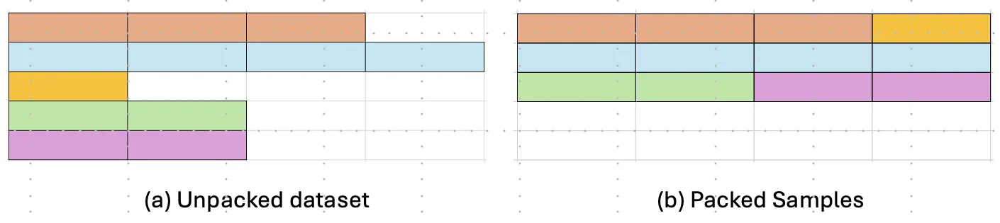
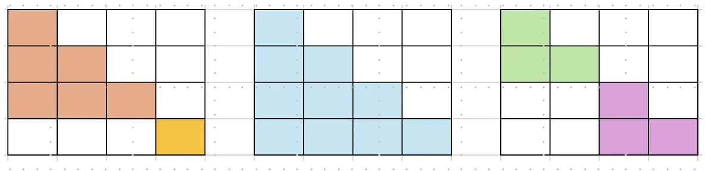
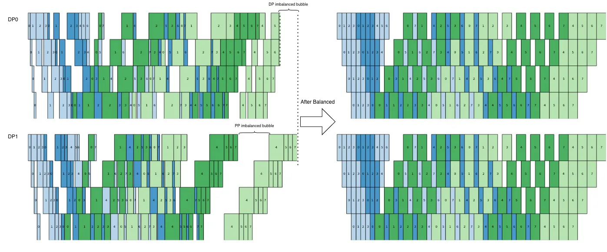

# Dynamic Context Parallelism

[NVIDIA 技术博客](https://developer.nvidia.cn/blog/speeding-up-variable-length-training-with-dynamic-context-parallelism-and-nvidia-megatron-core/)

## 背景和动机

情境：DP + PP + CP 的大模型训练

在数据集中，不同 sample 的序列长度往往参差不齐。

为应对可变长度的输入，现有训练系统通常采用样本级打包（sample-level packing）策略，即将多个较短序列拼接为一个 micro batch，并限制其总 token 长度不超过目标序列长度。



尽管这三个打包后的 micro batch 具有相同的总序列长度，但由于点积注意力的计算复杂度与序列长度是二次关系，它们的计算负载（执行时间）并不相同。



这种执行时间的不均衡会导致：
- DP 中，先执行完成的 DP rank 在梯度同步时需要等待未完成的 DP rank，造成 DP imbalanced bubble
- PP 中，不同 micro batch 之间的执行时间差异导致 PP imbalanced bubble。并且这种 bubble 会随着流水线被逐级放大。

Dynamic CP 的目标是让每个 micro batch 的执行时间尽量均匀，从而减少这两种 bubble。

***

一个 micro batch 对应一次 fwd，其中的不同 sample 被合并为一次 block-diagonal attn。

在传统 CP 中，所有 micro batch 共享一个 CP degree。为了避免显存不足，这个 CP degree 往往由总序列长度最长的 micro batch 决定。对于前文所述的追求每个 micro batch 的总序列长度近似相同的打包方法来说，所有 micro batch 共享一个 CP degree 是天然合理的。但是如果每个 micro batch 的总序列长度不同（Dynamic CP 的场景），那么这种共享 CP degree 的做法是 sub-optimal 的。

```
MB0：8K tokens   → CP=8，过度切分
MB1：12K tokens  → CP=8，过度切分
MB2：64K tokens  → CP=8，确实需要
```

CP 的通信量和序列长度成线性关系。当某些 micro batch 的总序列长度较小时，过度切分会导致通信难以被计算掩盖。

因此，Dynamic CP 为每个 micro batch 提供独立的 CP degree。

***



上图是一个 DP=2, VPP=8 的例子。
- 横轴表示时间，纵轴表示 DP rank 及物理 pipeline stage。
- 每个小矩形代表一个 micro batch，蓝色表示 fwd，绿色表示 bwd，浅色表示前四级虚拟流水线，深色表示后四级虚拟流水线。

约束：
- 第 $i+1$ 级流水线的 fwd 必须在第 $i$ 级流水线的 fwd 完成后才能开始。第 $i$ 级流水线的 bwd 必须在第 $i+1$ 级流水线的 bwd 完成后才能开始。
- 物理流水线中最多同时有 11 个 micro batch 的 fwd 保持 in flight。
- micro batch 的发射顺序是固定的
- 每个 DP rank 要等待所有其他 DP rank 执行完其 micro batch 之后，才能进行梯度同步。

原本（左侧），每个 micro batch 的执行时间不均匀，导致了：
- 逐级放大的 PP imbalanced bubble
- DP imbalanced bubble

Dynamic CP（右侧）通过将每个 micro batch 的执行时间尽量均匀化，减少了 bubble。

## 方法

[TODO] 用于支持 Dynamic-CP 的 Megatron Core 框架修改

***

算法：
给定一个 global batch 中的所有 samples：
1. 对每个 sample，根据其序列长度估算其执行时间和显存占用。
2. let m = number of micro batch per DP rank; 
3. for each m:
    1. 将各 sample 打包为 micro batch
    2. 确定每个 micro batch 的 CP degree
    3. 在分布式流水线并行调度下评估这些 micro-batch 的执行时间和峰值显存
4. 选择所有 m 中执行时间最短且峰值显存不超过阈值的方案。

### 数学建模

第 $i$ 个 DP pipeline 的端到端时间 $T_i$ 有：

$$T_i = W_i (m_i V + p - 1)$$
其中：
- $W_i$：该 DP 中每个 micro-batch、每个 virtual stage 的目标工作量；
- $m_i$：该 DP rank 的 micro-batch 数量；
- $V$：virtual stage 数量；
- $p$：物理 pipeline stage 数量。

两个 DP rank 同时完成，所以：

$$W_1 (m_1 V + p - 1) = W_2 (m_2 V + p - 1)$$

即

$$W_2 = W_1 \frac{m_1 V + p - 1}{m_2 V + p - 1}$$

同时，global batch 的总工作量 $\sum_i W_i m_i$ 是守恒的。

结合“同时完成”和“总工作量守恒”，就能解出各个 DP rank 的 $W_i$ 和 $m_i$。

但是实践中，Dynamic CP 以各个 DP rank 采用相同 $m_i$ 为前提，所以以上数学建模直接退化为 $W_1 = W_2 = ... = W_n$，即每个 DP rank 的 micro batch 执行时间相同。

貌似这个数学建模并没有什么实际意义。

### 双目标平衡

执行时间关于序列长度平方增长，显存占用关于序列长度线性增长。Dynamic CP 的目标是既均匀化执行时间，又均匀化显存占用。
- 前文已经说明了为什么要均匀执行时间，但是博客并没有解释为什么要均匀显存占用。
- 博客的意思可能更接近于：均匀化执行时间目标 + 峰值显存不导致 OOM 约束
    - 调研代码实现，的确是这样

1. 调度器先为每个 sample 估算 workload，对于 workload 超过阈值的 sample，系统为它增加 CP degree 以降低其 workload
2. 处理完超重 sample 后，调度器把剩余 sample 放进 DP × m 个桶（micro batch）里。
    1. 每个 micro batch 都有一个 workload 目标容量（衡量执行时间）和一个目标总序列长度（衡量显存占用）
    2. 第一个 pass：将所有 sample 按照 workload 从大到小排序，在不超过 micro batch 的目标总序列长度的前提下，依次将 sample 放进剩余 workload 空间最大的 micro batch 里，尽量让每个 micro batch 的 workload 接近目标容量。
    3. 现在可能会剩下一些 sample，由于目标总序列长度的限制，无法放进剩余的 micro batch 里。
    4. 第二个 pass：将剩余 sample 按照序列长度从大到小排序。对于每个 sample，寻找一个 micro batch，使得放入该 sample 后，micro batch 的总序列长度与其目标总序列长度的距离最小。

第二遍可能允许一些 micro batch 略微超过目标长度。每个 micro batch 的目标总序列长度更多是一个软约束。之后还会运行 simulator。

> 原文：“选择计算量最少的样本来填充存储桶”？

以上从博客总结。

***

调研实际代码的总结：

Dynamic CP 使用 $S^2/CP$ 作为单个 sample 在每个参与 rank 上的近似工作量，并使用 max_seq_len_per_rank 作为单 rank token 容量约束。调度器首先根据 sample 长度和单 rank 容量计算其最小 CP degree，随后将全局样本按长度降序处理，并反复构造覆盖全部 DP×CP ranks 的平衡调度 group。在构造一个 group 时，sample 会被放入一个已有的同尺寸 CP subgroup，或者使用空闲 ranks 创建新的 CP subgroup；选择时优先使用当前 workload 较低的 ranks，同时保证 pack 后的单 rank token 数不超过容量。当前 group 足够均衡或无法继续容纳 sample 后，剩余 sample 被留给下一个 group。若 group 中存在空闲 GPU，调度器会扩展某个较小 CP subgroup，使所有 ranks 都参与该调度槽。最终生成的 group 数即动态 micro-batch 数，并直接交由 Megatron 的标准 PP/VPP schedule 执行。
